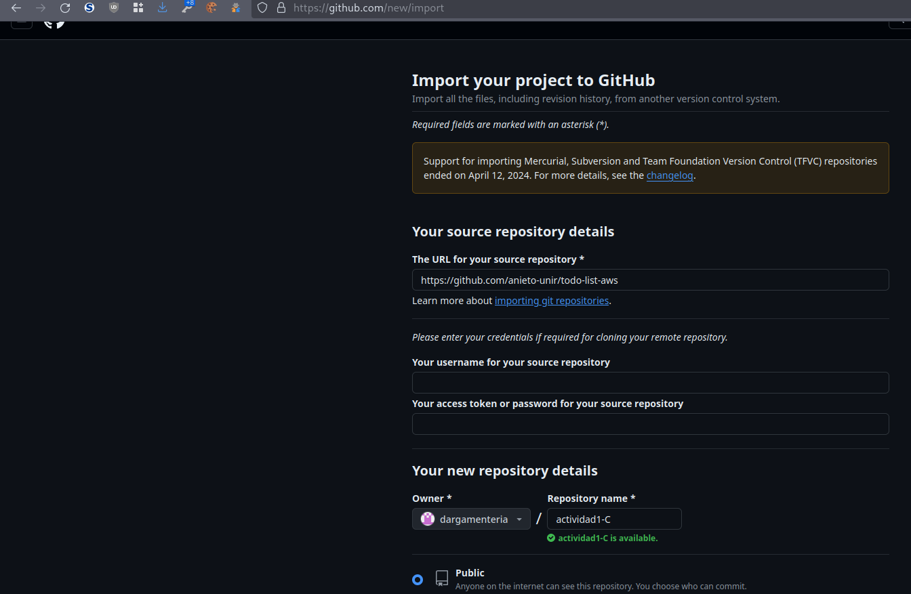
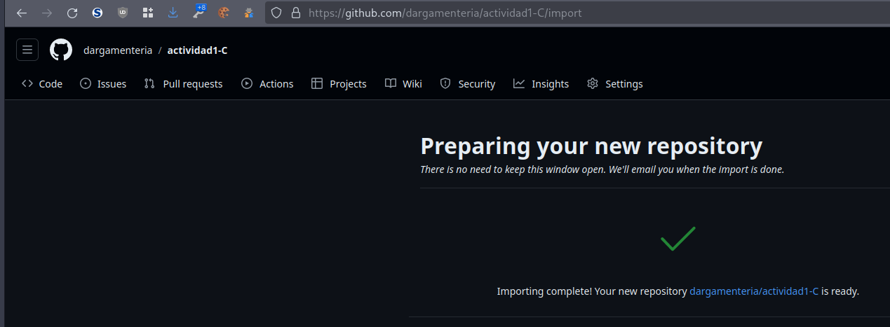
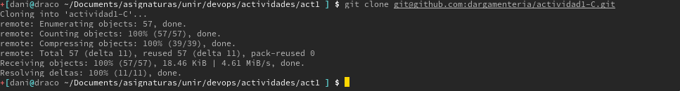
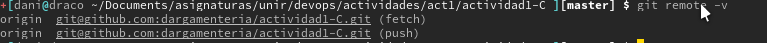

-   [Reto 1 -- Clonado del
    repositorio](#reto-1-clonado-del-repositorio)
    -   [Descarga del código fuente, y creación del repositorio del
        alumno con este mismo código
        fuente.](#descarga-del-código-fuente-y-creación-del-repositorio-del-alumno-con-este-mismo-código-fuente.)
    -   [Indicar la URL del nuevo
        repositorio](#indicar-la-url-del-nuevo-repositorio)
    -   [Lista de comandos ejecutados y pasos manuales en GitHub, para
        llevar a cabo la creación del nuevo
        repositorio.](#lista-de-comandos-ejecutados-y-pasos-manuales-en-github-para-llevar-a-cabo-la-creación-del-nuevo-repositorio.)

# Reto 1 -- Clonado del repositorio

## Descarga del código fuente, y creación del repositorio del alumno con este mismo código fuente.

Importamos el repositorio `https://github.com/anieto-unir/todo-list-aws`
en el nuestro

Clonamos el nuevo repositorio,
`https://github.com/dargamenteria/actividad1-C`, en nuestro local

## Indicar la URL del nuevo repositorio

Solo queda indicar nuevamente la dirección de nuestro nuevo repositorio
de código: https://github.com/dargamenteria/actividad1-C

## Lista de comandos ejecutados y pasos manuales en GitHub, para llevar a cabo la creación del nuevo repositorio.

Si quisiéramos realizar la cración del repositório sin usar el asistente
que proporciona *GitHub* podríamos realizar un procedimiento análogo al
que se realizó en la primera entrega,
[clonado-del-proyecto-con-github](https://github.com/dargamenteria/actividad1-A/blob/master/docs/Parte%20A%20Reto1.md#clonado-del-proyecto-con-github)
