-   [Reto 2 -- Infraestructura
    AWS](#reto-2-infraestructura-aws)
    -   [Creación de instancia
        EC2](#creación-de-instancia-ec2)
    -   [Manual](#manual)
    -   [Automático](#automático)
        -   [Variables](#variables)
            -   [Definicion de las
                variables](#definicion-de-las-variables)
            -   [Valores de las
                variables](#valores-de-las-variables)
        -   [Scripts](#scripts)
            -   [EC2](#ec2)
            -   [VPC](#vpc)
            -   [EIP](#eip)
            -   [SGs](#sgs)
        -   [Plan](#plan)
    -   [Acceso a la
        instancia](#acceso-a-la-instancia)
    -   [Integración con
        Cloud9](#integración-con-cloud9)
    -   [Instalación de
        Jenkins](#instalación-de-jenkins)
    -   [Verificación de acceso a
        Jenkins](#verificación-de-acceso-a-jenkins)
    -   [Creación de una ip
        estática.](#creación-de-una-ip-estática.)

# Reto 2 -- Infraestructura AWS

Es una pena que las credenciales del laboratorio AWS no sean
permanentes, y tengamos que establecerlas cada vez que se inicia el
laborario.\
Para ello o bien podemos usar las variables de entorno o estableciendo
los ficheros \$HOME/.aws/credentias y \$HOME/.aws/config

-   Credentials file

``` bash
$ cat /home/dani/.aws/credentials
[unir]
aws_access_key_id=xxxxx
aws_secret_access_key=xxxxx
aws_session_token=xxxxxx
```

-   Config file

```{=html}
<!-- -->
```
    cat /home/dani/.aws/config 
    File: /home/dani/.aws/config
    [profile default]
    region = eu-west-1
    output = json

    [profile unir]
    region = us-east-1

## Creación de instancia EC2

## Manual

1.- Creamos una nueva instancia desde el asistente\
2.- El primer punto oscuro que encontramos es como siempre elegir el ami
ya que no se lista adecuadamente en el asistente, por lo que probamos
con aws cli\
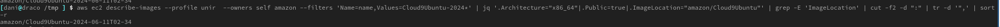\
3.-Obtenemos los resultados\
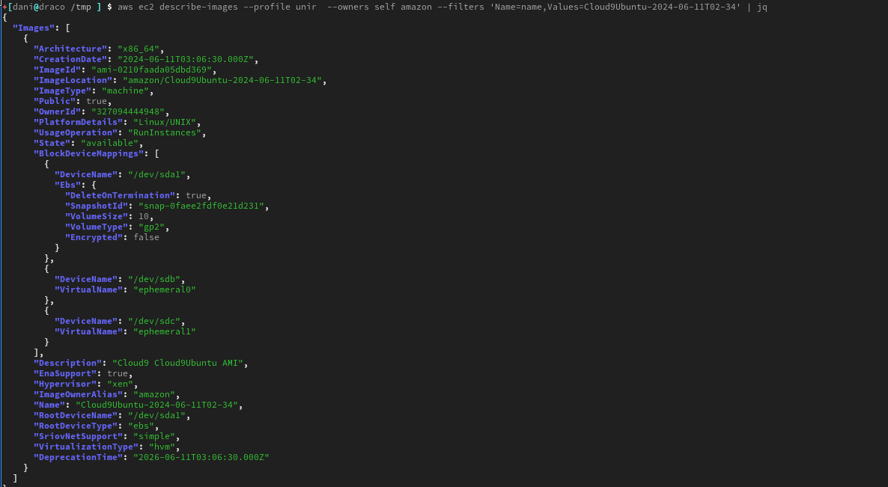\
4.- Una vez con el id de la instancia\
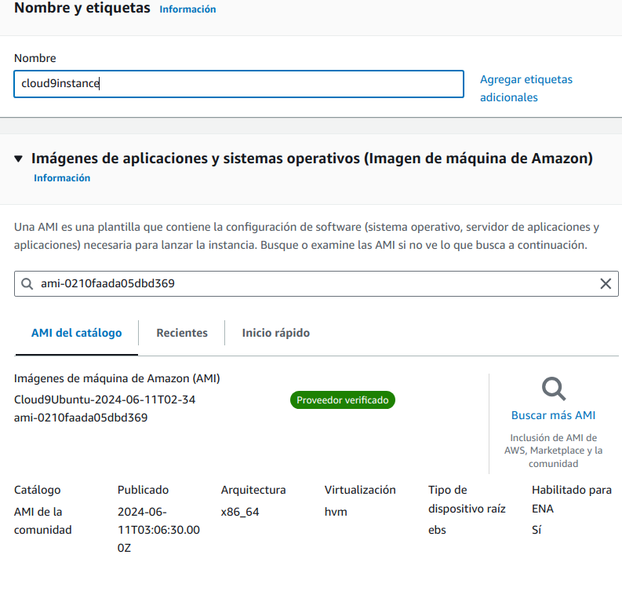\
5.- Ajustamos el tipo y la clave\
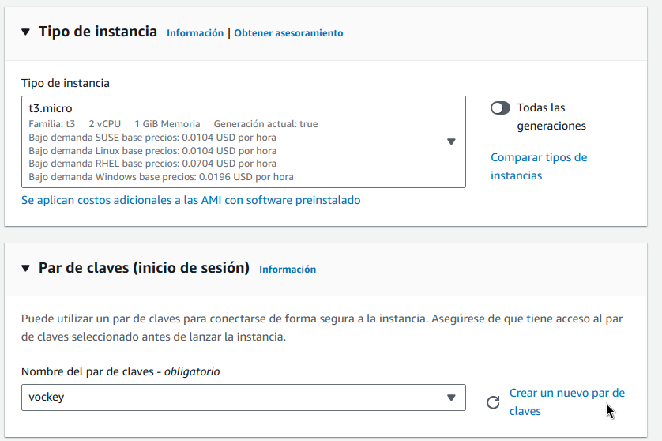\
6.- Ajustes de red\
\
7.- Profile\
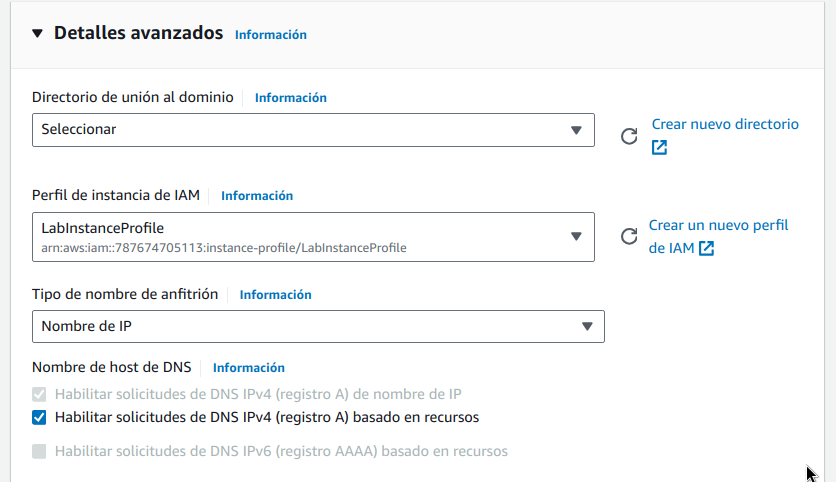

## Automático

Usamos una serie de scripts de terraform para crear automáticamente la
instancia
### Notas adicionales
1.- Se ha utilizado al final una instancia t3.medium, era la muerte a pellizcos esperar a que levantara la imagen de Jenkins en las t3 de categoria inferior.

2.- Cada vez que se pone en los grupos de seguiridad un 0.0.0.0/0 mueren siete gatos en cada pueblo de Asturies y los primogénitos varones de las ciudades, aunque se ha mantenido para seguir las peticiones de la documentación. Se puede establecer el valor de determinadas ips en el fichero `./iac/resources/ips.yaml`.


```yaml
#IPS de servicios

#IPS personales
arga: aaa.bbb.ccc.ddd
```

y referenciarla luego en la configuración del grupo de seguridad


```
    sg = "sg1", from = 80, to = 80, ingress = true, protocol = "tcp", cidr = "arga", ipv6_cidr = "", source_sg = "", description = "Allow http [tf]"
    sg = "sg1", from = 8080, to = 8080, ingress = true, protocol = "tcp", cidr = "arga", ipv6_cidr = "", source_sg = "", description = "Allow 8080 [tf]"
    sg = "sg1", from = 22, to = 22, ingress = true, protocol = "tcp", cidr = "arga", ipv6_cidr = "", source_sg = "", description = "Allow ssh  [tf]"
```

### Variables

#### Definicion de las variables

``` python
variable "provider_default_tags" {
  description = "provider_default_tags"
  type        = map(any)
}

variable "client_name" {
  description = "client_name"
  type        = string
}

variable "region" {
  description = "region"
  type        = string
}

variable "vpc_name" {
  description = "vpc_name"
  type        = string
}

variable "vpc_cidr" {
  description = "vpc_cidr"
  type        = string
}

variable "vpc_public_subnets" {
  description = "vpc_public_subnets"
  type        = list(string)
}

variable "vpc_public_subnet_names" {
  description = "vpc_public_subnets"
  type        = list(string)
}

variable "vpc_private_subnets" {
  description = "vpc_private_subnets"
  type        = list(string)
}

variable "vpc_private_subnet_names" {
  description = "vpc_private_subnets"
  type        = list(string)
}
variable "vpc_azs" {
  description = "vpc_azs"
  type        = list(string)
}


variable "sgs" {
  description = "security groups going pot"
  type = map(object({
    enabled     = bool
    description = string
    sgs_tags    = map(any)
  }))
}

variable "sgs_rules" {
  description = "security inbound rules cidr"
  type = list(object({
    sg          = string
    from        = number
    to          = number
    ingress     = bool
    protocol    = string
    cidr        = string
    ipv6_cidr   = string
    source_sg   = string
    description = string
  }))
}

variable "ec2_instances" {
  description = "instances"
  type = map(object({
    enabled           = bool
    ec2_ami           = string
    ec2_instance_type = string
    ec2_ebs_encrypted = bool
    ec2_snet          = string
    ec2_snet_index    = number
    ec2_public_ip     = bool
    ec2_static_ip     = bool
    profile           = string
    ec2_sgs           = list(string)
    ec2_root_block_device = list(object({
      encrypted   = bool
      volume_type = string
      volume_size = number
    }))
    ec2_tags = map(any)
  }))
}
```

#### Valores de las variables

``` python
provider_default_tags = {
  environment = "unir"
  terraform   = "true"
}

region = "us-east-1"

client_name = "unir"


vpc_name = "vpc"
vpc_cidr = "10.153.0.0/16"
vpc_azs  = ["us-east-1a"]

vpc_public_subnets      = ["10.153.10.0/24"]
vpc_public_subnet_names = ["pub_snet_a"]

vpc_private_subnets      = ["10.153.30.0/24"]
vpc_private_subnet_names = ["priv_snet_a"]


sgs = {
  sg1 = {
    enabled     = true
    description = "this rds goes for the lb"
    sgs_tags = {
      Name = "sg1"
    }
  }
}

sgs_rules = [

  ##INGRESS RULES
  {
    sg = "sg1", from = 80, to = 80, ingress = true, protocol = "tcp", cidr = "0.0.0.0/0", ipv6_cidr = "", source_sg = "", description = "Allow http [tf]"
    sg = "sg1", from = 8080, to = 8080, ingress = true, protocol = "tcp", cidr = "0.0.0.0/0", ipv6_cidr = "", source_sg = "", description = "Allow 8080 [tf]"
    sg = "sg1", from = 22, to = 22, ingress = true, protocol = "tcp", cidr = "0.0.0.0/0", ipv6_cidr = "", source_sg = "", description = "Allow ssh  [tf]"
  },

  ## EGREES RULES
  {
    sg          = "sg1", from = 0, to = 0, ingress = false, protocol = "-1", cidr = "0.0.0.0/0", ipv6_cidr = "", source_sg = ""
    description = "Default egress rule [tf]"
  }

]


#ec2_ami_filter_owner = ["099720109477"] # Canonical

ec2_instances = {
  cloud9 = {
    enabled           = true
    ec2_ami           = "ami-0210faada05dbd369"
    ec2_instance_type = "t3.micro"
    ec2_ebs_encrypted = true
    ec2_snet          = "public"
    ec2_public_ip     = true
    ec2_static_ip     = true
    ec2_snet_index    = 0
    ec2_sgs           = ["sg1"]
    profile           = "LabInstanceProfile"
    ec2_root_block_device = [{
      encrypted   = true
      volume_type = "gp2"
      volume_size = 20
    }]
    ec2_tags = {
      scheduled = "workdays"
    }
  }
}
```

### Scripts

#### EC2

``` python
provider_default_tags = {
  environment = "unir"
  terraform   = "true"
}

region = "us-east-1"

client_name = "unir"


vpc_name = "vpc"
vpc_cidr = "10.153.0.0/16"
vpc_azs  = ["us-east-1a"]

vpc_public_subnets      = ["10.153.10.0/24"]
vpc_public_subnet_names = ["pub_snet_a"]

vpc_private_subnets      = ["10.153.30.0/24"]
vpc_private_subnet_names = ["priv_snet_a"]


sgs = {
  sg1 = {
    enabled     = true
    description = "this rds goes for the lb"
    sgs_tags = {
      Name = "sg1"
    }
  }
}

sgs_rules = [

  ##INGRESS RULES
  {
    sg = "sg1", from = 80, to = 80, ingress = true, protocol = "tcp", cidr = "0.0.0.0/0", ipv6_cidr = "", source_sg = "", description = "Allow http [tf]"
    sg = "sg1", from = 8080, to = 8080, ingress = true, protocol = "tcp", cidr = "0.0.0.0/0", ipv6_cidr = "", source_sg = "", description = "Allow 8080 [tf]"
    sg = "sg1", from = 22, to = 22, ingress = true, protocol = "tcp", cidr = "0.0.0.0/0", ipv6_cidr = "", source_sg = "", description = "Allow ssh  [tf]"
  },

  ## EGREES RULES
  {
    sg          = "sg1", from = 0, to = 0, ingress = false, protocol = "-1", cidr = "0.0.0.0/0", ipv6_cidr = "", source_sg = ""
    description = "Default egress rule [tf]"
  }

]


#ec2_ami_filter_owner = ["099720109477"] # Canonical

ec2_instances = {
  vpn = {
    enabled           = true
    ec2_ami           = "ami-0210faada05dbd369"
    ec2_instance_type = "t3.micro"
    ec2_ebs_encrypted = true
    ec2_snet          = "public"
    ec2_public_ip     = true
    ec2_static_ip     = true
    ec2_snet_index    = 0
    ec2_sgs           = ["sg1"]
    profile           = "LabInstanceProfile"
    ec2_root_block_device = [{
      encrypted   = true
      volume_type = "gp2"
      volume_size = 20
    }]
    ec2_tags = {
      scheduled = "workdays"
    }
  }
}
```

#### VPC

``` python
resource "aws_eip" "nat" {
  count = length(var.vpc_public_subnet_names)

  domain = "vpc"
  tags = {
    Name = "eip_${var.vpc_public_subnet_names[count.index]}"
  }

}


#tfsec:ignore:aws-ec2-require-vpc-flow-logs-for-all-vpcs
module "network" {
  source  = "terraform-aws-modules/vpc/aws"
  version = "> 5.8.0"

  name                 = "${var.vpc_name}-${var.client_name}"
  cidr                 = var.vpc_cidr
  enable_dns_hostnames = true

  azs                 = var.vpc_azs
  public_subnets      = var.vpc_public_subnets
  public_subnet_names = var.vpc_public_subnet_names

  private_subnets      = var.vpc_private_subnets
  private_subnet_names = var.vpc_private_subnet_names

  enable_nat_gateway     = true
  single_nat_gateway     = false
  one_nat_gateway_per_az = true

  reuse_nat_ips       = true
  external_nat_ip_ids = aws_eip.nat[*].id
  #
}
```

#### EIP

``` python
resource "aws_eip" "eips" {
  for_each = { for k, v in var.ec2_instances : k => v if v.enabled == true && v.ec2_static_ip == true } #only enabled ones with static_ip
  instance = module.ec2_instances[each.key].id
  domain   = "vpc"
  tags = {
    Name = each.key
  }
}
```

#### SGs

``` python
resource "aws_security_group" "sgs" {
  for_each    = { for k, v in var.sgs : k => v if v.enabled == true } #only enabled ones
  vpc_id      = module.network.vpc_id
  name        = each.key
  tags        = each.value.sgs_tags
  description = each.value.description

}


resource "aws_security_group_rule" "sgs" {
  for_each = { for rule in var.sgs_rules : join("-", [rule.sg, sha1("${rule.sg}${rule.to}${rule.from}${rule.cidr}${rule.source_sg}")]) => rule }

  security_group_id = aws_security_group.sgs[each.value.sg].id
  from_port         = each.value.from
  to_port           = each.value.to
  type              = each.value.ingress == true ? "ingress" : "egress"
  protocol          = each.value.protocol
  description       = each.value.description

  cidr_blocks              = each.value.cidr != "" ? strcontains(each.value.cidr, "/") ? [each.value.cidr] : ["${local.ip_map[each.value.cidr]}/32"] : null
  ipv6_cidr_blocks         = each.value.ipv6_cidr != "" ? [each.value.ipv6_cidr] : null
  source_security_group_id = each.value.source_sg != "" ? aws_security_group.sgs[each.value.source_sg].id : null

}
```

### Plan

``` bash
+[dani@draco ~/Documents/asignaturas/unir/devops/actividades/act1/actividad1-C/IaC ][master ?](TF:default) $ terraform plan 
module.ec2_instances["vpn"].data.aws_partition.current: Reading...
module.network.aws_vpc.this[0]: Refreshing state... [id=vpc-09a7f79d612344a4c]
aws_eip.nat[0]: Refreshing state... [id=eipalloc-05b525930f13be2ae]
module.ec2_instances["vpn"].data.aws_partition.current: Read complete after 0s [id=aws]
module.network.aws_default_route_table.default[0]: Refreshing state... [id=rtb-0a10e57e91be3c6d8]
module.network.aws_default_security_group.this[0]: Refreshing state... [id=sg-00765123fd7d3d3d4]
module.network.aws_route_table.private[0]: Refreshing state... [id=rtb-0773e2791272c3dfd]
module.network.aws_subnet.public[0]: Refreshing state... [id=subnet-0f2c8611f27f66699]
module.network.aws_default_network_acl.this[0]: Refreshing state... [id=acl-07883c6d63fc7d1ab]
module.network.aws_internet_gateway.this[0]: Refreshing state... [id=igw-0195ec74117511c68]
module.network.aws_route_table.public[0]: Refreshing state... [id=rtb-0274917b594160171]
module.network.aws_subnet.private[0]: Refreshing state... [id=subnet-0c421d7b3cf60b9ff]
aws_security_group.sgs["sg1"]: Refreshing state... [id=sg-04b510f19e9f44d25]
module.network.aws_route.public_internet_gateway[0]: Refreshing state... [id=r-rtb-0274917b5941601711080289494]
module.network.aws_route_table_association.public[0]: Refreshing state... [id=rtbassoc-0252a26324a54e625]
module.network.aws_nat_gateway.this[0]: Refreshing state... [id=nat-0a874e2b27ddb9594]
module.network.aws_route_table_association.private[0]: Refreshing state... [id=rtbassoc-067be5366479b44de]
aws_security_group_rule.sgs["sg1-f3ecdf28cb9e8f2683051e804bc587e3f2faaf41"]: Refreshing state... [id=sgrule-2799037188]
aws_security_group_rule.sgs["sg1-e3c5a9eead75eb51d78712a7994338dd8560451a"]: Refreshing state... [id=sgrule-1966080563]
module.ec2_instances["vpn"].aws_instance.this[0]: Refreshing state... [id=i-0ff420baecba6b028]
module.network.aws_route.private_nat_gateway[0]: Refreshing state... [id=r-rtb-0773e2791272c3dfd1080289494]
aws_eip.eips["vpn"]: Refreshing state... [id=eipalloc-05daf7f68cc565cc8]

No changes. Your infrastructure matches the configuration.
```

## Acceso a la instancia

Accedemos a la instancia utilizando las credenciales asignadas\
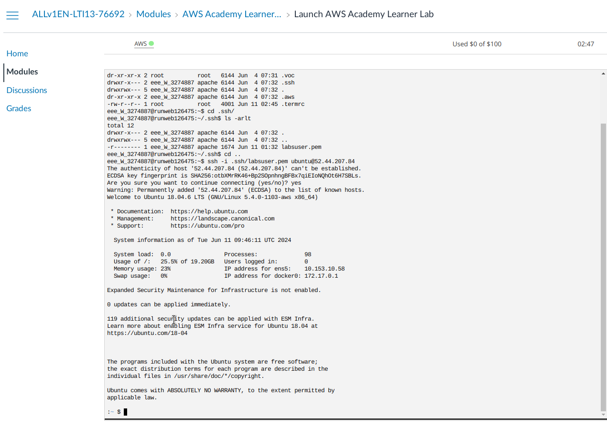\
Lanzamos algunos commandos\
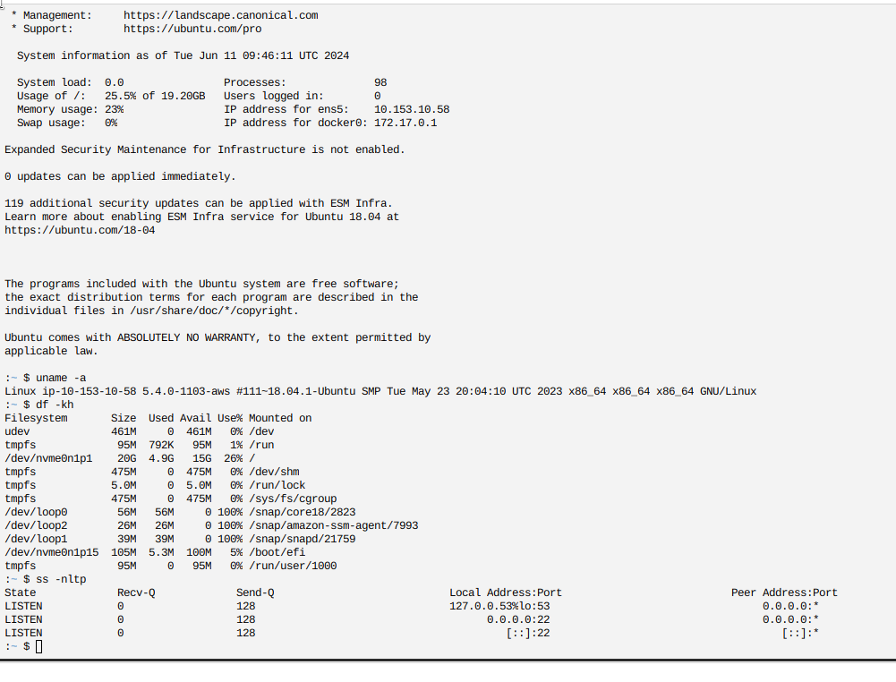

## Integración con Cloud9

:\`( no hay integración directa con terraform  asi que hay que hacerla a
mano.\
1.- Rellenamos con los datos de nuestra instancia\
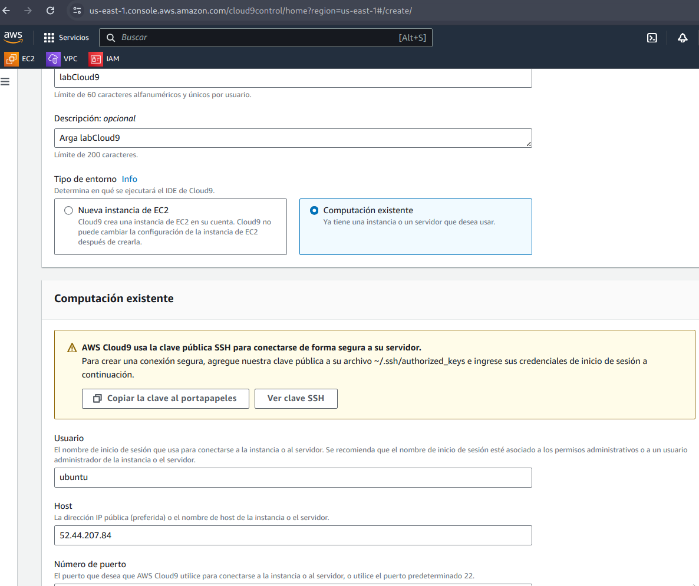\
2.- Desplegamos la clave publica en el autorized_keys en nuestro nodo.\
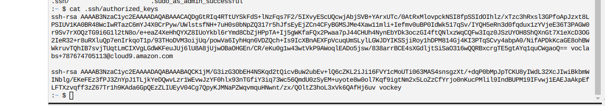\
3.- Se crea el entorno\
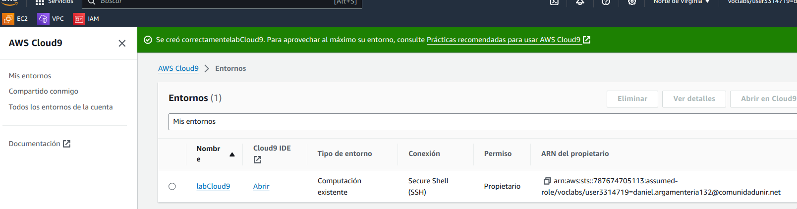

## Instalación de Jenkins

Para la instalación de jenkins hemos propuesto utilizar la funcionalidad
de ejecutar un script en la creación de la instancia

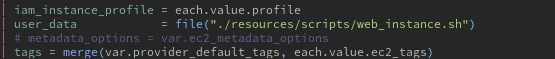

``` bash
#!/bin/bash
#
sudo wget -O /usr/share/keyrings/jenkins-keyring.asc \
  https://pkg.jenkins.io/debian-stable/jenkins.io-2023.key
echo "deb [signed-by=/usr/share/keyrings/jenkins-keyring.asc]" \
  https://pkg.jenkins.io/debian-stable binary/ | sudo tee \
  /etc/apt/sources.list.d/jenkins.list >/dev/null
sudo apt-get update
sudo apt-get install jenkins
```

Tambíen se ha probado a usar la consola de *Cloud9*
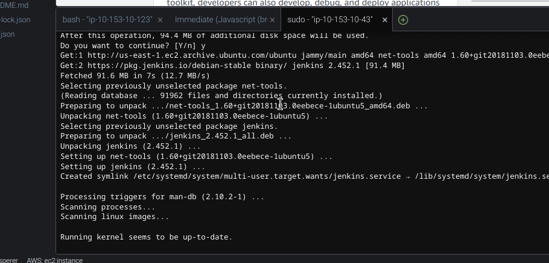

## Verificación de acceso a Jenkins

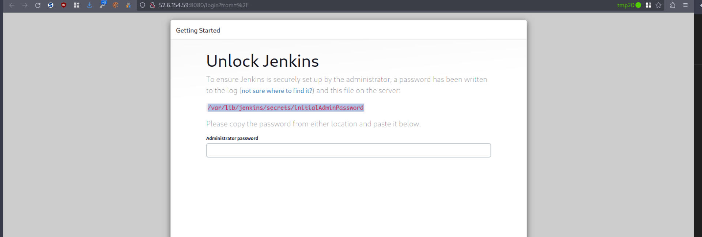
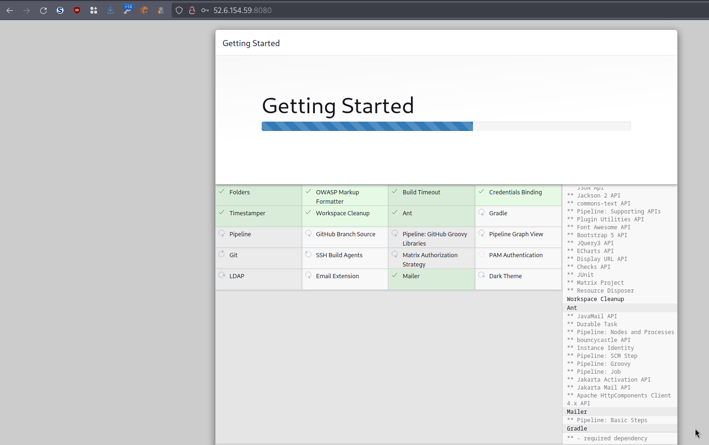
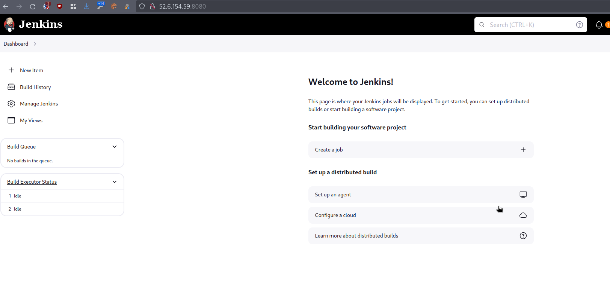

## Creación de una ip estática.

Nuestro propio codigo de *Terraform* nos permite asignar una *EIP*
durante el proceso de creación de la instancia. Tan solo hemos de
ajustar el parámetro `ec2_public_ip` en el mapa `ec2_instances` para la
instancia que precisemos una *EIP*

``` python
module "ec2_instances" {

  source = "terraform-aws-modules/ec2-instance/aws"

  for_each      = { for k, v in var.ec2_instances : k => v if v.enabled == true } #only enabled ones
  name          = each.key
  ami           = each.value.ec2_ami #!= "" ? each.value.ec2_ami : data.aws_ami.ami.id #use latest ami if no amiid is defined
  instance_type = each.value.ec2_instance_type

  associate_public_ip_address = each.value.ec2_public_ip == true ? true : false # get public ip or not
  root_block_device           = each.value.ec2_root_block_device
  #vpc_security_group_ids =  [local.sg_map[each.value.ec2_sg]]
  vpc_security_group_ids = [for sg in each.value.ec2_sgs : aws_security_group.sgs[sg].id]
  #key_name = resource.aws_key_pair.kp.key_name
  key_name = "vockey"
  #subnets are public or private 
  subnet_id = each.value.ec2_snet == "public" ? module.network.public_subnets[each.value.ec2_snet_index] : module.network.private_subnets[each.value.ec2_snet_index]

  iam_instance_profile = each.value.profile
  user_data            = file("./resources/scripts/web_instance.sh")
  # metadata_options = var.ec2_metadata_options
  tags = merge(var.provider_default_tags, each.value.ec2_tags)
}
```

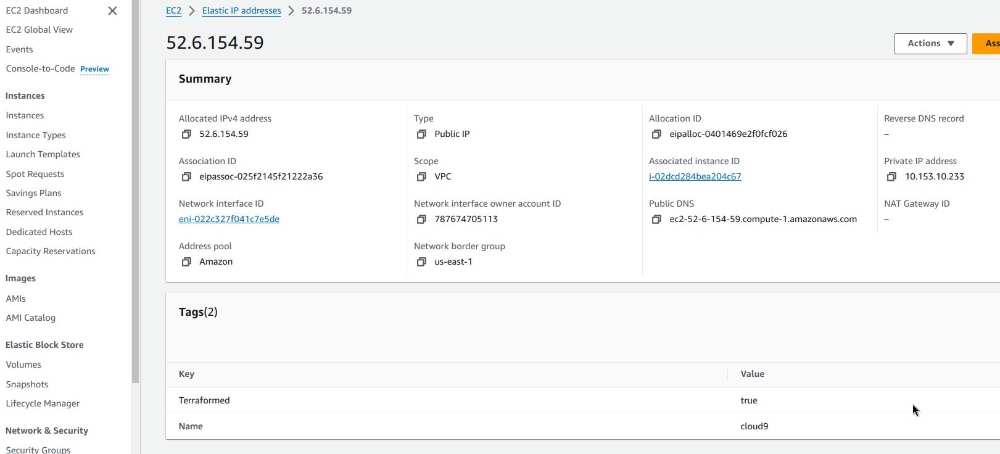
