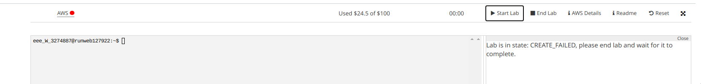
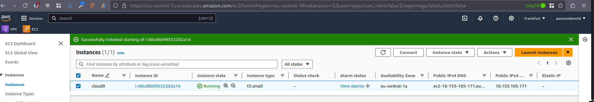
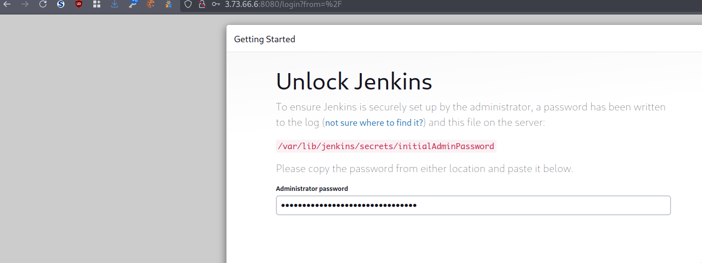
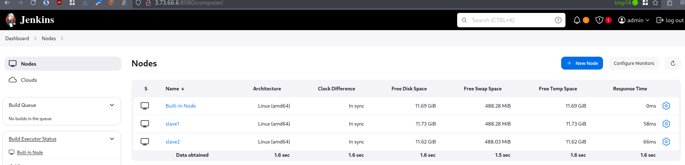
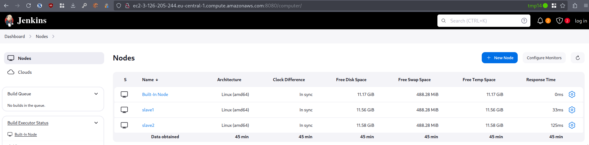
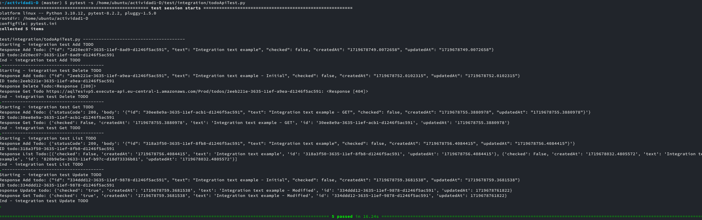
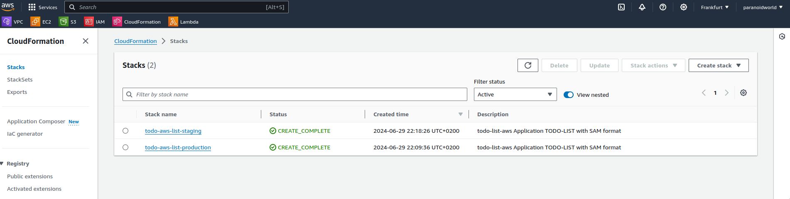
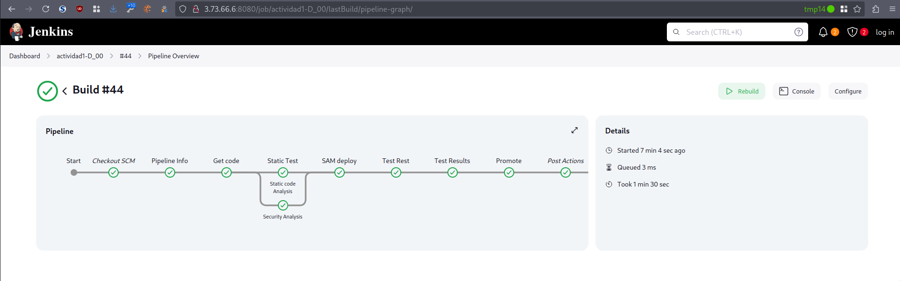
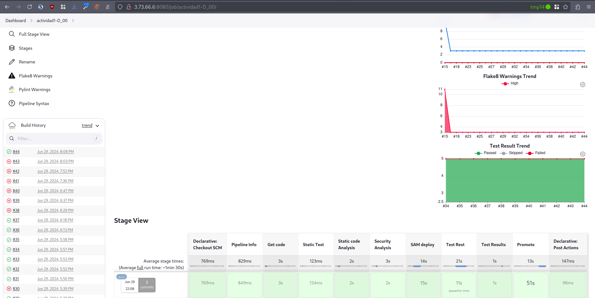

-   [Reto 1 -- Pipeline
    "CI"](#reto-1-pipeline-ci)
-   [NOTA IMPORTANTE](#nota-importante)
    -   [Creación de la infra en cuenta
        personal](#creación-de-la-infra-en-cuenta-personal)
    -   [Setup de infra](#setup-de-infra)
        -   [Jenkins](#jenkins)
-   [Obtención del
    código](#obtención-del-código)
-   [Etapas](#etapas)
    -   [Etapa "Get Code" para descargar el código fuente del
        repositorio (rama
        develop).](#etapa-get-code-para-descargar-el-código-fuente-del-repositorio-rama-develop.)
    -   [Etapa "Static Test" para la ejecución de las pruebas de
        análisis
        estático](#etapa-static-test-para-la-ejecución-de-las-pruebas-de-análisis-estático)
    -   [Etapa de despliegue SAM
        ("Deploy")](#etapa-de-despliegue-sam-deploy)
        -   [Despliegue preliminar utilizando sam
            deploy](#despliegue-preliminar-utilizando-sam-deploy)
        -   [Execution log](#execution-log)
    -   [Etapa "Rest Test"](#etapa-rest-test)
    -   [Etapa "Promote"](#etapa-promote)
        -   [Pipeline](#pipeline)
        -   [Log de ejecución](#log-de-ejecución)

# Reto 1 -- Pipeline "CI"

# NOTA IMPORTANTE

Debido causas inesperadas el laboratorio ha dejado de funcionar. Para
poder continuar a partir de ahora utilizaremos una cuenta personal de
AWS.



## Creación de la infra en cuenta personal

El lab como se dice tecnicamente está mirando para la cuenca minera.
Para salir del paso creamo con *OpenTofu* la infra, y para que lo vamos
a negar probamos *OpenTofu*. A priori los modulos de S3 y EC2 funcionan
correctaente y la velocidad de creación del plan y ejecución parace
mejorar.

``` python
mtls_private_key.pk: Refreshing state... [id=889cc0d9fecf3678020195882f428f6da29cf03e]
module.s3_server_anjana_buckets["marga-deploy-bucket"].data.aws_partition.current: Reading...
module.s3_server_anjana_buckets["marga-deploy-bucket"].data.aws_region.current: Reading...
module.ec2_instances["cloud9"].data.aws_partition.current: Reading...
module.s3_server_anjana_buckets["marga-deploy-bucket-staging"].data.aws_region.current: Reading...
module.s3_server_anjana_buckets["marga-deploy-bucket-prod"].data.aws_region.current: Reading...
module.ec2_instances["slave1"].data.aws_partition.current: Reading...
module.ec2_instances["slave2"].data.aws_partition.current: Reading...
aws_key_pair.kp: Refreshing state... [id=unir_key]
module.network.aws_vpc.this[0]: Refreshing state... [id=vpc-04794989594da890f]
aws_eip.nat[0]: Refreshing state... [id=eipalloc-0edbafb279709d9a8]
module.ec2_instances["cloud9"].data.aws_partition.current: Read complete after 0s [id=aws]
module.s3_server_anjana_buckets["marga-deploy-bucket"].data.aws_partition.current: Read complete after 0s [id=aws]
module.s3_server_anjana_buckets["marga-deploy-bucket-staging"].data.aws_region.current: Read complete after 0s [id=eu-central-1]
module.s3_server_anjana_buckets["marga-deploy-bucket-prod"].data.aws_region.current: Read complete after 0s [id=eu-central-1]
module.s3_server_anjana_buckets["marga-deploy-bucket"].data.aws_region.current: Read complete after 0s [id=eu-central-1]
module.ec2_instances["slave2"].data.aws_partition.current: Read complete after 0s [id=aws]
module.ec2_instances["slave1"].data.aws_partition.current: Read complete after 0s [id=aws]
module.s3_server_anjana_buckets["marga-deploy-bucket-prod"].data.aws_partition.current: Reading...
module.s3_server_anjana_buckets["marga-deploy-bucket"].data.aws_caller_identity.current: Reading...
module.s3_server_anjana_buckets["marga-deploy-bucket-staging"].data.aws_caller_identity.current: Reading...
module.s3_server_anjana_buckets["marga-deploy-bucket-staging"].data.aws_partition.current: Reading...
module.s3_server_anjana_buckets["marga-deploy-bucket-prod"].data.aws_partition.current: Read complete after 0s [id=aws]
module.s3_server_anjana_buckets["marga-deploy-bucket-prod"].data.aws_caller_identity.current: Reading...
module.s3_server_anjana_buckets["marga-deploy-bucket-prod"].aws_s3_bucket.this[0]: Refreshing state... [id=marga-deploy-bucket-prod-unir]
module.s3_server_anjana_buckets["marga-deploy-bucket-staging"].data.aws_partition.current: Read complete after 0s [id=aws]
module.s3_server_anjana_buckets["marga-deploy-bucket"].aws_s3_bucket.this[0]: Refreshing state... [id=marga-deploy-bucket-unir]
module.s3_server_anjana_buckets["marga-deploy-bucket-staging"].aws_s3_bucket.this[0]: Refreshing state... [id=marga-deploy-bucket-staging-unir]
module.s3_server_anjana_buckets["marga-deploy-bucket-prod"].data.aws_caller_identity.current: Read complete after 1s [id=851725263660]
module.s3_server_anjana_buckets["marga-deploy-bucket"].data.aws_caller_identity.current: Read complete after 1s [id=851725263660]
module.s3_server_anjana_buckets["marga-deploy-bucket-staging"].data.aws_caller_identity.current: Read complete after 1s [id=851725263660]
local_file.ssh_key: Refreshing state... [id=7abc0016bc9b0c0fdf9cdfecf17eef829122cbd1]
module.s3_server_anjana_buckets["marga-deploy-bucket-staging"].aws_s3_bucket_public_access_block.this[0]: Refreshing state... [id=marga-deploy-bucket-staging-unir]
module.s3_server_anjana_buckets["marga-deploy-bucket"].aws_s3_bucket_public_access_block.this[0]: Refreshing state... [id=marga-deploy-bucket-unir]
module.s3_server_anjana_buckets["marga-deploy-bucket-prod"].aws_s3_bucket_public_access_block.this[0]: Refreshing state... [id=marga-deploy-bucket-prod-unir]
module.s3_server_anjana_buckets["marga-deploy-bucket"].aws_s3_bucket_server_side_encryption_configuration.this[0]: Refreshing state... [id=marga-deploy-bucket-unir]
module.s3_server_anjana_buckets["marga-deploy-bucket-prod"].aws_s3_bucket_server_side_encryption_configuration.this[0]: Refreshing state... [id=marga-deploy-bucket-prod-unir]
module.s3_server_anjana_buckets["marga-deploy-bucket-staging"].aws_s3_bucket_server_side_encryption_configuration.this[0]: Refreshing state... [id=marga-deploy-bucket-staging-unir]
module.s3_server_anjana_buckets["marga-deploy-bucket-prod"].aws_s3_bucket_versioning.this[0]: Refreshing state... [id=marga-deploy-bucket-prod-unir]
module.s3_server_anjana_buckets["marga-deploy-bucket-staging"].aws_s3_bucket_versioning.this[0]: Refreshing state... [id=marga-deploy-bucket-staging-unir]
module.s3_server_anjana_buckets["marga-deploy-bucket"].aws_s3_bucket_versioning.this[0]: Refreshing state... [id=marga-deploy-bucket-unir]
module.network.aws_default_route_table.default[0]: Refreshing state... [id=rtb-08628a128b856673c]
module.network.aws_default_security_group.this[0]: Refreshing state... [id=sg-02b6546f23896b95e]
module.network.aws_default_network_acl.this[0]: Refreshing state... [id=acl-05301e7f9c63950d0]
aws_security_group.sgs["sg1"]: Refreshing state... [id=sg-06abd86bcf84971ed]
module.network.aws_internet_gateway.this[0]: Refreshing state... [id=igw-02f11c45a4a805a54]
module.network.aws_subnet.public[0]: Refreshing state... [id=subnet-02c0ae1e31c749564]
module.network.aws_route_table.public[0]: Refreshing state... [id=rtb-06ded54828e098634]
module.network.aws_subnet.private[0]: Refreshing state... [id=subnet-0caa5ee24b28e4e09]
module.network.aws_route_table.private[0]: Refreshing state... [id=rtb-06edfabfc0f7f49bf]
module.s3_server_anjana_buckets["marga-deploy-bucket-prod"].aws_s3_bucket_ownership_controls.this[0]: Refreshing state... [id=marga-deploy-bucket-prod-unir]
module.s3_server_anjana_buckets["marga-deploy-bucket-staging"].aws_s3_bucket_ownership_controls.this[0]: Refreshing state... [id=marga-deploy-bucket-staging-unir]
module.s3_server_anjana_buckets["marga-deploy-bucket"].aws_s3_bucket_ownership_controls.this[0]: Refreshing state... [id=marga-deploy-bucket-unir]
module.network.aws_route.public_internet_gateway[0]: Refreshing state... [id=r-rtb-06ded54828e0986341080289494]
aws_security_group_rule.sgs["sg1-5ad83e7d4e588d806af027fb0f593b8c9f04ddaf"]: Refreshing state... [id=sgrule-2418148359]
aws_security_group_rule.sgs["sg1-e48bbcaa2fb503cdf50212816a9bd5e5b141357c"]: Refreshing state... [id=sgrule-2665842902]
aws_security_group_rule.sgs["sg1-7aec3e15e69e473a2e02d5f8b28557b751954a69"]: Refreshing state... [id=sgrule-4099692999]
aws_security_group_rule.sgs["sg1-820b47df9099455e54e7cd2dbe2cd994327e6511"]: Refreshing state... [id=sgrule-2998972103]
aws_security_group_rule.sgs["sg1-f9cc8b72408c8b829305f7197d165eb17216fa36"]: Refreshing state... [id=sgrule-1302316501]
aws_security_group_rule.sgs["sg1-1e08eb3aab5d072f0f2b77cc7dd299401714a17c"]: Refreshing state... [id=sgrule-2236946107]
aws_security_group_rule.sgs["sg1-27326918809d64a15f7bde6f77b99d374a332804"]: Refreshing state... [id=sgrule-3522010209]
module.network.aws_nat_gateway.this[0]: Refreshing state... [id=nat-07227650f9175cb55]
module.network.aws_route_table_association.public[0]: Refreshing state... [id=rtbassoc-0159fce0e8f7833a2]
module.network.aws_route_table_association.private[0]: Refreshing state... [id=rtbassoc-03bec352ff3fbc051]
module.ec2_instances["slave1"].aws_instance.this[0]: Refreshing state... [id=i-090a7a30d5ef6a62d]
module.ec2_instances["slave2"].aws_instance.this[0]: Refreshing state... [id=i-00de5a4cb4d55f3a6]
module.ec2_instances["cloud9"].aws_instance.this[0]: Refreshing state... [id=i-0f76227e4b0a41031]
module.network.aws_route.private_nat_gateway[0]: Refreshing state... [id=r-rtb-06edfabfc0f7f49bf1080289494]
```

Le damos al play

    # aws_eip.nat[0]:
    resource "aws_eip" "nat" {
        allocation_id        = "eipalloc-0edbafb279709d9a8"
        arn                  = "arn:aws:ec2:eu-central-1:851725263660:elastic-ip/eipalloc-0edbafb279709d9a8"
        association_id       = "eipassoc-0a21e4cfb5d298156"
        domain               = "vpc"
        id                   = "eipalloc-0edbafb279709d9a8"
        network_border_group = "eu-central-1"
        network_interface    = "eni-0abb8c7ca1508bc1c"
        private_dns          = "ip-10-153-10-206.eu-central-1.compute.internal"
        private_ip           = "10.153.10.206"
        public_dns           = "ec2-18-184-238-142.eu-central-1.compute.amazonaws.com"
        public_ip            = "18.184.238.142"
        public_ipv4_pool     = "amazon"
        tags                 = {
            "Name" = "eip_pub_snet_a"
        }
        tags_all             = {
            "Name" = "eip_pub_snet_a"
        }
        vpc                  = true
    }

    # aws_key_pair.kp:
    resource "aws_key_pair" "kp" {
        arn         = "arn:aws:ec2:eu-central-1:851725263660:key-pair/unir_key"
        fingerprint = "fd:4d:71:00:05:ad:8d:f7:17:5e:55:7d:fb:8e:8c:ca"
        id          = "unir_key"
        key_name    = "unir_key"
        key_pair_id = "key-05c9edb12d828258d"
        key_type    = "rsa"
        public_key  = "ssh-rsa AAAAB3NzaC1yc2EAAAADAQABAAABAQC10DpfEnj3b8GPyihYCr4UOxHwHxDnh/QxtUD1y95zbehV3JqG7sfM+nMwCKB1AB/riwLKMQBgBgIeDDJCZDO+rD3lFGJ4j0bfB53aaSn6kFKIzWQW8d5vtTX2OCYXNCLr0ob00NwEzVCueyNV6S/bYSg6ZZGgiUTkINcmATSqVquBVYtYtwGwlX+MqcWhEbso8Iu0fSY/LHYdAgGyxseWNyvo2GHW2mUee7rQ4Exq3qPXds9eK+8tJdMJf0yEUySWbSyRmwCLS5NKqh+AhcbrKiM3eW50tKzdawJhlxekUUk8WuTksdcG/sOAlaOT7ymB/nFHbrtnWmTRlLIjh13r"
        tags        = {}
        tags_all    = {}
    }

    # aws_security_group.sgs["sg1"]:
    resource "aws_security_group" "sgs" {
        arn                    = "arn:aws:ec2:eu-central-1:851725263660:security-group/sg-06abd86bcf84971ed"
        description            = "SG for the massess"
        egress                 = [
            {
                cidr_blocks      = [
                    "0.0.0.0/0",
                ]
                description      = "Default egress rule [tf]"
                from_port        = 0
                ipv6_cidr_blocks = []
                prefix_list_ids  = []
                protocol         = "-1"
                security_groups  = []
                self             = false
                to_port          = 0
            },
        ]
        id                     = "sg-06abd86bcf84971ed"
        ingress                = [
            {
                cidr_blocks      = [
                    "0.0.0.0/0",
                ]
                description      = "Allow https [tf]"
                from_port        = 22
                ipv6_cidr_blocks = []
                prefix_list_ids  = []
                protocol         = "tcp"
                security_groups  = []
                self             = false
                to_port          = 22
            },
            {
                cidr_blocks      = [
                    "213.195.126.222/32",
                ]
                description      = "Allow 8080 [tf]"
                from_port        = 8080
                ipv6_cidr_blocks = []
                prefix_list_ids  = []
                protocol         = "tcp"
                security_groups  = []
                self             = false
                to_port          = 8080
            },
            {
                cidr_blocks      = [
                    "213.195.126.222/32",
                ]
                description      = "Allow http [tf]"
                from_port        = 80
                ipv6_cidr_blocks = []
                prefix_list_ids  = []
                protocol         = "tcp"
                security_groups  = []
                self             = false
                to_port          = 80
            },
            {
                cidr_blocks      = [
                    "213.195.126.222/32",
                ]
                description      = "Allow https [tf]"
                from_port        = 443
                ipv6_cidr_blocks = []
                prefix_list_ids  = []
                protocol         = "tcp"
                security_groups  = []
                self             = false
                to_port          = 443
            },
            {
                cidr_blocks      = [
                    "213.195.126.222/32",
                ]
                description      = "Allow ssh  [tf]"
                from_port        = 22
                ipv6_cidr_blocks = []
                prefix_list_ids  = []
                protocol         = "tcp"
                security_groups  = []
                self             = false
                to_port          = 22
            },
            {
                cidr_blocks      = [
                    "3.126.205.244/32",
                ]
                description      = "Allow https [tf]"
                from_port        = 22
                ipv6_cidr_blocks = []
                prefix_list_ids  = []
                protocol         = "tcp"
                security_groups  = []
                self             = false
                to_port          = 22
            },
        ]
        name                   = "sg1"
        owner_id               = "851725263660"
        revoke_rules_on_delete = false
        tags                   = {
            "Name" = "sg1"
        }
        tags_all               = {
            "Name" = "sg1"
        }
        vpc_id                 = "vpc-04794989594da890f"
    }

    # aws_security_group_rule.sgs["sg1-1e08eb3aab5d072f0f2b77cc7dd299401714a17c"]:
    resource "aws_security_group_rule" "sgs" {
        cidr_blocks            = [
            "213.195.126.222/32",
        ]
        description            = "Allow https [tf]"
        from_port              = 443
        id                     = "sgrule-2236946107"
        protocol               = "tcp"
        security_group_id      = "sg-06abd86bcf84971ed"
        security_group_rule_id = "sgr-0642e7e4aa81bda41"
        self                   = false
        to_port                = 443
        type                   = "ingress"
    }

    # aws_security_group_rule.sgs["sg1-27326918809d64a15f7bde6f77b99d374a332804"]:
    resource "aws_security_group_rule" "sgs" {
        cidr_blocks            = [
            "3.126.205.244/32",
        ]
        description            = "Allow https [tf]"
        from_port              = 22
        id                     = "sgrule-3522010209"
        protocol               = "tcp"
        security_group_id      = "sg-06abd86bcf84971ed"
        security_group_rule_id = "sgr-0ca5f5831db23e1f6"
        self                   = false
        to_port                = 22
        type                   = "ingress"
    }

    # aws_security_group_rule.sgs["sg1-5ad83e7d4e588d806af027fb0f593b8c9f04ddaf"]:
    resource "aws_security_group_rule" "sgs" {
        cidr_blocks            = [
            "213.195.126.222/32",
        ]
        description            = "Allow 8080 [tf]"
        from_port              = 8080
        id                     = "sgrule-2418148359"
        protocol               = "tcp"
        security_group_id      = "sg-06abd86bcf84971ed"
        security_group_rule_id = "sgr-0a3a54ac2349b0071"
        self                   = false
        to_port                = 8080
        type                   = "ingress"
    }

    # aws_security_group_rule.sgs["sg1-7aec3e15e69e473a2e02d5f8b28557b751954a69"]:
    resource "aws_security_group_rule" "sgs" {
        cidr_blocks            = [
            "0.0.0.0/0",
        ]
        description            = "Default egress rule [tf]"
        from_port              = 0
        id                     = "sgrule-4099692999"
        protocol               = "-1"
        security_group_id      = "sg-06abd86bcf84971ed"
        security_group_rule_id = "sgr-06a6c030300ad912e"
        self                   = false
        to_port                = 0
        type                   = "egress"
    }

    # aws_security_group_rule.sgs["sg1-820b47df9099455e54e7cd2dbe2cd994327e6511"]:
    resource "aws_security_group_rule" "sgs" {
        cidr_blocks            = [
            "213.195.126.222/32",
        ]
        description            = "Allow http [tf]"
        from_port              = 80
        id                     = "sgrule-2998972103"
        protocol               = "tcp"
        security_group_id      = "sg-06abd86bcf84971ed"
        security_group_rule_id = "sgr-06d194b2f0d5a6162"
        self                   = false
        to_port                = 80
        type                   = "ingress"
    }

    # aws_security_group_rule.sgs["sg1-e48bbcaa2fb503cdf50212816a9bd5e5b141357c"]:
    resource "aws_security_group_rule" "sgs" {
        cidr_blocks            = [
            "213.195.126.222/32",
        ]
        description            = "Allow ssh  [tf]"
        from_port              = 22
        id                     = "sgrule-2665842902"
        protocol               = "tcp"
        security_group_id      = "sg-06abd86bcf84971ed"
        security_group_rule_id = "sgr-05742b725700e6af8"
        self                   = false
        to_port                = 22
        type                   = "ingress"
    }

    # aws_security_group_rule.sgs["sg1-f9cc8b72408c8b829305f7197d165eb17216fa36"]:
    resource "aws_security_group_rule" "sgs" {
        cidr_blocks            = [
            "0.0.0.0/0",
        ]
        description            = "Allow https [tf]"
        from_port              = 22
        id                     = "sgrule-1302316501"
        protocol               = "tcp"
        security_group_id      = "sg-06abd86bcf84971ed"
        security_group_rule_id = "sgr-023ee67412feb86a3"
        self                   = false
        to_port                = 22
        type                   = "ingress"
    }

    # local_file.ssh_key:
    resource "local_file" "ssh_key" {
        content              = (sensitive value)
        content_base64sha256 = "SHxqtAsTti47N/iTVkpfHO8vUQ2n1E0I43VBK4RWEhA="
        content_base64sha512 = "ru+ZhiIX5fQvCRo1TACKtQdi+DBTNuJtAT6/xAlAG7BUGBqJ1z8v1bC4YVMn44EHnrA5/RXFf2kxnMfCnUWgsg=="
        content_md5          = "a22784d8fa29708921f210d42ec536c1"
        content_sha1         = "7abc0016bc9b0c0fdf9cdfecf17eef829122cbd1"
        content_sha256       = "487c6ab40b13b62e3b37f893564a5f1cef2f510da7d44d08e375412b84561210"
        content_sha512       = "aeef99862217e5f42f091a354c008ab50762f8305336e26d013ebfc409401bb054181a89d73f2fd5b0b8615327e381079eb039fd15c57f69319cc7c29d45a0b2"
        directory_permission = "0777"
        file_permission      = "600"
        filename             = "global_resources/unir/unir_key.pem"
        id                   = "7abc0016bc9b0c0fdf9cdfecf17eef829122cbd1"
    }

    # tls_private_key.pk:
    resource "tls_private_key" "pk" {
        algorithm                     = "RSA"
        ecdsa_curve                   = "P224"
        id                            = "889cc0d9fecf3678020195882f428f6da29cf03e"
        private_key_openssh           = (sensitive value)
        private_key_pem               = (sensitive value)
        private_key_pem_pkcs8         = (sensitive value)
        public_key_fingerprint_md5    = "3f:98:b9:2f:87:96:fd:5b:7f:4c:59:14:35:04:67:89"
        public_key_fingerprint_sha256 = "SHA256:QhhXv15Fsb6H/B0i7ucD7n72K0XkfJtXl7fBl2LFHng"
        public_key_openssh            = <<-EOT
            ssh-rsa AAAAB3NzaC1yc2EAAAADAQABAAABAQC10DpfEnj3b8GPyihYCr4UOxHwHxDnh/QxtUD1y95zbehV3JqG7sfM+nMwCKB1AB/riwLKMQBgBgIeDDJCZDO+rD3lFGJ4j0bfB53aaSn6kFKIzWQW8d5vtTX2OCYXNCLr0ob00NwEzVCueyNV6S/bYSg6ZZGgiUTkINcmATSqVquBVYtYtwGwlX+MqcWhEbso8Iu0fSY/LHYdAgGyxseWNyvo2GHW2mUee7rQ4Exq3qPXds9eK+8tJdMJf0yEUySWbSyRmwCLS5NKqh+AhcbrKiM3eW50tKzdawJhlxekUUk8WuTksdcG/sOAlaOT7ymB/nFHbrtnWmTRlLIjh13r
        EOT
        public_key_pem                = <<-EOT
            -----BEGIN PUBLIC KEY-----
            MIIBIjANBgkqhkiG9w0BAQEFAAOCAQ8AMIIBCgKCAQEAtdA6XxJ492/Bj8ooWAq+
            FDsR8B8Q54f0MbVA9cvec23oVdyahu7HzPpzMAigdQAf64sCyjEAYAYCHgwyQmQz
            vqw95RRieI9G3wed2mkp+pBSiM1kFvHeb7U19jgmFzQi69KG9NDcBM1QrnsjVekv
            22EoOmWRoIlE5CDXJgE0qlargVWLWLcBsJV/jKnFoRG7KPCLtH0mPyx2HQIBssbH
            ljcr6Nhh1tplHnu60OBMat6j13bPXivvLSXTCX9MhFMklm0skZsAi0uTSqofgIXG
            6yojN3ludLSs3WsCYZcXpFFJPFrk5LHXBv7DgJWjk+8pgf5xR267Z1pk0ZSyI4dd
            6wIDAQAB
            -----END PUBLIC KEY-----
        EOT
        rsa_bits                      = 2048
    }


    # module.ec2_instances["cloud9"].data.aws_partition.current:
    data "aws_partition" "current" {
        dns_suffix         = "amazonaws.com"
        id                 = "aws"
        partition          = "aws"
        reverse_dns_prefix = "com.amazonaws"
    }

    # module.ec2_instances["cloud9"].aws_instance.this[0]:
    resource "aws_instance" "this" {
        ami                                  = "ami-0d6fe2b9878a33fa8"
        arn                                  = "arn:aws:ec2:eu-central-1:851725263660:instance/i-0f76227e4b0a41031"
        associate_public_ip_address          = true
        availability_zone                    = "eu-central-1c"
        cpu_core_count                       = 1
        cpu_threads_per_core                 = 2
        disable_api_stop                     = false
        disable_api_termination              = false
        ebs_optimized                        = false
        get_password_data                    = false
        hibernation                          = false
        id                                   = "i-0f76227e4b0a41031"
        instance_initiated_shutdown_behavior = "stop"
        instance_state                       = "running"
        instance_type                        = "t3.medium"
        ipv6_address_count                   = 0
        ipv6_addresses                       = []
        key_name                             = "unir_key"
        monitoring                           = false
        placement_partition_number           = 0
        primary_network_interface_id         = "eni-0946a742a94862808"
        private_dns                          = "ip-10-153-10-188.eu-central-1.compute.internal"
        private_ip                           = "10.153.10.188"
        public_dns                           = "ec2-3-126-205-244.eu-central-1.compute.amazonaws.com"
        public_ip                            = "3.126.205.244"
        secondary_private_ips                = []
        security_groups                      = []
        source_dest_check                    = true
        subnet_id                            = "subnet-02c0ae1e31c749564"
        tags                                 = {
            "Name"        = "cloud9"
            "environment" = "unir"
            "scheduled"   = "workdays"
            "terraform"   = "true"
        }
        tags_all                             = {
            "Name"        = "cloud9"
            "environment" = "unir"
            "scheduled"   = "workdays"
            "terraform"   = "true"
        }
        tenancy                              = "default"
        user_data                            = "d50e668d749936c440f04828ddcad96512b2b81b"
        user_data_replace_on_change          = false
        volume_tags                          = {
            "Name" = "cloud9"
        }
        vpc_security_group_ids               = [
            "sg-06abd86bcf84971ed",
        ]

        capacity_reservation_specification {
            capacity_reservation_preference = "open"
        }

        cpu_options {
            core_count       = 1
            threads_per_core = 2
        }

        credit_specification {
            cpu_credits = "unlimited"
        }

        enclave_options {
            enabled = false
        }

        maintenance_options {
            auto_recovery = "default"
        }

        metadata_options {
            http_endpoint               = "enabled"
            http_protocol_ipv6          = "disabled"
            http_put_response_hop_limit = 1
            http_tokens                 = "optional"
            instance_metadata_tags      = "disabled"
        }

        private_dns_name_options {
            enable_resource_name_dns_a_record    = false
            enable_resource_name_dns_aaaa_record = false
            hostname_type                        = "ip-name"
        }

        root_block_device {
            delete_on_termination = true
            device_name           = "/dev/sda1"
            encrypted             = true
            iops                  = 100
            kms_key_id            = "arn:aws:kms:eu-central-1:851725263660:key/4fcf07d2-9acc-45d8-9e0a-7b8b52f90bea"
            tags                  = {}
            tags_all              = {}
            throughput            = 0
            volume_id             = "vol-059e85cac76fdf954"
            volume_size           = 20
            volume_type           = "gp2"
        }

        timeouts {}
    }


    # module.ec2_instances["slave1"].data.aws_partition.current:
    data "aws_partition" "current" {
        dns_suffix         = "amazonaws.com"
        id                 = "aws"
        partition          = "aws"
        reverse_dns_prefix = "com.amazonaws"
    }

    # module.ec2_instances["slave1"].aws_instance.this[0]:
    resource "aws_instance" "this" {
        ami                                  = "ami-0d6fe2b9878a33fa8"
        arn                                  = "arn:aws:ec2:eu-central-1:851725263660:instance/i-090a7a30d5ef6a62d"
        associate_public_ip_address          = true
        availability_zone                    = "eu-central-1c"
        cpu_core_count                       = 1
        cpu_threads_per_core                 = 2
        disable_api_stop                     = false
        disable_api_termination              = false
        ebs_optimized                        = false
        get_password_data                    = false
        hibernation                          = false
        iam_instance_profile                 = "LabInstanceProfile"
        id                                   = "i-090a7a30d5ef6a62d"
        instance_initiated_shutdown_behavior = "stop"
        instance_state                       = "running"
        instance_type                        = "t3.small"
        ipv6_address_count                   = 0
        ipv6_addresses                       = []
        key_name                             = "unir_key"
        monitoring                           = false
        placement_partition_number           = 0
        primary_network_interface_id         = "eni-0d41891164ef61775"
        private_dns                          = "ip-10-153-10-174.eu-central-1.compute.internal"
        private_ip                           = "10.153.10.174"
        public_dns                           = "ec2-3-69-255-37.eu-central-1.compute.amazonaws.com"
        public_ip                            = "3.69.255.37"
        secondary_private_ips                = []
        security_groups                      = []
        source_dest_check                    = true
        subnet_id                            = "subnet-02c0ae1e31c749564"
        tags                                 = {
            "Name"        = "slave1"
            "environment" = "unir"
            "scheduled"   = "workdays"
            "terraform"   = "true"
        }
        tags_all                             = {
            "Name"        = "slave1"
            "environment" = "unir"
            "scheduled"   = "workdays"
            "terraform"   = "true"
        }
        tenancy                              = "default"
        user_data                            = "f4846c898e86c1bb299f493d11d5ce36de7d92ad"
        user_data_replace_on_change          = false
        volume_tags                          = {
            "Name" = "slave1"
        }
        vpc_security_group_ids               = [
            "sg-06abd86bcf84971ed",
        ]

        capacity_reservation_specification {
            capacity_reservation_preference = "open"
        }

        cpu_options {
            core_count       = 1
            threads_per_core = 2
        }

        credit_specification {
            cpu_credits = "unlimited"
        }

        enclave_options {
            enabled = false
        }

        maintenance_options {
            auto_recovery = "default"
        }

        metadata_options {
            http_endpoint               = "enabled"
            http_protocol_ipv6          = "disabled"
            http_put_response_hop_limit = 1
            http_tokens                 = "optional"
            instance_metadata_tags      = "disabled"
        }

        private_dns_name_options {
            enable_resource_name_dns_a_record    = false
            enable_resource_name_dns_aaaa_record = false
            hostname_type                        = "ip-name"
        }

        root_block_device {
            delete_on_termination = true
            device_name           = "/dev/sda1"
            encrypted             = true
            iops                  = 100
            kms_key_id            = "arn:aws:kms:eu-central-1:851725263660:key/4fcf07d2-9acc-45d8-9e0a-7b8b52f90bea"
            tags                  = {}
            tags_all              = {}
            throughput            = 0
            volume_id             = "vol-09d208aa69251ef44"
            volume_size           = 20
            volume_type           = "gp2"
        }

        timeouts {}
    }


    # module.ec2_instances["slave2"].data.aws_partition.current:
    data "aws_partition" "current" {
        dns_suffix         = "amazonaws.com"
        id                 = "aws"
        partition          = "aws"
        reverse_dns_prefix = "com.amazonaws"
    }

    # module.ec2_instances["slave2"].aws_instance.this[0]:
    resource "aws_instance" "this" {
        ami                                  = "ami-0d6fe2b9878a33fa8"
        arn                                  = "arn:aws:ec2:eu-central-1:851725263660:instance/i-00de5a4cb4d55f3a6"
        associate_public_ip_address          = true
        availability_zone                    = "eu-central-1c"
        cpu_core_count                       = 1
        cpu_threads_per_core                 = 2
        disable_api_stop                     = false
        disable_api_termination              = false
        ebs_optimized                        = false
        get_password_data                    = false
        hibernation                          = false
        id                                   = "i-00de5a4cb4d55f3a6"
        instance_initiated_shutdown_behavior = "stop"
        instance_state                       = "running"
        instance_type                        = "t3.small"
        ipv6_address_count                   = 0
        ipv6_addresses                       = []
        key_name                             = "unir_key"
        monitoring                           = false
        placement_partition_number           = 0
        primary_network_interface_id         = "eni-0dbf5423637bb60ef"
        private_dns                          = "ip-10-153-10-218.eu-central-1.compute.internal"
        private_ip                           = "10.153.10.218"
        public_dns                           = "ec2-3-72-96-89.eu-central-1.compute.amazonaws.com"
        public_ip                            = "3.72.96.89"
        secondary_private_ips                = []
        security_groups                      = []
        source_dest_check                    = true
        subnet_id                            = "subnet-02c0ae1e31c749564"
        tags                                 = {
            "Name"        = "slave2"
            "environment" = "unir"
            "scheduled"   = "workdays"
            "terraform"   = "true"
        }
        tags_all                             = {
            "Name"        = "slave2"
            "environment" = "unir"
            "scheduled"   = "workdays"
            "terraform"   = "true"
        }
        tenancy                              = "default"
        user_data                            = "f4846c898e86c1bb299f493d11d5ce36de7d92ad"
        user_data_replace_on_change          = false
        volume_tags                          = {
            "Name" = "slave2"
        }
        vpc_security_group_ids               = [
            "sg-06abd86bcf84971ed",
        ]

        capacity_reservation_specification {
            capacity_reservation_preference = "open"
        }

        cpu_options {
            core_count       = 1
            threads_per_core = 2
        }

        credit_specification {
            cpu_credits = "unlimited"
        }

        enclave_options {
            enabled = false
        }

        maintenance_options {
            auto_recovery = "default"
        }

        metadata_options {
            http_endpoint               = "enabled"
            http_protocol_ipv6          = "disabled"
            http_put_response_hop_limit = 1
            http_tokens                 = "optional"
            instance_metadata_tags      = "disabled"
        }

        private_dns_name_options {
            enable_resource_name_dns_a_record    = false
            enable_resource_name_dns_aaaa_record = false
            hostname_type                        = "ip-name"
        }

        root_block_device {
            delete_on_termination = true
            device_name           = "/dev/sda1"
            encrypted             = true
            iops                  = 100
            kms_key_id            = "arn:aws:kms:eu-central-1:851725263660:key/4fcf07d2-9acc-45d8-9e0a-7b8b52f90bea"
            tags                  = {}
            tags_all              = {}
            throughput            = 0
            volume_id             = "vol-0bf1f76c6bc63afae"
            volume_size           = 20
            volume_type           = "gp2"
        }

        timeouts {}
    }


    # module.network.aws_default_network_acl.this[0]:
    resource "aws_default_network_acl" "this" {
        arn                    = "arn:aws:ec2:eu-central-1:851725263660:network-acl/acl-05301e7f9c63950d0"
        default_network_acl_id = "acl-05301e7f9c63950d0"
        id                     = "acl-05301e7f9c63950d0"
        owner_id               = "851725263660"
        subnet_ids             = [
            "subnet-02c0ae1e31c749564",
            "subnet-0caa5ee24b28e4e09",
        ]
        tags                   = {
            "Name" = "vpc-unir-default"
        }
        tags_all               = {
            "Name" = "vpc-unir-default"
        }
        vpc_id                 = "vpc-04794989594da890f"

        egress {
            action          = "allow"
            from_port       = 0
            icmp_code       = 0
            icmp_type       = 0
            ipv6_cidr_block = "::/0"
            protocol        = "-1"
            rule_no         = 101
            to_port         = 0
        }
        egress {
            action     = "allow"
            cidr_block = "0.0.0.0/0"
            from_port  = 0
            icmp_code  = 0
            icmp_type  = 0
            protocol   = "-1"
            rule_no    = 100
            to_port    = 0
        }

        ingress {
            action          = "allow"
            from_port       = 0
            icmp_code       = 0
            icmp_type       = 0
            ipv6_cidr_block = "::/0"
            protocol        = "-1"
            rule_no         = 101
            to_port         = 0
        }
        ingress {
            action     = "allow"
            cidr_block = "0.0.0.0/0"
            from_port  = 0
            icmp_code  = 0
            icmp_type  = 0
            protocol   = "-1"
            rule_no    = 100
            to_port    = 0
        }
    }

    # module.network.aws_default_route_table.default[0]:
    resource "aws_default_route_table" "default" {
        arn                    = "arn:aws:ec2:eu-central-1:851725263660:route-table/rtb-08628a128b856673c"
        default_route_table_id = "rtb-08628a128b856673c"
        id                     = "rtb-08628a128b856673c"
        owner_id               = "851725263660"
        propagating_vgws       = []
        route                  = []
        tags                   = {
            "Name" = "vpc-unir-default"
        }
        tags_all               = {
            "Name" = "vpc-unir-default"
        }
        vpc_id                 = "vpc-04794989594da890f"

        timeouts {
            create = "5m"
            update = "5m"
        }
    }

    # module.network.aws_default_security_group.this[0]:
    resource "aws_default_security_group" "this" {
        arn                    = "arn:aws:ec2:eu-central-1:851725263660:security-group/sg-02b6546f23896b95e"
        description            = "default VPC security group"
        egress                 = []
        id                     = "sg-02b6546f23896b95e"
        ingress                = []
        name                   = "default"
        owner_id               = "851725263660"
        revoke_rules_on_delete = false
        tags                   = {
            "Name" = "vpc-unir-default"
        }
        tags_all               = {
            "Name" = "vpc-unir-default"
        }
        vpc_id                 = "vpc-04794989594da890f"
    }

    # module.network.aws_internet_gateway.this[0]:
    resource "aws_internet_gateway" "this" {
        arn      = "arn:aws:ec2:eu-central-1:851725263660:internet-gateway/igw-02f11c45a4a805a54"
        id       = "igw-02f11c45a4a805a54"
        owner_id = "851725263660"
        tags     = {
            "Name" = "vpc-unir"
        }
        tags_all = {
            "Name" = "vpc-unir"
        }
        vpc_id   = "vpc-04794989594da890f"
    }

    # module.network.aws_nat_gateway.this[0]:
    resource "aws_nat_gateway" "this" {
        allocation_id                      = "eipalloc-0edbafb279709d9a8"
        association_id                     = "eipassoc-0a21e4cfb5d298156"
        connectivity_type                  = "public"
        id                                 = "nat-07227650f9175cb55"
        network_interface_id               = "eni-0abb8c7ca1508bc1c"
        private_ip                         = "10.153.10.206"
        public_ip                          = "18.184.238.142"
        secondary_allocation_ids           = []
        secondary_private_ip_address_count = 0
        secondary_private_ip_addresses     = []
        subnet_id                          = "subnet-02c0ae1e31c749564"
        tags                               = {
            "Name" = "vpc-unir-eu-central-1c"
        }
        tags_all                           = {
            "Name" = "vpc-unir-eu-central-1c"
        }
    }

    # module.network.aws_route.private_nat_gateway[0]:
    resource "aws_route" "private_nat_gateway" {
        destination_cidr_block = "0.0.0.0/0"
        id                     = "r-rtb-06edfabfc0f7f49bf1080289494"
        nat_gateway_id         = "nat-07227650f9175cb55"
        origin                 = "CreateRoute"
        route_table_id         = "rtb-06edfabfc0f7f49bf"
        state                  = "active"

        timeouts {
            create = "5m"
        }
    }

    # module.network.aws_route.public_internet_gateway[0]:
    resource "aws_route" "public_internet_gateway" {
        destination_cidr_block = "0.0.0.0/0"
        gateway_id             = "igw-02f11c45a4a805a54"
        id                     = "r-rtb-06ded54828e0986341080289494"
        origin                 = "CreateRoute"
        route_table_id         = "rtb-06ded54828e098634"
        state                  = "active"

        timeouts {
            create = "5m"
        }
    }

    # module.network.aws_route_table.private[0]:
    resource "aws_route_table" "private" {
        arn              = "arn:aws:ec2:eu-central-1:851725263660:route-table/rtb-06edfabfc0f7f49bf"
        id               = "rtb-06edfabfc0f7f49bf"
        owner_id         = "851725263660"
        propagating_vgws = []
        route            = [
            {
                carrier_gateway_id         = ""
                cidr_block                 = "0.0.0.0/0"
                core_network_arn           = ""
                destination_prefix_list_id = ""
                egress_only_gateway_id     = ""
                gateway_id                 = ""
                ipv6_cidr_block            = ""
                local_gateway_id           = ""
                nat_gateway_id             = "nat-07227650f9175cb55"
                network_interface_id       = ""
                transit_gateway_id         = ""
                vpc_endpoint_id            = ""
                vpc_peering_connection_id  = ""
            },
        ]
        tags             = {
            "Name" = "vpc-unir-private-eu-central-1c"
        }
        tags_all         = {
            "Name" = "vpc-unir-private-eu-central-1c"
        }
        vpc_id           = "vpc-04794989594da890f"
    }

    # module.network.aws_route_table.public[0]:
    resource "aws_route_table" "public" {
        arn              = "arn:aws:ec2:eu-central-1:851725263660:route-table/rtb-06ded54828e098634"
        id               = "rtb-06ded54828e098634"
        owner_id         = "851725263660"
        propagating_vgws = []
        route            = [
            {
                carrier_gateway_id         = ""
                cidr_block                 = "0.0.0.0/0"
                core_network_arn           = ""
                destination_prefix_list_id = ""
                egress_only_gateway_id     = ""
                gateway_id                 = "igw-02f11c45a4a805a54"
                ipv6_cidr_block            = ""
                local_gateway_id           = ""
                nat_gateway_id             = ""
                network_interface_id       = ""
                transit_gateway_id         = ""
                vpc_endpoint_id            = ""
                vpc_peering_connection_id  = ""
            },
        ]
        tags             = {
            "Name" = "vpc-unir-public"
        }
        tags_all         = {
            "Name" = "vpc-unir-public"
        }
        vpc_id           = "vpc-04794989594da890f"
    }

    # module.network.aws_route_table_association.private[0]:
    resource "aws_route_table_association" "private" {
        id             = "rtbassoc-03bec352ff3fbc051"
        route_table_id = "rtb-06edfabfc0f7f49bf"
        subnet_id      = "subnet-0caa5ee24b28e4e09"
    }

    # module.network.aws_route_table_association.public[0]:
    resource "aws_route_table_association" "public" {
        id             = "rtbassoc-0159fce0e8f7833a2"
        route_table_id = "rtb-06ded54828e098634"
        subnet_id      = "subnet-02c0ae1e31c749564"
    }

    # module.network.aws_subnet.private[0]:
    resource "aws_subnet" "private" {
        arn                                            = "arn:aws:ec2:eu-central-1:851725263660:subnet/subnet-0caa5ee24b28e4e09"
        assign_ipv6_address_on_creation                = false
        availability_zone                              = "eu-central-1c"
        availability_zone_id                           = "euc1-az1"
        cidr_block                                     = "10.153.30.0/24"
        enable_dns64                                   = false
        enable_lni_at_device_index                     = 0
        enable_resource_name_dns_a_record_on_launch    = false
        enable_resource_name_dns_aaaa_record_on_launch = false
        id                                             = "subnet-0caa5ee24b28e4e09"
        ipv6_native                                    = false
        map_customer_owned_ip_on_launch                = false
        map_public_ip_on_launch                        = false
        owner_id                                       = "851725263660"
        private_dns_hostname_type_on_launch            = "ip-name"
        tags                                           = {
            "Name" = "priv_snet_a"
        }
        tags_all                                       = {
            "Name" = "priv_snet_a"
        }
        vpc_id                                         = "vpc-04794989594da890f"
    }

    # module.network.aws_subnet.public[0]:
    resource "aws_subnet" "public" {
        arn                                            = "arn:aws:ec2:eu-central-1:851725263660:subnet/subnet-02c0ae1e31c749564"
        assign_ipv6_address_on_creation                = false
        availability_zone                              = "eu-central-1c"
        availability_zone_id                           = "euc1-az1"
        cidr_block                                     = "10.153.10.0/24"
        enable_dns64                                   = false
        enable_lni_at_device_index                     = 0
        enable_resource_name_dns_a_record_on_launch    = false
        enable_resource_name_dns_aaaa_record_on_launch = false
        id                                             = "subnet-02c0ae1e31c749564"
        ipv6_native                                    = false
        map_customer_owned_ip_on_launch                = false
        map_public_ip_on_launch                        = false
        owner_id                                       = "851725263660"
        private_dns_hostname_type_on_launch            = "ip-name"
        tags                                           = {
            "Name" = "pub_snet_a"
        }
        tags_all                                       = {
            "Name" = "pub_snet_a"
        }
        vpc_id                                         = "vpc-04794989594da890f"
    }

    # module.network.aws_vpc.this[0]:
    resource "aws_vpc" "this" {
        arn                                  = "arn:aws:ec2:eu-central-1:851725263660:vpc/vpc-04794989594da890f"
        assign_generated_ipv6_cidr_block     = false
        cidr_block                           = "10.153.0.0/16"
        default_network_acl_id               = "acl-05301e7f9c63950d0"
        default_route_table_id               = "rtb-08628a128b856673c"
        default_security_group_id            = "sg-02b6546f23896b95e"
        dhcp_options_id                      = "dopt-0cc0d99a4679021b8"
        enable_dns_hostnames                 = true
        enable_dns_support                   = true
        enable_network_address_usage_metrics = false
        id                                   = "vpc-04794989594da890f"
        instance_tenancy                     = "default"
        ipv6_netmask_length                  = 0
        main_route_table_id                  = "rtb-08628a128b856673c"
        owner_id                             = "851725263660"
        tags                                 = {
            "Name" = "vpc-unir"
        }
        tags_all                             = {
            "Name" = "vpc-unir"
        }
    }


    # module.s3_server_anjana_buckets["marga-deploy-bucket"].data.aws_caller_identity.current:
    data "aws_caller_identity" "current" {
        account_id = "851725263660"
        arn        = "arn:aws:iam::851725263660:user/arga"
        id         = "851725263660"
        user_id    = "AIDA4MTWIEMWNHQTFEXP7"
    }

    # module.s3_server_anjana_buckets["marga-deploy-bucket"].data.aws_partition.current:
    data "aws_partition" "current" {
        dns_suffix         = "amazonaws.com"
        id                 = "aws"
        partition          = "aws"
        reverse_dns_prefix = "com.amazonaws"
    }

    # module.s3_server_anjana_buckets["marga-deploy-bucket"].data.aws_region.current:
    data "aws_region" "current" {
        description = "Europe (Frankfurt)"
        endpoint    = "ec2.eu-central-1.amazonaws.com"
        id          = "eu-central-1"
        name        = "eu-central-1"
    }

    # module.s3_server_anjana_buckets["marga-deploy-bucket"].aws_s3_bucket.this[0]:
    resource "aws_s3_bucket" "this" {
        arn                         = "arn:aws:s3:::marga-deploy-bucket-unir"
        bucket                      = "marga-deploy-bucket-unir"
        bucket_domain_name          = "marga-deploy-bucket-unir.s3.amazonaws.com"
        bucket_regional_domain_name = "marga-deploy-bucket-unir.s3.eu-central-1.amazonaws.com"
        force_destroy               = false
        hosted_zone_id              = "Z21DNDUVLTQW6Q"
        id                          = "marga-deploy-bucket-unir"
        object_lock_enabled         = false
        region                      = "eu-central-1"
        request_payer               = "BucketOwner"
        tags                        = {}
        tags_all                    = {}

        grant {
            id          = "1385bebf5439cdd6b0f61084f1fdbccbb2e92b4846b291e80dd1f708101c0636"
            permissions = [
                "FULL_CONTROL",
            ]
            type        = "CanonicalUser"
        }

        server_side_encryption_configuration {
            rule {
                bucket_key_enabled = false

                apply_server_side_encryption_by_default {
                    sse_algorithm = "AES256"
                }
            }
        }

        versioning {
            enabled    = false
            mfa_delete = false
        }
    }

    # module.s3_server_anjana_buckets["marga-deploy-bucket"].aws_s3_bucket_ownership_controls.this[0]:
    resource "aws_s3_bucket_ownership_controls" "this" {
        bucket = "marga-deploy-bucket-unir"
        id     = "marga-deploy-bucket-unir"

        rule {
            object_ownership = "BucketOwnerEnforced"
        }
    }

    # module.s3_server_anjana_buckets["marga-deploy-bucket"].aws_s3_bucket_public_access_block.this[0]:
    resource "aws_s3_bucket_public_access_block" "this" {
        block_public_acls       = true
        block_public_policy     = true
        bucket                  = "marga-deploy-bucket-unir"
        id                      = "marga-deploy-bucket-unir"
        ignore_public_acls      = true
        restrict_public_buckets = true
    }

    # module.s3_server_anjana_buckets["marga-deploy-bucket"].aws_s3_bucket_server_side_encryption_configuration.this[0]:
    resource "aws_s3_bucket_server_side_encryption_configuration" "this" {
        bucket = "marga-deploy-bucket-unir"
        id     = "marga-deploy-bucket-unir"

        rule {
            bucket_key_enabled = false

            apply_server_side_encryption_by_default {
                sse_algorithm = "AES256"
            }
        }
    }

    # module.s3_server_anjana_buckets["marga-deploy-bucket"].aws_s3_bucket_versioning.this[0]:
    resource "aws_s3_bucket_versioning" "this" {
        bucket = "marga-deploy-bucket-unir"
        id     = "marga-deploy-bucket-unir"

        versioning_configuration {
            status = "Suspended"
        }
    }


    # module.s3_server_anjana_buckets["marga-deploy-bucket-prod"].data.aws_caller_identity.current:
    data "aws_caller_identity" "current" {
        account_id = "851725263660"
        arn        = "arn:aws:iam::851725263660:user/arga"
        id         = "851725263660"
        user_id    = "AIDA4MTWIEMWNHQTFEXP7"
    }

    # module.s3_server_anjana_buckets["marga-deploy-bucket-prod"].data.aws_partition.current:
    data "aws_partition" "current" {
        dns_suffix         = "amazonaws.com"
        id                 = "aws"
        partition          = "aws"
        reverse_dns_prefix = "com.amazonaws"
    }

    # module.s3_server_anjana_buckets["marga-deploy-bucket-prod"].data.aws_region.current:
    data "aws_region" "current" {
        description = "Europe (Frankfurt)"
        endpoint    = "ec2.eu-central-1.amazonaws.com"
        id          = "eu-central-1"
        name        = "eu-central-1"
    }

    # module.s3_server_anjana_buckets["marga-deploy-bucket-prod"].aws_s3_bucket.this[0]:
    resource "aws_s3_bucket" "this" {
        arn                         = "arn:aws:s3:::marga-deploy-bucket-prod-unir"
        bucket                      = "marga-deploy-bucket-prod-unir"
        bucket_domain_name          = "marga-deploy-bucket-prod-unir.s3.amazonaws.com"
        bucket_regional_domain_name = "marga-deploy-bucket-prod-unir.s3.eu-central-1.amazonaws.com"
        force_destroy               = false
        hosted_zone_id              = "Z21DNDUVLTQW6Q"
        id                          = "marga-deploy-bucket-prod-unir"
        object_lock_enabled         = false
        region                      = "eu-central-1"
        request_payer               = "BucketOwner"
        tags                        = {}
        tags_all                    = {}

        grant {
            id          = "1385bebf5439cdd6b0f61084f1fdbccbb2e92b4846b291e80dd1f708101c0636"
            permissions = [
                "FULL_CONTROL",
            ]
            type        = "CanonicalUser"
        }

        server_side_encryption_configuration {
            rule {
                bucket_key_enabled = false

                apply_server_side_encryption_by_default {
                    sse_algorithm = "AES256"
                }
            }
        }

        versioning {
            enabled    = false
            mfa_delete = false
        }
    }

    # module.s3_server_anjana_buckets["marga-deploy-bucket-prod"].aws_s3_bucket_ownership_controls.this[0]:
    resource "aws_s3_bucket_ownership_controls" "this" {
        bucket = "marga-deploy-bucket-prod-unir"
        id     = "marga-deploy-bucket-prod-unir"

        rule {
            object_ownership = "BucketOwnerEnforced"
        }
    }

    # module.s3_server_anjana_buckets["marga-deploy-bucket-prod"].aws_s3_bucket_public_access_block.this[0]:
    resource "aws_s3_bucket_public_access_block" "this" {
        block_public_acls       = true
        block_public_policy     = true
        bucket                  = "marga-deploy-bucket-prod-unir"
        id                      = "marga-deploy-bucket-prod-unir"
        ignore_public_acls      = true
        restrict_public_buckets = true
    }

    # module.s3_server_anjana_buckets["marga-deploy-bucket-prod"].aws_s3_bucket_server_side_encryption_configuration.this[0]:
    resource "aws_s3_bucket_server_side_encryption_configuration" "this" {
        bucket = "marga-deploy-bucket-prod-unir"
        id     = "marga-deploy-bucket-prod-unir"

        rule {
            bucket_key_enabled = false

            apply_server_side_encryption_by_default {
                sse_algorithm = "AES256"
            }
        }
    }

    # module.s3_server_anjana_buckets["marga-deploy-bucket-prod"].aws_s3_bucket_versioning.this[0]:
    resource "aws_s3_bucket_versioning" "this" {
        bucket = "marga-deploy-bucket-prod-unir"
        id     = "marga-deploy-bucket-prod-unir"

        versioning_configuration {
            status = "Suspended"
        }
    }


    # module.s3_server_anjana_buckets["marga-deploy-bucket-staging"].data.aws_caller_identity.current:
    data "aws_caller_identity" "current" {
        account_id = "851725263660"
        arn        = "arn:aws:iam::851725263660:user/arga"
        id         = "851725263660"
        user_id    = "AIDA4MTWIEMWNHQTFEXP7"
    }

    # module.s3_server_anjana_buckets["marga-deploy-bucket-staging"].data.aws_partition.current:
    data "aws_partition" "current" {
        dns_suffix         = "amazonaws.com"
        id                 = "aws"
        partition          = "aws"
        reverse_dns_prefix = "com.amazonaws"
    }

    # module.s3_server_anjana_buckets["marga-deploy-bucket-staging"].data.aws_region.current:
    data "aws_region" "current" {
        description = "Europe (Frankfurt)"
        endpoint    = "ec2.eu-central-1.amazonaws.com"
        id          = "eu-central-1"
        name        = "eu-central-1"
    }

    # module.s3_server_anjana_buckets["marga-deploy-bucket-staging"].aws_s3_bucket.this[0]:
    resource "aws_s3_bucket" "this" {
        arn                         = "arn:aws:s3:::marga-deploy-bucket-staging-unir"
        bucket                      = "marga-deploy-bucket-staging-unir"
        bucket_domain_name          = "marga-deploy-bucket-staging-unir.s3.amazonaws.com"
        bucket_regional_domain_name = "marga-deploy-bucket-staging-unir.s3.eu-central-1.amazonaws.com"
        force_destroy               = false
        hosted_zone_id              = "Z21DNDUVLTQW6Q"
        id                          = "marga-deploy-bucket-staging-unir"
        object_lock_enabled         = false
        region                      = "eu-central-1"
        request_payer               = "BucketOwner"
        tags                        = {}
        tags_all                    = {}

        grant {
            id          = "1385bebf5439cdd6b0f61084f1fdbccbb2e92b4846b291e80dd1f708101c0636"
            permissions = [
                "FULL_CONTROL",
            ]
            type        = "CanonicalUser"
        }

        server_side_encryption_configuration {
            rule {
                bucket_key_enabled = false

                apply_server_side_encryption_by_default {
                    sse_algorithm = "AES256"
                }
            }
        }

        versioning {
            enabled    = false
            mfa_delete = false
        }
    }

    # module.s3_server_anjana_buckets["marga-deploy-bucket-staging"].aws_s3_bucket_ownership_controls.this[0]:
    resource "aws_s3_bucket_ownership_controls" "this" {
        bucket = "marga-deploy-bucket-staging-unir"
        id     = "marga-deploy-bucket-staging-unir"

        rule {
            object_ownership = "BucketOwnerEnforced"
        }
    }

    # module.s3_server_anjana_buckets["marga-deploy-bucket-staging"].aws_s3_bucket_public_access_block.this[0]:
    resource "aws_s3_bucket_public_access_block" "this" {
        block_public_acls       = true
        block_public_policy     = true
        bucket                  = "marga-deploy-bucket-staging-unir"
        id                      = "marga-deploy-bucket-staging-unir"
        ignore_public_acls      = true
        restrict_public_buckets = true
    }

    # module.s3_server_anjana_buckets["marga-deploy-bucket-staging"].aws_s3_bucket_server_side_encryption_configuration.this[0]:
    resource "aws_s3_bucket_server_side_encryption_configuration" "this" {
        bucket = "marga-deploy-bucket-staging-unir"
        id     = "marga-deploy-bucket-staging-unir"

        rule {
            bucket_key_enabled = false

            apply_server_side_encryption_by_default {
                sse_algorithm = "AES256"
            }
        }
    }

    # module.s3_server_anjana_buckets["marga-deploy-bucket-staging"].aws_s3_bucket_versioning.this[0]:
    resource "aws_s3_bucket_versioning" "this" {
        bucket = "marga-deploy-bucket-staging-unir"
        id     = "marga-deploy-bucket-staging-unir"

        versioning_configuration {
            status = "Suspended"
        }
    }

## Setup de infra

### Jenkins

-   Introducimos el password inicial
    
-   Configuramos la instancia con los plugins por defecto, luego habrá
    que instalar alguno más a mano
-   Configuramos los slaves1 y 2
    
-   Configuramos la *pipeline*

# Obtención del código

Clonamos con en la practica anterior el repositorio
`https://github.com/dargamenteria/actividad1-C` en el nuestro
`https://github.com/dargamenteria/actividad1-D`

De esta forma ya tenemos practicamente listo la integración con
*Terraform* y algunos arreglos en el código.

# Etapas

La ejecución de las distintas etapas del *pipeline* se realiza en los
nodos esclavos creados y asignados a *Jenkins*


Se ha delegado la asignación de las tareas al nodo maestro. Para
identificar en que nodo se ha ejecutado una etapa se ha añadido la
función `pipelineBanner()`. Siempre evitamos la ejecución de tareas en
el nodo maestro.

## Etapa "Get Code" para descargar el código fuente del repositorio (rama develop).

En esta fase realizamos la descarga del respositorio de código desde
`git clone https://${GIT_TOKEN}@github.com/dargamenteria/actividad1-D` .
Utilizando *Git*, previamente realizmos una limpieza del directorio y
para finalizar una operación *stash*

``` groovy
    stage('Get code') {
      agent { label 'linux' }
      steps {
        catchError(buildResult: 'SUCCESS', stageResult: 'FAILURE') {
          pipelineBanner()
          sh ('''
            [ -e "$WORKSPACE/gitCode" ] && rm -fr "$WORKSPACE/gitCode"
            git clone https://${GITHUB_TOKEN}@github.com/dargamenteria/actividad1-D $WORKSPACE/gitCode
            git checkout develop
            '''
          )
          stash  (name: 'workspace')
        }
      }
    }
```

## Etapa "Static Test" para la ejecución de las pruebas de análisis estático

En esta fase, Static Test, realizamos los test de análisis estático y de
seguridad, utilizando flake y bandit. La estructura de ambas fases es
idéntica.

-   Se realiza una operación stash
-   Se ejecuta el comando flake o bandit dependiendo de la fase.
-   Se generan los reportes

También es importante señalar que la fase se marca no se marca como
fallida si fallan los tests.

``` groovy
stage ('Static Test'){
      parallel {
        stage('Static code Analysis') {
          agent { label 'linux' }
          steps {
            catchError(buildResult: 'SUCCESS', stageResult: 'FAILURE') {
              pipelineBanner()
              unstash 'workspace'
              sh ('''
                cd "$WORKSPACE/gitCode"
                flake8 --format=pylint --exit-zero --max-line-length 120 $(pwd)/src >$(pwd)/flake8.out
                '''
              )
              recordIssues tools: [flake8(name: 'Flake8', pattern: 'gitCode/flake8.out')],
                qualityGates: [
                  [threshold: 8, type: 'TOTAL', critically: 'UNSTABLE'],
                  [threshold: 10,  type: 'TOTAL', critically: 'FAILURE', unstable: false ]
                ]
              // stash  (name: 'workspace')
            }
          }
        }
        stage('Security Analysis') {
          agent { label 'linux' }
          steps {
            catchError(buildResult: 'SUCCESS', stageResult: 'FAILURE') {
              pipelineBanner()
              unstash 'workspace'
              sh ('''
                cd "$WORKSPACE/gitCode"
                bandit  -r src --format custom --msg-template     "{abspath}:{line}: {test_id}[bandit]: {severity}: {msg}"  -o $(pwd)/bandit.out || echo "Controlled exit"
                '''
              )
              recordIssues tools: [pyLint(pattern: 'gitCode/bandit.out')],
                qualityGates: [
                  [threshold: 1, type: 'TOTAL', critically: 'UNSTABLE'],
                  [threshold: 2, type: 'TOTAL', critically: 'FAILURE', unstable: false]
                ]
              // stash  (name: 'workspace')
            }
          }
        }
      }
    }
```

## Etapa de despliegue SAM ("Deploy")

Para la ejecución desatendida de SAM, utilizamos el siguiente commando

``` bash
:~/actividad1-D (master) $ sam deploy --stack-name todo-aws-list-staging --region eu-central-1 --disable-rollback  --config-env staging  --no-fail-on-empty-changeset
```

Se ha decidido no utlizar el parámetro **--resolve-s3** por higiene y
forzar siempre a utilizar los buckets proporcionados.

``` bash
File with same data already exists at todo-list-aws/0d73a6a61cee12bb1ecbcbb687b960c1, skipping upload
File with same data already exists at todo-list-aws/0d73a6a61cee12bb1ecbcbb687b960c1, skipping upload
File with same data already exists at todo-list-aws/0d73a6a61cee12bb1ecbcbb687b960c1, skipping upload
File with same data already exists at todo-list-aws/0d73a6a61cee12bb1ecbcbb687b960c1, skipping upload
File with same data already exists at todo-list-aws/0d73a6a61cee12bb1ecbcbb687b960c1, skipping upload

        Deploying with following values
        ===============================
        Stack name                   : todo-aws-list-staging
        Region                       : eu-central-1
        Confirm changeset            : False
        Disable rollback             : True
        Deployment s3 bucket         : marga-deploy-bucket-staging
        Capabilities                 : ["CAPABILITY_IAM"]
        Parameter overrides          : {"Stage": "staging"}
        Signing Profiles             : {}

Initiating deployment
=====================
File with same data already exists at todo-list-aws/ce858d03fc0b68c7c71816aa541d0004.template, skipping upload

Waiting for changeset to be created..
No changes to deploy. Stack todo-aws-list-staging is up to date
```

Previamente hemos modificado el ficchero `samconfig.toml` con los
siguientes parámetros. Para la prueba hemos desplegado en el entorno de
*staging*

``` yaml
version = 0.1
[default]
[default.deploy]
[default.deploy.parameters]
stack_name = "todo-list-aws"
s3_bucket = "marga-deploy-bucket"
s3_prefix = "todo-list-aws"
region = "us-east-1"
capabilities = "CAPABILITY_IAM"
parameter_overrides = "Stage=\"default\""
image_repositories = []

[staging]
[staging.deploy]
[staging.deploy.parameters]
stack_name = "todo-list-aws-staging"
s3_bucket = "marga-deploy-bucket-staging"
s3_prefix = "todo-list-aws"
region = "us-east-1"
capabilities = "CAPABILITY_IAM"
parameter_overrides = "Stage=\"staging\""
image_repositories = []

[production]
[production.deploy]
[production.deploy.parameters]
stack_name = "todo-list-aws-production"
s3_bucket = "marga-deploy-bucket-prod"
s3_prefix = "todo-list-aws"
region = "us-east-1"
capabilities = "CAPABILITY_IAM"
parameter_overrides = "Stage=\"production\""
image_repositories = []
```

``` groovy
  stage ('SAM deploy') {
    agent { label 'linux' }
    steps {
      catchError(buildResult: 'SUCCESS', stageResult: 'FAILURE') {
        pipelineBanner()
        unstash 'workspace'
        sh ('''
          cd "$WORKSPACE/gitCode"

          export AWS_ACCESS_KEY_ID=${AWS_ACCESS_KEY_ID}
          export AWS_SECRET_ACCESS_KEY=${AWS_SECRET_ACCESS_KEY}

          sam build
          sam deploy \
          --stack-name todo-aws-list-staging \
          --region eu-central-1 \
          --disable-rollback  \
          --config-env staging  --no-fail-on-empty-changeset

          unset AWS_SECRET_ACCESS_KEY
          unset AWS_ACCESS_KEY_ID

          '''

      
        )
      }
    } 
  }
```

### Despliegue preliminar utilizando sam deploy

``` bash
:~/actividad1-D (master) $             sam deploy             --stack-name todo-aws-list-staging             --region eu-central-1             --disable-rollback              --config-env staging  --no-fail-on-empty-changeset
        Uploading to todo-list-aws/e697d5530e7f62b8a4421e802565d5c2  562393 / 562393  (100.00%)
File with same data already exists at todo-list-aws/e697d5530e7f62b8a4421e802565d5c2, skipping upload
File with same data already exists at todo-list-aws/e697d5530e7f62b8a4421e802565d5c2, skipping upload
File with same data already exists at todo-list-aws/e697d5530e7f62b8a4421e802565d5c2, skipping upload
File with same data already exists at todo-list-aws/e697d5530e7f62b8a4421e802565d5c2, skipping upload

        Deploying with following values
        ===============================
        Stack name                   : todo-aws-list-staging
        Region                       : eu-central-1
        Confirm changeset            : False
        Disable rollback             : True
        Deployment s3 bucket         : marga-deploy-bucket-staging-unir
        Capabilities                 : ["CAPABILITY_IAM"]
        Parameter overrides          : {"Stage": "staging"}
        Signing Profiles             : {}

Initiating deployment
=====================

        Uploading to todo-list-aws/5726e425be2a50cf8ce561ad7b28b6a3.template  4500 / 4500  (100.00%)


Waiting for changeset to be created..

CloudFormation stack changeset
-----------------------------------------------------------------------------------------------------------------------------------------------------------------------------------------------------------------------------------------------------------------------------
Operation                                                           LogicalResourceId                                                   ResourceType                                                        Replacement
-----------------------------------------------------------------------------------------------------------------------------------------------------------------------------------------------------------------------------------------------------------------------------
* Modify                                                            CreateTodoFunction                                                  AWS::Lambda::Function                                               False
* Modify                                                            DeleteTodoFunction                                                  AWS::Lambda::Function                                               False
* Modify                                                            GetTodoFunction                                                     AWS::Lambda::Function                                               False
* Modify                                                            ListTodosFunction                                                   AWS::Lambda::Function                                               False
* Modify                                                            ServerlessRestApi                                                   AWS::ApiGateway::RestApi                                            False
* Modify                                                            UpdateTodoFunction                                                  AWS::Lambda::Function                                               False
-----------------------------------------------------------------------------------------------------------------------------------------------------------------------------------------------------------------------------------------------------------------------------


Changeset created successfully. arn:aws:cloudformation:eu-central-1:851725263660:changeSet/samcli-deploy1719660171/2496ee41-c193-484b-8d02-99593c9dc315


2024-06-29 11:23:02 - Waiting for stack create/update to complete

CloudFormation events from stack operations (refresh every 5.0 seconds)
-----------------------------------------------------------------------------------------------------------------------------------------------------------------------------------------------------------------------------------------------------------------------------
ResourceStatus                                                      ResourceType                                                        LogicalResourceId                                                   ResourceStatusReason
-----------------------------------------------------------------------------------------------------------------------------------------------------------------------------------------------------------------------------------------------------------------------------
UPDATE_IN_PROGRESS                                                  AWS::Lambda::Function                                               GetTodoFunction                                                     -
UPDATE_IN_PROGRESS                                                  AWS::Lambda::Function                                               ListTodosFunction                                                   -
UPDATE_IN_PROGRESS                                                  AWS::Lambda::Function                                               DeleteTodoFunction                                                  -
UPDATE_IN_PROGRESS                                                  AWS::Lambda::Function                                               UpdateTodoFunction                                                  -
UPDATE_IN_PROGRESS                                                  AWS::Lambda::Function                                               CreateTodoFunction                                                  -
UPDATE_COMPLETE                                                     AWS::Lambda::Function                                               ListTodosFunction                                                   -
UPDATE_COMPLETE                                                     AWS::Lambda::Function                                               UpdateTodoFunction                                                  -
UPDATE_COMPLETE                                                     AWS::Lambda::Function                                               DeleteTodoFunction                                                  -
UPDATE_COMPLETE                                                     AWS::Lambda::Function                                               CreateTodoFunction                                                  -
UPDATE_COMPLETE                                                     AWS::Lambda::Function                                               GetTodoFunction                                                     -
UPDATE_COMPLETE_CLEANUP_IN_PROGRESS                                 AWS::CloudFormation::Stack                                          todo-aws-list-staging                                               -
UPDATE_COMPLETE                                                     AWS::CloudFormation::Stack                                          todo-aws-list-staging                                               -
-----------------------------------------------------------------------------------------------------------------------------------------------------------------------------------------------------------------------------------------------------------------------------

CloudFormation outputs from deployed stack
-----------------------------------------------------------------------------------------------------------------------------------------------------------------------------------------------------------------------------------------------------------------------------
Outputs
-----------------------------------------------------------------------------------------------------------------------------------------------------------------------------------------------------------------------------------------------------------------------------
Key                 BaseUrlApi
Description         Base URL of API
Value               https://6cgu3d1iz2.execute-api.eu-central-1.amazonaws.com/Prod

Key                 DeleteTodoApi
Description         API Gateway endpoint URL for ${opt:stage} stage for Delete TODO
Value               https://6cgu3d1iz2.execute-api.eu-central-1.amazonaws.com/Prod/todos/{id}

Key                 ListTodosApi
Description         API Gateway endpoint URL for ${opt:stage} stage for List TODO
Value               https://6cgu3d1iz2.execute-api.eu-central-1.amazonaws.com/Prod/todos

Key                 UpdateTodoApi
Description         API Gateway endpoint URL for ${opt:stage} stage for Update TODO
Value               https://6cgu3d1iz2.execute-api.eu-central-1.amazonaws.com/Prod/todos/{id}

Key                 GetTodoApi
Description         API Gateway endpoint URL for ${opt:stage} stage for Get TODO
Value               https://6cgu3d1iz2.execute-api.eu-central-1.amazonaws.com/Prod/todos/{id}

Key                 CreateTodoApi
Description         API Gateway endpoint URL for ${opt:stage} stage for Create TODO
Value               https://6cgu3d1iz2.execute-api.eu-central-1.amazonaws.com/Prod/todos/
-----------------------------------------------------------------------------------------------------------------------------------------------------------------------------------------------------------------------------------------------------------------------------


Successfully created/updated stack - todo-aws-list-staging in eu-central-1

:~/actividad1-D (master) $
```

### Execution log

Log del pipeline mostrando la ejecución de las fases anteriores

``` bash
Started by user unknown or anonymous
Obtained Jenkinsfile from git https://github.com/dargamenteria/actividad1-D
Loading library test-pipeline-library@master
Attempting to resolve master from remote references...
 > git --version # timeout=10
 > git --version # 'git version 2.34.1'
 > git ls-remote -h -- https://github.com/dargamenteria/actividad1-B # timeout=10
Found match: refs/heads/master revision 92a82048d1a7deb3d98a83bc83d08ab2eb6d14a9
The recommended git tool is: NONE
No credentials specified
 > git rev-parse --resolve-git-dir /var/lib/jenkins/workspace/actividad1-D_00@libs/dbe5ec756152d72f500a5d42d4722cf67d056c195f909a0176fbaf5b216a8290/.git # timeout=10
Fetching changes from the remote Git repository
 > git config remote.origin.url https://github.com/dargamenteria/actividad1-B # timeout=10
Fetching without tags
Fetching upstream changes from https://github.com/dargamenteria/actividad1-B
 > git --version # timeout=10
 > git --version # 'git version 2.34.1'
 > git fetch --no-tags --force --progress -- https://github.com/dargamenteria/actividad1-B +refs/heads/*:refs/remotes/origin/* # timeout=10
Checking out Revision 92a82048d1a7deb3d98a83bc83d08ab2eb6d14a9 (master)
 > git config core.sparsecheckout # timeout=10
 > git checkout -f 92a82048d1a7deb3d98a83bc83d08ab2eb6d14a9 # timeout=10
Commit message: "Some cosmetical changes"
 > git rev-list --no-walk 92a82048d1a7deb3d98a83bc83d08ab2eb6d14a9 # timeout=10
[Pipeline] Start of Pipeline
[Pipeline] node
Running on slave1 in /home/ubuntu/workspace/actividad1-D_00
[Pipeline] {
[Pipeline] stage
[Pipeline] { (Declarative: Checkout SCM)
[Pipeline] checkout
Selected Git installation does not exist. Using Default
The recommended git tool is: NONE
No credentials specified
Fetching changes from the remote Git repository
Checking out Revision fadf41b81b7014473e4d21eaeb93b6f85ba939e5 (refs/remotes/origin/master)
Commit message: "fix credentials management"
 > git rev-parse --resolve-git-dir /home/ubuntu/workspace/actividad1-D_00/.git # timeout=10
 > git config remote.origin.url https://github.com/dargamenteria/actividad1-D # timeout=10
Fetching upstream changes from https://github.com/dargamenteria/actividad1-D
 > git --version # timeout=10
 > git --version # 'git version 2.34.1'
 > git fetch --tags --force --progress -- https://github.com/dargamenteria/actividad1-D +refs/heads/*:refs/remotes/origin/* # timeout=10
 > git rev-parse refs/remotes/origin/master^{commit} # timeout=10
 > git config core.sparsecheckout # timeout=10
 > git checkout -f fadf41b81b7014473e4d21eaeb93b6f85ba939e5 # timeout=10
 > git rev-list --no-walk fadf41b81b7014473e4d21eaeb93b6f85ba939e5 # timeout=10
[Pipeline] }
[Pipeline] // stage
[Pipeline] withEnv
[Pipeline] {
[Pipeline] withCredentials
Masking supported pattern matches of $AWS_ACCESS_KEY_ID or $AWS_SECRET_ACCESS_KEY
[Pipeline] {
[Pipeline] stage
[Pipeline] { (Pipeline Info)
[Pipeline] sh
+ echo         pipelineBanner 
        pipelineBanner 
[Pipeline] script
[Pipeline] {
[Pipeline] sh
+ echo ##########################
##########################
+ hostname -f
+ echo #Hostname: ip-10-153-10-174.eu-central-1.compute.internal
#Hostname: ip-10-153-10-174.eu-central-1.compute.internal
+ uname -a
+ echo #Hostinfo: Linux ip-10-153-10-174 6.5.0-1014-aws #14~22.04.1-Ubuntu SMP Thu Feb 15 15:27:06 UTC 2024 x86_64 x86_64 x86_64 GNU/Linux
#Hostinfo: Linux ip-10-153-10-174 6.5.0-1014-aws #14~22.04.1-Ubuntu SMP Thu Feb 15 15:27:06 UTC 2024 x86_64 x86_64 x86_64 GNU/Linux
+ echo ##########################
##########################
[Pipeline] }
[Pipeline] // script
[Pipeline] }
[Pipeline] // stage
[Pipeline] stage
[Pipeline] { (Get code)
[Pipeline] node
Running on slave2 in /home/ubuntu/workspace/actividad1-D_00
[Pipeline] {
[Pipeline] checkout
Selected Git installation does not exist. Using Default
The recommended git tool is: NONE
No credentials specified
Fetching changes from the remote Git repository
Checking out Revision fadf41b81b7014473e4d21eaeb93b6f85ba939e5 (refs/remotes/origin/master)
 > git rev-parse --resolve-git-dir /home/ubuntu/workspace/actividad1-D_00/.git # timeout=10
 > git config remote.origin.url https://github.com/dargamenteria/actividad1-D # timeout=10
Fetching upstream changes from https://github.com/dargamenteria/actividad1-D
 > git --version # timeout=10
 > git --version # 'git version 2.34.1'
 > git fetch --tags --force --progress -- https://github.com/dargamenteria/actividad1-D +refs/heads/*:refs/remotes/origin/* # timeout=10
 > git rev-parse refs/remotes/origin/master^{commit} # timeout=10
 > git config core.sparsecheckout # timeout=10
 > git checkout -f fadf41b81b7014473e4d21eaeb93b6f85ba939e5 # timeout=10
Commit message: "fix credentials management"
[Pipeline] withEnv
[Pipeline] {
[Pipeline] catchError
[Pipeline] {
[Pipeline] script
[Pipeline] {
[Pipeline] sh
+ echo ##########################
##########################
+ hostname -f
+ echo #Hostname: ip-10-153-10-218.eu-central-1.compute.internal
#Hostname: ip-10-153-10-218.eu-central-1.compute.internal
+ uname -a
+ echo #Hostinfo: Linux ip-10-153-10-218 6.5.0-1014-aws #14~22.04.1-Ubuntu SMP Thu Feb 15 15:27:06 UTC 2024 x86_64 x86_64 x86_64 GNU/Linux
#Hostinfo: Linux ip-10-153-10-218 6.5.0-1014-aws #14~22.04.1-Ubuntu SMP Thu Feb 15 15:27:06 UTC 2024 x86_64 x86_64 x86_64 GNU/Linux
+ echo ##########################
##########################
[Pipeline] }
[Pipeline] // script
[Pipeline] sh
+ [ -e /home/ubuntu/workspace/actividad1-D_00/gitCode ]
+ rm -fr /home/ubuntu/workspace/actividad1-D_00/gitCode
+ git clone https://github.com/dargamenteria/actividad1-D /home/ubuntu/workspace/actividad1-D_00/gitCode
Cloning into '/home/ubuntu/workspace/actividad1-D_00/gitCode'...
[Pipeline] stash
Stashed 742 file(s)
[Pipeline] }
[Pipeline] // catchError
[Pipeline] }
[Pipeline] // withEnv
[Pipeline] }
[Pipeline] // node
[Pipeline] }
[Pipeline] // stage
[Pipeline] stage
[Pipeline] { (Static Test)
[Pipeline] parallel
[Pipeline] { (Branch: Static code Analysis)
[Pipeline] { (Branch: Security Analysis)
[Pipeline] stage
[Pipeline] { (Static code Analysis)
[Pipeline] stage
[Pipeline] { (Security Analysis)
[Pipeline] node
[Pipeline] node
Running on slave1 in /home/ubuntu/workspace/actividad1-D_00@2
Running on slave1 in /home/ubuntu/workspace/actividad1-D_00@3
[Pipeline] {
[Pipeline] {
[Pipeline] checkout
Selected Git installation does not exist. Using Default
The recommended git tool is: NONE
No credentials specified
Fetching changes from the remote Git repository
[Pipeline] checkout
Selected Git installation does not exist. Using Default
The recommended git tool is: NONE
No credentials specified
Fetching changes from the remote Git repository
Checking out Revision fadf41b81b7014473e4d21eaeb93b6f85ba939e5 (refs/remotes/origin/master)
Commit message: "fix credentials management"
Checking out Revision fadf41b81b7014473e4d21eaeb93b6f85ba939e5 (refs/remotes/origin/master)
[Pipeline] withEnv
[Pipeline] {
Commit message: "fix credentials management"
[Pipeline] withEnv
[Pipeline] {
[Pipeline] catchError
[Pipeline] {
[Pipeline] script
[Pipeline] {
[Pipeline] sh
[Pipeline] catchError
[Pipeline] {
[Pipeline] script
[Pipeline] {
[Pipeline] sh
 > git rev-parse --resolve-git-dir /home/ubuntu/workspace/actividad1-D_00@2/.git # timeout=10
 > git config remote.origin.url https://github.com/dargamenteria/actividad1-D # timeout=10
Fetching upstream changes from https://github.com/dargamenteria/actividad1-D
 > git --version # timeout=10
 > git --version # 'git version 2.34.1'
 > git fetch --tags --force --progress -- https://github.com/dargamenteria/actividad1-D +refs/heads/*:refs/remotes/origin/* # timeout=10
 > git rev-parse refs/remotes/origin/master^{commit} # timeout=10
 > git config core.sparsecheckout # timeout=10
 > git checkout -f fadf41b81b7014473e4d21eaeb93b6f85ba939e5 # timeout=10
 > git rev-parse --resolve-git-dir /home/ubuntu/workspace/actividad1-D_00@3/.git # timeout=10
 > git config remote.origin.url https://github.com/dargamenteria/actividad1-D # timeout=10
Fetching upstream changes from https://github.com/dargamenteria/actividad1-D
 > git --version # timeout=10
 > git --version # 'git version 2.34.1'
 > git fetch --tags --force --progress -- https://github.com/dargamenteria/actividad1-D +refs/heads/*:refs/remotes/origin/* # timeout=10
 > git rev-parse refs/remotes/origin/master^{commit} # timeout=10
 > git config core.sparsecheckout # timeout=10
 > git checkout -f fadf41b81b7014473e4d21eaeb93b6f85ba939e5 # timeout=10
+ echo ##########################
##########################
+ hostname -f
+ echo #Hostname: ip-10-153-10-174.eu-central-1.compute.internal
#Hostname: ip-10-153-10-174.eu-central-1.compute.internal
+ uname -a
+ echo #Hostinfo: Linux ip-10-153-10-174 6.5.0-1014-aws #14~22.04.1-Ubuntu SMP Thu Feb 15 15:27:06 UTC 2024 x86_64 x86_64 x86_64 GNU/Linux
#Hostinfo: Linux ip-10-153-10-174 6.5.0-1014-aws #14~22.04.1-Ubuntu SMP Thu Feb 15 15:27:06 UTC 2024 x86_64 x86_64 x86_64 GNU/Linux
+ echo ##########################
##########################
[Pipeline] }
[Pipeline] // script
[Pipeline] unstash
+ echo ##########################
##########################
+ hostname -f
+ echo #Hostname: ip-10-153-10-174.eu-central-1.compute.internal
#Hostname: ip-10-153-10-174.eu-central-1.compute.internal
+ uname -a
+ echo #Hostinfo: Linux ip-10-153-10-174 6.5.0-1014-aws #14~22.04.1-Ubuntu SMP Thu Feb 15 15:27:06 UTC 2024 x86_64 x86_64 x86_64 GNU/Linux
#Hostinfo: Linux ip-10-153-10-174 6.5.0-1014-aws #14~22.04.1-Ubuntu SMP Thu Feb 15 15:27:06 UTC 2024 x86_64 x86_64 x86_64 GNU/Linux
+ echo ##########################
##########################
[Pipeline] }
[Pipeline] // script
[Pipeline] unstash
[Pipeline] sh
[Pipeline] sh
+ cd /home/ubuntu/workspace/actividad1-D_00@2/gitCode
+ pwd
+ pwd
+ flake8 --format=pylint --exit-zero --max-line-length 120 /home/ubuntu/workspace/actividad1-D_00@2/gitCode/src
+ cd /home/ubuntu/workspace/actividad1-D_00@3/gitCode
+ pwd
+ bandit -r src --format custom --msg-template {abspath}:{line}: {test_id}[bandit]: {severity}: {msg} -o /home/ubuntu/workspace/actividad1-D_00@3/gitCode/bandit.out
[Pipeline] recordIssues
WARNING: Unknown parameter(s) found for class type 'io.jenkins.plugins.analysis.core.util.WarningsQualityGate': critically
WARNING: Unknown parameter(s) found for class type 'io.jenkins.plugins.analysis.core.util.WarningsQualityGate': critically
[Flake8] Searching for all files in '/home/ubuntu/workspace/actividad1-D_00@2' that match the pattern 'gitCode/flake8.out'
[Flake8] Traversing of symbolic links: enabled
[Flake8] -> found 1 file
[Flake8] Successfully parsed file /home/ubuntu/workspace/actividad1-D_00@2/gitCode/flake8.out
[Flake8] -> found 3 issues (skipped 0 duplicates)
[Flake8] Successfully processed file 'gitCode/flake8.out'
[Flake8] Post processing issues on 'slave1' with source code encoding 'UTF-8'
[Flake8] Creating SCM blamer to obtain author and commit information for affected files
[Flake8] -> No blamer installed yet. You need to install the 'git-forensics' plugin to enable blaming for Git.
[Flake8] Resolving file names for all issues in workspace '/home/ubuntu/workspace/actividad1-D_00@2'
[Flake8] -> resolved paths in source directory (1 found, 0 not found)
[Flake8] Resolving module names from module definitions (build.xml, pom.xml, or Manifest.mf files)
[Flake8] -> resolved module names for 3 issues
[Flake8] Resolving package names (or namespaces) by parsing the affected files
[Flake8] -> resolved package names of 1 affected files
[Flake8] No filter has been set, publishing all 3 issues
[Flake8] Creating fingerprints for all affected code blocks to track issues over different builds
[Flake8] -> created fingerprints for 3 issues (skipped 0 issues)
[Flake8] Copying affected files to Jenkins' build folder '/var/lib/jenkins/jobs/actividad1-D_00/builds/18/files-with-issues'
[Flake8] -> 1 copied, 0 not in workspace, 0 not-found, 0 with I/O error
[Flake8] Skipping cleaning of source code files in old builds
[Flake8] Repository miner is not configured, skipping repository mining
[Flake8] Searching for all files in '/home/ubuntu/workspace/actividad1-D_00@2' that match the pattern 'gitCode/flake8.out'
[Flake8] Traversing of symbolic links: enabled
[Flake8] -> found 1 file
[Flake8] Successfully parsed file /home/ubuntu/workspace/actividad1-D_00@2/gitCode/flake8.out
[Flake8] -> found 3 issues (skipped 0 duplicates)
[Flake8] Successfully processed file 'gitCode/flake8.out'
[Flake8] Post processing issues on 'slave1' with source code encoding 'UTF-8'
[Flake8] Creating SCM blamer to obtain author and commit information for affected files
[Flake8] -> No blamer installed yet. You need to install the 'git-forensics' plugin to enable blaming for Git.
[Flake8] Resolving file names for all issues in workspace '/home/ubuntu/workspace/actividad1-D_00@2'
[Flake8] -> resolved paths in source directory (1 found, 0 not found)
[Flake8] Resolving module names from module definitions (build.xml, pom.xml, or Manifest.mf files)
[Flake8] -> resolved module names for 3 issues
[Flake8] Resolving package names (or namespaces) by parsing the affected files
[Flake8] -> resolved package names of 1 affected files
[Flake8] No filter has been set, publishing all 3 issues
[Flake8] Creating fingerprints for all affected code blocks to track issues over different builds
[Flake8] -> created fingerprints for 3 issues (skipped 0 issues)
[Flake8] Copying affected files to Jenkins' build folder '/var/lib/jenkins/jobs/actividad1-D_00/builds/18/files-with-issues'
[Flake8] -> 1 copied, 0 not in workspace, 0 not-found, 0 with I/O error
[Flake8] Skipping cleaning of source code files in old builds
[Flake8] Repository miner is not configured, skipping repository mining
[Flake8] Reference build recorder is not configured
[Flake8] No valid reference build found
[Flake8] All reported issues will be considered outstanding
[Flake8] Evaluating quality gates
[Flake8] -> All quality gates have been passed
[Flake8] -> Details for each quality gate:
[Flake8]    - [Total (any severity)]: ≪Success≫ - (Actual value: 3, Quality gate: 8.00)
[Flake8]    - [Total (any severity)]: ≪Success≫ - (Actual value: 3, Quality gate: 10.00)
[Flake8] Health report is disabled - skipping
[Flake8] Created analysis result for 3 issues (found 0 new issues, fixed 0 issues)
[Flake8] Attaching ResultAction with ID 'flake8' to build 'actividad1-D_00 #18'.
[Checks API] No suitable checks publisher found.
[Pipeline] }
[main]  INFO    profile include tests: None
[main]  INFO    profile exclude tests: None
[main]  INFO    cli include tests: None
[main]  INFO    cli exclude tests: None
[main]  INFO    running on Python 3.10.12
[custom]    INFO    Result written to file: /home/ubuntu/workspace/actividad1-D_00@3/gitCode/bandit.out
[Pipeline] // catchError
[Pipeline] }
[Pipeline] recordIssues
WARNING: Unknown parameter(s) found for class type 'io.jenkins.plugins.analysis.core.util.WarningsQualityGate': critically
WARNING: Unknown parameter(s) found for class type 'io.jenkins.plugins.analysis.core.util.WarningsQualityGate': critically
[Pylint] Searching for all files in '/home/ubuntu/workspace/actividad1-D_00@3' that match the pattern 'gitCode/bandit.out'
[Pylint] Traversing of symbolic links: enabled
[Pylint] -> found 1 file
[Pylint] Skipping file 'gitCode/bandit.out' because it's empty
[Pylint] Skipping post processing
[Pylint] No filter has been set, publishing all 0 issues
[Pylint] Repository miner is not configured, skipping repository mining
[Pylint] Searching for all files in '/home/ubuntu/workspace/actividad1-D_00@3' that match the pattern 'gitCode/bandit.out'
[Pylint] Traversing of symbolic links: enabled
[Pylint] -> found 1 file
[Pylint] Skipping file 'gitCode/bandit.out' because it's empty
[Pylint] Skipping post processing
[Pylint] No filter has been set, publishing all 0 issues
[Pylint] Repository miner is not configured, skipping repository mining
[Pylint] Reference build recorder is not configured
[Pylint] No valid reference build found
[Pylint] All reported issues will be considered outstanding
[Pylint] Evaluating quality gates
[Pylint] -> All quality gates have been passed
[Pylint] -> Details for each quality gate:
[Pylint]    - [Total (any severity)]: ≪Success≫ - (Actual value: 0, Quality gate: 1.00)
[Pylint]    - [Total (any severity)]: ≪Success≫ - (Actual value: 0, Quality gate: 2.00)
[Pylint] Health report is disabled - skipping
[Pylint] Created analysis result for 0 issues (found 0 new issues, fixed 0 issues)
[Pylint] Attaching ResultAction with ID 'pylint' to build 'actividad1-D_00 #18'.
[Pipeline] // withEnv
[Pipeline] }
[Checks API] No suitable checks publisher found.
[Pipeline] // node
[Pipeline] }
[Pipeline] }
[Pipeline] // stage
[Pipeline] // catchError
[Pipeline] }
[Pipeline] }
[Pipeline] // withEnv
[Pipeline] }
[Pipeline] // node
[Pipeline] }
[Pipeline] // stage
[Pipeline] }
[Pipeline] // parallel
[Pipeline] }
[Pipeline] // stage
[Pipeline] stage
[Pipeline] { (SAM deploy)
[Pipeline] node
Running on slave2 in /home/ubuntu/workspace/actividad1-D_00
[Pipeline] {
[Pipeline] checkout
Selected Git installation does not exist. Using Default
The recommended git tool is: NONE
No credentials specified
Fetching changes from the remote Git repository
Checking out Revision fadf41b81b7014473e4d21eaeb93b6f85ba939e5 (refs/remotes/origin/master)
Commit message: "fix credentials management"
[Pipeline] withEnv
[Pipeline] {
[Pipeline] catchError
[Pipeline] {
[Pipeline] script
[Pipeline] {
[Pipeline] sh
+ echo ##########################
##########################
+ hostname -f
+ echo #Hostname: ip-10-153-10-218.eu-central-1.compute.internal
#Hostname: ip-10-153-10-218.eu-central-1.compute.internal
+ uname -a
+ echo #Hostinfo: Linux ip-10-153-10-218 6.5.0-1014-aws #14~22.04.1-Ubuntu SMP Thu Feb 15 15:27:06 UTC 2024 x86_64 x86_64 x86_64 GNU/Linux
#Hostinfo: Linux ip-10-153-10-218 6.5.0-1014-aws #14~22.04.1-Ubuntu SMP Thu Feb 15 15:27:06 UTC 2024 x86_64 x86_64 x86_64 GNU/Linux
+ echo ##########################
##########################
[Pipeline] }
 > git rev-parse --resolve-git-dir /home/ubuntu/workspace/actividad1-D_00/.git # timeout=10
 > git config remote.origin.url https://github.com/dargamenteria/actividad1-D # timeout=10
Fetching upstream changes from https://github.com/dargamenteria/actividad1-D
 > git --version # timeout=10
 > git --version # 'git version 2.34.1'
 > git fetch --tags --force --progress -- https://github.com/dargamenteria/actividad1-D +refs/heads/*:refs/remotes/origin/* # timeout=10
 > git rev-parse refs/remotes/origin/master^{commit} # timeout=10
 > git config core.sparsecheckout # timeout=10
 > git checkout -f fadf41b81b7014473e4d21eaeb93b6f85ba939e5 # timeout=10
[Pipeline] // script
[Pipeline] unstash
[Pipeline] sh
+ cd /home/ubuntu/workspace/actividad1-D_00/gitCode
+ sam build
Building codeuri: /home/ubuntu/workspace/actividad1-D_00/gitCode/src runtime: python3.10 metadata: {} architecture: x86_64 functions: CreateTodoFunction, ListTodosFunction, GetTodoFunction, UpdateTodoFunction, DeleteTodoFunction
 Running PythonPipBuilder:ResolveDependencies
 Running PythonPipBuilder:CopySource

Build Succeeded

Built Artifacts  : .aws-sam/build
Built Template   : .aws-sam/build/template.yaml

Commands you can use next
=========================
[*] Validate SAM template: sam validate
[*] Invoke Function: sam local invoke
[*] Test Function in the Cloud: sam sync --stack-name {{stack-name}} --watch
[*] Deploy: sam deploy --guided
+ AWS_ACCESS_KEY_ID=**** AWS_SECRET_ACCESS_KEY=**** sam deploy --stack-name todo-aws-list-staging --region eu-central-1 --disable-rollback --config-env staging --no-fail-on-empty-changeset
File with same data already exists at todo-list-aws/0eb47a2b3fe620b3936bd178596d48b5, skipping upload
File with same data already exists at todo-list-aws/0eb47a2b3fe620b3936bd178596d48b5, skipping upload
File with same data already exists at todo-list-aws/0eb47a2b3fe620b3936bd178596d48b5, skipping upload
File with same data already exists at todo-list-aws/0eb47a2b3fe620b3936bd178596d48b5, skipping upload
File with same data already exists at todo-list-aws/0eb47a2b3fe620b3936bd178596d48b5, skipping upload

    Deploying with following values
    ===============================
    Stack name                   : todo-aws-list-staging
    Region                       : eu-central-1
    Confirm changeset            : False
    Disable rollback             : True
    Deployment s3 bucket         : marga-deploy-bucket-staging-unir
    Capabilities                 : ["CAPABILITY_IAM"]
    Parameter overrides          : {"Stage": "staging"}
    Signing Profiles             : {}

Initiating deployment
=====================

File with same data already exists at todo-list-aws/833e3fe4be8fc3216002e868d7ec09e7.template, skipping upload


Waiting for changeset to be created..

No changes to deploy. Stack todo-aws-list-staging is up to date
[Pipeline] }
[Pipeline] // catchError
[Pipeline] }
[Pipeline] // withEnv
[Pipeline] }
[Pipeline] // node
[Pipeline] }
[Pipeline] // stage
[Pipeline] stage
[Pipeline] { (Declarative: Post Actions)
[Pipeline] cleanWs
[WS-CLEANUP] Deleting project workspace...
[WS-CLEANUP] Deferred wipeout is used...
[WS-CLEANUP] done
[Pipeline] }
[Pipeline] // stage
[Pipeline] }
[Pipeline] // withCredentials
[Pipeline] }
[Pipeline] // withEnv
[Pipeline] }
[Pipeline] // node
[Pipeline] End of Pipeline
Finished: SUCCESS

```

## Etapa "Rest Test"

Esta ha costado un poco reproducirla en local, pero tras generar un
sessionToken, los test funcionaron a la prefección.

``` bash
aws sts get-session-token
{
    "Credentials": {
        "AccessKeyId": "BBBBP",
        "SecretAccessKey": "AAAA",
        "SessionToken": "XXXXX",
        "Expiration": "2024-06-30T04:12:07+00:00"
    }
}
```



Despues de unas cuantas pruebas se ha conseguido que funcione el
pipeline con las pruebas de test. Hizo falta sacar algún conejo de la
chistera ya que hasta el último momento no se ha tenido en cuenta el
problema del *session token*. En el lab de *AWS* se genera
automáticamente, aquí hay que hacer algún arco de iglesia.

``` groovy
stage ('Test Rest') {
      agent { label 'linux' }
      steps {
        catchError(buildResult: 'SUCCESS', stageResult: 'FAILURE') {
          pipelineBanner()
          unstash 'workspace'
          lock ('test-resources'){
            sh ('''
              echo "Test phase"
              cd "$WORKSPACE/gitCode"
              
              export AWS_ACCESS_KEY_ID=${AWS_ACCESS_KEY_ID}
              export AWS_SECRET_ACCESS_KEY=${AWS_SECRET_ACCESS_KEY}

              export BASE_URL=$(aws cloudformation describe-stacks --stack-name todo-aws-list-staging     --query 'Stacks[0].Outputs[?OutputKey==`BaseUrlApi`].OutputValue'     --output text) 

              aws sts get-session-token > a.json
              
              export AWS_ACCESS_KEY_ID=$(cat a.json | jq $jq .Credentials.AccessKeyId)
              export AWS_SECRET_ACCESS_KEY=$(cat a.json | jq $jq .Credentials.SecretAccessKey)
              export AWS_SESSION_TOKEN=$(cat a.json | jq $jq .Credentials.SessionToken)

              pytest $(pwd)/test/integration/todoApiTest.py
              #pytest --junitxml=result-rest.xml $(pwd)/test/integration/todoApiTest.py
              '''
            )
          }
        }
      }
    }

```

Aquí se muestra el log de ejecución

    Started by user unknown or anonymous
    Obtained Jenkinsfile from git https://github.com/dargamenteria/actividad1-D
    Loading library test-pipeline-library@master
    Attempting to resolve master from remote references...
     > git --version # timeout=10
     > git --version # 'git version 2.34.1'
     > git ls-remote -h -- https://github.com/dargamenteria/actividad1-B # timeout=10
    Found match: refs/heads/master revision 92a82048d1a7deb3d98a83bc83d08ab2eb6d14a9
    The recommended git tool is: NONE
    No credentials specified
     > git rev-parse --resolve-git-dir /var/lib/jenkins/workspace/actividad1-D_00@libs/dbe5ec756152d72f500a5d42d4722cf67d056c195f909a0176fbaf5b216a8290/.git # timeout=10
    Fetching changes from the remote Git repository
     > git config remote.origin.url https://github.com/dargamenteria/actividad1-B # timeout=10
    Fetching without tags
    Fetching upstream changes from https://github.com/dargamenteria/actividad1-B
     > git --version # timeout=10
     > git --version # 'git version 2.34.1'
     > git fetch --no-tags --force --progress -- https://github.com/dargamenteria/actividad1-B +refs/heads/*:refs/remotes/origin/* # timeout=10
    Checking out Revision 92a82048d1a7deb3d98a83bc83d08ab2eb6d14a9 (master)
     > git config core.sparsecheckout # timeout=10
     > git checkout -f 92a82048d1a7deb3d98a83bc83d08ab2eb6d14a9 # timeout=10
    Commit message: "Some cosmetical changes"
     > git rev-list --no-walk 92a82048d1a7deb3d98a83bc83d08ab2eb6d14a9 # timeout=10
    [Pipeline] Start of Pipeline
    [Pipeline] node
    Running on slave1 in /home/ubuntu/workspace/actividad1-D_00
    [Pipeline] {
    [Pipeline] stage
    [Pipeline] { (Declarative: Checkout SCM)
    [Pipeline] checkout
    Selected Git installation does not exist. Using Default
    The recommended git tool is: NONE
    No credentials specified
    Cloning the remote Git repository
    Avoid second fetch
    Checking out Revision 5ea73f07e69a331b0f417e497b800a86fc1ea870 (refs/remotes/origin/master)
    Commit message: "Fix errors with the result.xml"
    Cloning repository https://github.com/dargamenteria/actividad1-D
     > git init /home/ubuntu/workspace/actividad1-D_00 # timeout=10
    Fetching upstream changes from https://github.com/dargamenteria/actividad1-D
     > git --version # timeout=10
     > git --version # 'git version 2.34.1'
     > git fetch --tags --force --progress -- https://github.com/dargamenteria/actividad1-D +refs/heads/*:refs/remotes/origin/* # timeout=10
     > git config remote.origin.url https://github.com/dargamenteria/actividad1-D # timeout=10
     > git config --add remote.origin.fetch +refs/heads/*:refs/remotes/origin/* # timeout=10
     > git rev-parse refs/remotes/origin/master^{commit} # timeout=10
     > git config core.sparsecheckout # timeout=10
     > git checkout -f 5ea73f07e69a331b0f417e497b800a86fc1ea870 # timeout=10
     > git rev-list --no-walk 5ea73f07e69a331b0f417e497b800a86fc1ea870 # timeout=10
    [Pipeline] }
    [Pipeline] // stage
    [Pipeline] withEnv
    [Pipeline] {
    [Pipeline] withCredentials
    Masking supported pattern matches of $AWS_ACCESS_KEY_ID or $AWS_SECRET_ACCESS_KEY
    [Pipeline] {
    [Pipeline] stage
    [Pipeline] { (Pipeline Info)
    [Pipeline] sh
    + echo         pipelineBanner 
            pipelineBanner 
    [Pipeline] script
    [Pipeline] {
    [Pipeline] sh
    + echo ##########################
    ##########################
    + hostname -f
    + echo #Hostname: ip-10-153-10-174.eu-central-1.compute.internal
    #Hostname: ip-10-153-10-174.eu-central-1.compute.internal
    + uname -a
    + echo #Hostinfo: Linux ip-10-153-10-174 6.5.0-1021-aws #21~22.04.1-Ubuntu SMP Fri May 10 20:04:44 UTC 2024 x86_64 x86_64 x86_64 GNU/Linux
    #Hostinfo: Linux ip-10-153-10-174 6.5.0-1021-aws #21~22.04.1-Ubuntu SMP Fri May 10 20:04:44 UTC 2024 x86_64 x86_64 x86_64 GNU/Linux
    + echo ##########################
    ##########################
    [Pipeline] }
    [Pipeline] // script
    [Pipeline] }
    [Pipeline] // stage
    [Pipeline] stage
    [Pipeline] { (Get code)
    [Pipeline] node
    Running on slave2 in /home/ubuntu/workspace/actividad1-D_00
    [Pipeline] {
    [Pipeline] checkout
    Selected Git installation does not exist. Using Default
    The recommended git tool is: NONE
    No credentials specified
    Fetching changes from the remote Git repository
    Checking out Revision 5ea73f07e69a331b0f417e497b800a86fc1ea870 (refs/remotes/origin/master)
    Commit message: "Fix errors with the result.xml"
    [Pipeline] withEnv
    [Pipeline] {
    [Pipeline] catchError
    [Pipeline] {
    [Pipeline] script
    [Pipeline] {
    [Pipeline] sh
    + echo ##########################
    ##########################
    + hostname -f
    + echo #Hostname: ip-10-153-10-218.eu-central-1.compute.internal
    #Hostname: ip-10-153-10-218.eu-central-1.compute.internal
    + uname -a
    + echo #Hostinfo: Linux ip-10-153-10-218 6.5.0-1014-aws #14~22.04.1-Ubuntu SMP Thu Feb 15 15:27:06 UTC 2024 x86_64 x86_64 x86_64 GNU/Linux
    #Hostinfo: Linux ip-10-153-10-218 6.5.0-1014-aws #14~22.04.1-Ubuntu SMP Thu Feb 15 15:27:06 UTC 2024 x86_64 x86_64 x86_64 GNU/Linux
    + echo ##########################
    ##########################
    [Pipeline] }
    [Pipeline] // script
    [Pipeline] sh
     > git rev-parse --resolve-git-dir /home/ubuntu/workspace/actividad1-D_00/.git # timeout=10
     > git config remote.origin.url https://github.com/dargamenteria/actividad1-D # timeout=10
    Fetching upstream changes from https://github.com/dargamenteria/actividad1-D
     > git --version # timeout=10
     > git --version # 'git version 2.34.1'
     > git fetch --tags --force --progress -- https://github.com/dargamenteria/actividad1-D +refs/heads/*:refs/remotes/origin/* # timeout=10
     > git rev-parse refs/remotes/origin/master^{commit} # timeout=10
     > git config core.sparsecheckout # timeout=10
     > git checkout -f 5ea73f07e69a331b0f417e497b800a86fc1ea870 # timeout=10
    + [ -e /home/ubuntu/workspace/actividad1-D_00/gitCode ]
    + rm -fr /home/ubuntu/workspace/actividad1-D_00/gitCode
    + git clone https://github.com/dargamenteria/actividad1-D /home/ubuntu/workspace/actividad1-D_00/gitCode
    Cloning into '/home/ubuntu/workspace/actividad1-D_00/gitCode'...
    [Pipeline] stash
    Stashed 680 file(s)
    [Pipeline] }
    [Pipeline] // catchError
    [Pipeline] }
    [Pipeline] // withEnv
    [Pipeline] }
    [Pipeline] // node
    [Pipeline] }
    [Pipeline] // stage
    [Pipeline] stage
    [Pipeline] { (Static Test)
    [Pipeline] parallel
    [Pipeline] { (Branch: Static code Analysis)
    [Pipeline] { (Branch: Security Analysis)
    [Pipeline] stage
    [Pipeline] { (Static code Analysis)
    [Pipeline] stage
    [Pipeline] { (Security Analysis)
    [Pipeline] node
    [Pipeline] node
    Running on slave1 in /home/ubuntu/workspace/actividad1-D_00@2
    Running on slave1 in /home/ubuntu/workspace/actividad1-D_00@3
    [Pipeline] {
    [Pipeline] {
    [Pipeline] checkout
    Selected Git installation does not exist. Using Default
    The recommended git tool is: NONE
    No credentials specified
    [Pipeline] checkout
    Fetching changes from the remote Git repository
    Selected Git installation does not exist. Using Default
    The recommended git tool is: NONE
    No credentials specified
    Fetching changes from the remote Git repository
    Checking out Revision 5ea73f07e69a331b0f417e497b800a86fc1ea870 (refs/remotes/origin/master)
    Checking out Revision 5ea73f07e69a331b0f417e497b800a86fc1ea870 (refs/remotes/origin/master)
    Commit message: "Fix errors with the result.xml"
    Commit message: "Fix errors with the result.xml"
    [Pipeline] withEnv
    [Pipeline] {
    [Pipeline] withEnv
    [Pipeline] {
    [Pipeline] catchError
    [Pipeline] {
    [Pipeline] script
    [Pipeline] {
    [Pipeline] sh
    [Pipeline] catchError
    [Pipeline] {
    [Pipeline] script
    [Pipeline] {
     > git rev-parse --resolve-git-dir /home/ubuntu/workspace/actividad1-D_00@3/.git # timeout=10
     > git config remote.origin.url https://github.com/dargamenteria/actividad1-D # timeout=10
    Fetching upstream changes from https://github.com/dargamenteria/actividad1-D
     > git --version # timeout=10
     > git --version # 'git version 2.34.1'
     > git fetch --tags --force --progress -- https://github.com/dargamenteria/actividad1-D +refs/heads/*:refs/remotes/origin/* # timeout=10
     > git rev-parse refs/remotes/origin/master^{commit} # timeout=10
     > git config core.sparsecheckout # timeout=10
     > git checkout -f 5ea73f07e69a331b0f417e497b800a86fc1ea870 # timeout=10
     > git rev-parse --resolve-git-dir /home/ubuntu/workspace/actividad1-D_00@2/.git # timeout=10
     > git config remote.origin.url https://github.com/dargamenteria/actividad1-D # timeout=10
    Fetching upstream changes from https://github.com/dargamenteria/actividad1-D
     > git --version # timeout=10
     > git --version # 'git version 2.34.1'
     > git fetch --tags --force --progress -- https://github.com/dargamenteria/actividad1-D +refs/heads/*:refs/remotes/origin/* # timeout=10
     > git rev-parse refs/remotes/origin/master^{commit} # timeout=10
     > git config core.sparsecheckout # timeout=10
     > git checkout -f 5ea73f07e69a331b0f417e497b800a86fc1ea870 # timeout=10
    [Pipeline] sh
    + echo ##########################
    ##########################
    + hostname -f
    + echo #Hostname: ip-10-153-10-174.eu-central-1.compute.internal
    #Hostname: ip-10-153-10-174.eu-central-1.compute.internal
    + uname -a
    + echo #Hostinfo: Linux ip-10-153-10-174 6.5.0-1021-aws #21~22.04.1-Ubuntu SMP Fri May 10 20:04:44 UTC 2024 x86_64 x86_64 x86_64 GNU/Linux
    #Hostinfo: Linux ip-10-153-10-174 6.5.0-1021-aws #21~22.04.1-Ubuntu SMP Fri May 10 20:04:44 UTC 2024 x86_64 x86_64 x86_64 GNU/Linux
    + echo ##########################
    ##########################
    [Pipeline] }
    [Pipeline] // script
    [Pipeline] unstash
    + echo ##########################
    ##########################
    + hostname -f
    + echo #Hostname: ip-10-153-10-174.eu-central-1.compute.internal
    #Hostname: ip-10-153-10-174.eu-central-1.compute.internal
    + uname -a
    + echo #Hostinfo: Linux ip-10-153-10-174 6.5.0-1021-aws #21~22.04.1-Ubuntu SMP Fri May 10 20:04:44 UTC 2024 x86_64 x86_64 x86_64 GNU/Linux
    #Hostinfo: Linux ip-10-153-10-174 6.5.0-1021-aws #21~22.04.1-Ubuntu SMP Fri May 10 20:04:44 UTC 2024 x86_64 x86_64 x86_64 GNU/Linux
    + echo ##########################
    ##########################
    [Pipeline] }
    [Pipeline] // script
    [Pipeline] unstash
    [Pipeline] sh
    [Pipeline] sh
    + cd /home/ubuntu/workspace/actividad1-D_00@2/gitCode
    + pwd
    + pwd
    + flake8 --format=pylint --exit-zero --max-line-length 120 /home/ubuntu/workspace/actividad1-D_00@2/gitCode/src
    + cd /home/ubuntu/workspace/actividad1-D_00@3/gitCode
    + pwd
    + bandit -r src --format custom --msg-template {abspath}:{line}: {test_id}[bandit]: {severity}: {msg} -o /home/ubuntu/workspace/actividad1-D_00@3/gitCode/bandit.out
    [Pipeline] recordIssues
    WARNING: Unknown parameter(s) found for class type 'io.jenkins.plugins.analysis.core.util.WarningsQualityGate': critically
    WARNING: Unknown parameter(s) found for class type 'io.jenkins.plugins.analysis.core.util.WarningsQualityGate': critically
    [Flake8] Searching for all files in '/home/ubuntu/workspace/actividad1-D_00@2' that match the pattern 'gitCode/flake8.out'
    [Flake8] Traversing of symbolic links: enabled
    [Flake8] -> found 1 file
    [Flake8] Successfully parsed file /home/ubuntu/workspace/actividad1-D_00@2/gitCode/flake8.out
    [Flake8] -> found 3 issues (skipped 0 duplicates)
    [Flake8] Successfully processed file 'gitCode/flake8.out'
    [main]  INFO    profile include tests: None
    [main]  INFO    profile exclude tests: None
    [main]  INFO    cli include tests: None
    [main]  INFO    cli exclude tests: None
    [main]  INFO    running on Python 3.10.12
    [custom]    INFO    Result written to file: /home/ubuntu/workspace/actividad1-D_00@3/gitCode/bandit.out
    [Flake8] Post processing issues on 'slave1' with source code encoding 'UTF-8'
    [Flake8] Creating SCM blamer to obtain author and commit information for affected files
    [Flake8] -> No blamer installed yet. You need to install the 'git-forensics' plugin to enable blaming for Git.
    [Flake8] Resolving file names for all issues in workspace '/home/ubuntu/workspace/actividad1-D_00@2'
    [Flake8] -> resolved paths in source directory (1 found, 0 not found)
    [Flake8] Resolving module names from module definitions (build.xml, pom.xml, or Manifest.mf files)
    [Flake8] -> resolved module names for 3 issues
    [Flake8] Resolving package names (or namespaces) by parsing the affected files
    [Flake8] -> resolved package names of 1 affected files
    [Flake8] No filter has been set, publishing all 3 issues
    [Flake8] Creating fingerprints for all affected code blocks to track issues over different builds
    [Flake8] -> created fingerprints for 3 issues (skipped 0 issues)
    [Flake8] Copying affected files to Jenkins' build folder '/var/lib/jenkins/jobs/actividad1-D_00/builds/35/files-with-issues'
    [Flake8] -> 1 copied, 0 not in workspace, 0 not-found, 0 with I/O error
    [Flake8] Skipping cleaning of source code files in old builds
    [Flake8] Repository miner is not configured, skipping repository mining
    [Flake8] Searching for all files in '/home/ubuntu/workspace/actividad1-D_00@2' that match the pattern 'gitCode/flake8.out'
    [Flake8] Traversing of symbolic links: enabled
    [Flake8] -> found 1 file
    [Flake8] Successfully parsed file /home/ubuntu/workspace/actividad1-D_00@2/gitCode/flake8.out
    [Flake8] -> found 3 issues (skipped 0 duplicates)
    [Flake8] Successfully processed file 'gitCode/flake8.out'
    [Flake8] Post processing issues on 'slave1' with source code encoding 'UTF-8'
    [Flake8] Creating SCM blamer to obtain author and commit information for affected files
    [Flake8] -> No blamer installed yet. You need to install the 'git-forensics' plugin to enable blaming for Git.
    [Flake8] Resolving file names for all issues in workspace '/home/ubuntu/workspace/actividad1-D_00@2'
    [Flake8] -> resolved paths in source directory (1 found, 0 not found)
    [Flake8] Resolving module names from module definitions (build.xml, pom.xml, or Manifest.mf files)
    [Flake8] -> resolved module names for 3 issues
    [Flake8] Resolving package names (or namespaces) by parsing the affected files
    [Flake8] -> resolved package names of 1 affected files
    [Flake8] No filter has been set, publishing all 3 issues
    [Flake8] Creating fingerprints for all affected code blocks to track issues over different builds
    [Flake8] -> created fingerprints for 3 issues (skipped 0 issues)
    [Flake8] Copying affected files to Jenkins' build folder '/var/lib/jenkins/jobs/actividad1-D_00/builds/35/files-with-issues'
    [Flake8] -> 1 copied, 0 not in workspace, 0 not-found, 0 with I/O error
    [Flake8] Skipping cleaning of source code files in old builds
    [Flake8] Repository miner is not configured, skipping repository mining
    [Flake8] Reference build recorder is not configured
    [Flake8] No valid reference build found
    [Flake8] All reported issues will be considered outstanding
    [Flake8] Evaluating quality gates
    [Flake8] -> All quality gates have been passed
    [Flake8] -> Details for each quality gate:
    [Flake8]    - [Total (any severity)]: ≪Success≫ - (Actual value: 3, Quality gate: 8.00)
    [Flake8]    - [Total (any severity)]: ≪Success≫ - (Actual value: 3, Quality gate: 10.00)
    [Flake8] Health report is disabled - skipping
    [Flake8] Created analysis result for 3 issues (found 0 new issues, fixed 0 issues)
    [Flake8] Attaching ResultAction with ID 'flake8' to build 'actividad1-D_00 #35'.
    [Checks API] No suitable checks publisher found.
    [Pipeline] }
    [Pipeline] // catchError
    [Pipeline] }
    [Pipeline] // withEnv
    [Pipeline] }
    [Pipeline] recordIssues
    WARNING: Unknown parameter(s) found for class type 'io.jenkins.plugins.analysis.core.util.WarningsQualityGate': critically
    WARNING: Unknown parameter(s) found for class type 'io.jenkins.plugins.analysis.core.util.WarningsQualityGate': critically
    [Pylint] Searching for all files in '/home/ubuntu/workspace/actividad1-D_00@3' that match the pattern 'gitCode/bandit.out'
    [Pylint] Traversing of symbolic links: enabled
    [Pylint] -> found 1 file
    [Pylint] Skipping file 'gitCode/bandit.out' because it's empty
    [Pylint] Skipping post processing
    [Pylint] No filter has been set, publishing all 0 issues
    [Pylint] Repository miner is not configured, skipping repository mining
    [Pylint] Searching for all files in '/home/ubuntu/workspace/actividad1-D_00@3' that match the pattern 'gitCode/bandit.out'
    [Pylint] Traversing of symbolic links: enabled
    [Pylint] -> found 1 file
    [Pylint] Skipping file 'gitCode/bandit.out' because it's empty
    [Pylint] Skipping post processing
    [Pylint] No filter has been set, publishing all 0 issues
    [Pylint] Repository miner is not configured, skipping repository mining
    [Pylint] Reference build recorder is not configured
    [Pylint] No valid reference build found
    [Pylint] All reported issues will be considered outstanding
    [Pylint] Evaluating quality gates
    [Pylint] -> All quality gates have been passed
    [Pylint] -> Details for each quality gate:
    [Pylint]    - [Total (any severity)]: ≪Success≫ - (Actual value: 0, Quality gate: 1.00)
    [Pylint]    - [Total (any severity)]: ≪Success≫ - (Actual value: 0, Quality gate: 2.00)
    [Pylint] Health report is disabled - skipping
    [Pylint] Created analysis result for 0 issues (found 0 new issues, fixed 0 issues)
    [Pylint] Attaching ResultAction with ID 'pylint' to build 'actividad1-D_00 #35'.
    [Checks API] No suitable checks publisher found.
    [Pipeline] // node
    [Pipeline] }
    [Pipeline] }
    [Pipeline] // stage
    [Pipeline] // catchError
    [Pipeline] }
    [Pipeline] }
    [Pipeline] // withEnv
    [Pipeline] }
    [Pipeline] // node
    [Pipeline] }
    [Pipeline] // stage
    [Pipeline] }
    [Pipeline] // parallel
    [Pipeline] }
    [Pipeline] // stage
    [Pipeline] stage
    [Pipeline] { (SAM deploy)
    [Pipeline] node
    Running on slave2 in /home/ubuntu/workspace/actividad1-D_00
    [Pipeline] {
    [Pipeline] checkout
    Selected Git installation does not exist. Using Default
    The recommended git tool is: NONE
    No credentials specified
    Fetching changes from the remote Git repository
    Checking out Revision 5ea73f07e69a331b0f417e497b800a86fc1ea870 (refs/remotes/origin/master)
    Commit message: "Fix errors with the result.xml"
    [Pipeline] withEnv
    [Pipeline] {
    [Pipeline] catchError
    [Pipeline] {
    [Pipeline] script
    [Pipeline] {
    [Pipeline] sh
    + echo ##########################
    ##########################
    + hostname -f
    + echo #Hostname: ip-10-153-10-218.eu-central-1.compute.internal
    #Hostname: ip-10-153-10-218.eu-central-1.compute.internal
    + uname -a
    + echo #Hostinfo: Linux ip-10-153-10-218 6.5.0-1014-aws #14~22.04.1-Ubuntu SMP Thu Feb 15 15:27:06 UTC 2024 x86_64 x86_64 x86_64 GNU/Linux
    #Hostinfo: Linux ip-10-153-10-218 6.5.0-1014-aws #14~22.04.1-Ubuntu SMP Thu Feb 15 15:27:06 UTC 2024 x86_64 x86_64 x86_64 GNU/Linux
    + echo ##########################
    ##########################
    [Pipeline] }
    [Pipeline] // script
    [Pipeline] unstash
     > git rev-parse --resolve-git-dir /home/ubuntu/workspace/actividad1-D_00/.git # timeout=10
     > git config remote.origin.url https://github.com/dargamenteria/actividad1-D # timeout=10
    Fetching upstream changes from https://github.com/dargamenteria/actividad1-D
     > git --version # timeout=10
     > git --version # 'git version 2.34.1'
     > git fetch --tags --force --progress -- https://github.com/dargamenteria/actividad1-D +refs/heads/*:refs/remotes/origin/* # timeout=10
     > git rev-parse refs/remotes/origin/master^{commit} # timeout=10
     > git config core.sparsecheckout # timeout=10
     > git checkout -f 5ea73f07e69a331b0f417e497b800a86fc1ea870 # timeout=10
    [Pipeline] sh
    + cd /home/ubuntu/workspace/actividad1-D_00/gitCode
    + export AWS_ACCESS_KEY_ID=****
    + export AWS_SECRET_ACCESS_KEY=****
    + sam build
    Building codeuri: /home/ubuntu/workspace/actividad1-D_00/gitCode/src runtime: python3.10 metadata: {} architecture: x86_64 functions: CreateTodoFunction, ListTodosFunction, GetTodoFunction, UpdateTodoFunction, DeleteTodoFunction
     Running PythonPipBuilder:ResolveDependencies
     Running PythonPipBuilder:CopySource

    Build Succeeded

    Built Artifacts  : .aws-sam/build
    Built Template   : .aws-sam/build/template.yaml

    Commands you can use next
    =========================
    [*] Validate SAM template: sam validate
    [*] Invoke Function: sam local invoke
    [*] Test Function in the Cloud: sam sync --stack-name {{stack-name}} --watch
    [*] Deploy: sam deploy --guided
    + sam deploy --stack-name todo-aws-list-staging --region eu-central-1 --disable-rollback --config-env staging --no-fail-on-empty-changeset
    File with same data already exists at todo-list-aws/0eb47a2b3fe620b3936bd178596d48b5, skipping upload
    File with same data already exists at todo-list-aws/0eb47a2b3fe620b3936bd178596d48b5, skipping upload
    File with same data already exists at todo-list-aws/0eb47a2b3fe620b3936bd178596d48b5, skipping upload
    File with same data already exists at todo-list-aws/0eb47a2b3fe620b3936bd178596d48b5, skipping upload
    File with same data already exists at todo-list-aws/0eb47a2b3fe620b3936bd178596d48b5, skipping upload

        Deploying with following values
        ===============================
        Stack name                   : todo-aws-list-staging
        Region                       : eu-central-1
        Confirm changeset            : False
        Disable rollback             : True
        Deployment s3 bucket         : marga-deploy-bucket-staging-unir
        Capabilities                 : ["CAPABILITY_IAM"]
        Parameter overrides          : {"Stage": "staging"}
        Signing Profiles             : {}

    Initiating deployment
    =====================

    File with same data already exists at todo-list-aws/d360cb8c74062105e7beec3681155e17.template, skipping upload


    Waiting for changeset to be created..

    No changes to deploy. Stack todo-aws-list-staging is up to date
    + unset AWS_SECRET_ACCESS_KEY
    + unset AWS_ACCESS_KEY_ID
    [Pipeline] }
    [Pipeline] // catchError
    [Pipeline] }
    [Pipeline] // withEnv
    [Pipeline] }
    [Pipeline] // node
    [Pipeline] }
    [Pipeline] // stage
    [Pipeline] stage
    [Pipeline] { (Test Rest)
    [Pipeline] node
    Running on slave2 in /home/ubuntu/workspace/actividad1-D_00
    [Pipeline] {
    [Pipeline] checkout
    Selected Git installation does not exist. Using Default
    The recommended git tool is: NONE
    No credentials specified
    Fetching changes from the remote Git repository
    Checking out Revision 5ea73f07e69a331b0f417e497b800a86fc1ea870 (refs/remotes/origin/master)
    Commit message: "Fix errors with the result.xml"
    [Pipeline] withEnv
    [Pipeline] {
    [Pipeline] catchError
    [Pipeline] {
    [Pipeline] script
    [Pipeline] {
    [Pipeline] sh
    + echo ##########################
    ##########################
    + hostname -f
    + echo #Hostname: ip-10-153-10-218.eu-central-1.compute.internal
    #Hostname: ip-10-153-10-218.eu-central-1.compute.internal
    + uname -a
    + echo #Hostinfo: Linux ip-10-153-10-218 6.5.0-1014-aws #14~22.04.1-Ubuntu SMP Thu Feb 15 15:27:06 UTC 2024 x86_64 x86_64 x86_64 GNU/Linux
    #Hostinfo: Linux ip-10-153-10-218 6.5.0-1014-aws #14~22.04.1-Ubuntu SMP Thu Feb 15 15:27:06 UTC 2024 x86_64 x86_64 x86_64 GNU/Linux
    + echo ##########################
    ##########################
    [Pipeline] }
     > git rev-parse --resolve-git-dir /home/ubuntu/workspace/actividad1-D_00/.git # timeout=10
     > git config remote.origin.url https://github.com/dargamenteria/actividad1-D # timeout=10
    Fetching upstream changes from https://github.com/dargamenteria/actividad1-D
     > git --version # timeout=10
     > git --version # 'git version 2.34.1'
     > git fetch --tags --force --progress -- https://github.com/dargamenteria/actividad1-D +refs/heads/*:refs/remotes/origin/* # timeout=10
     > git rev-parse refs/remotes/origin/master^{commit} # timeout=10
     > git config core.sparsecheckout # timeout=10
     > git checkout -f 5ea73f07e69a331b0f417e497b800a86fc1ea870 # timeout=10
    [Pipeline] // script
    [Pipeline] unstash
    [Pipeline] lock
    Trying to acquire lock on [Resource: test-resources]
    Resource [test-resources] did not exist. Created.
    Lock acquired on [Resource: test-resources]
    [Pipeline] {
    [Pipeline] sh
    + echo Test phase
    Test phase
    + cd /home/ubuntu/workspace/actividad1-D_00/gitCode
    + export AWS_ACCESS_KEY_ID=****
    + export AWS_SECRET_ACCESS_KEY=****
    + aws cloudformation describe-stacks --stack-name todo-aws-list-staging --query Stacks[0].Outputs[?OutputKey==`BaseUrlApi`].OutputValue --output text
    + export BASE_URL=https://mxtscn5lxb.execute-api.eu-central-1.amazonaws.com/Prod
    + aws sts get-session-token
    + cat a.json
    + jq .Credentials.AccessKeyId
    + AWS_ACCESS_KEY_ID="XXXX"
    + cat a.json
    + jq .Credentials.SecretAccessKey
    + AWS_SECRET_ACCESS_KEY="YYYY"
    + cat a.json
    + jq .Credentials.SessionToken
    + AWS_SESSION_TOKEN="AAAA"
    + pwd
    + pytest --junitxml=result-rest.xml /home/ubuntu/workspace/actividad1-D_00/gitCode/test/integration/todoApiTest.py
    ============================= test session starts ==============================
    platform linux -- Python 3.10.12, pytest-8.2.2, pluggy-1.5.0
    rootdir: /home/ubuntu/workspace/actividad1-D_00/gitCode
    configfile: pytest.ini
    collected 5 items

    test/integration/todoApiTest.py .....                                    [100%]

    - generated xml file: /home/ubuntu/workspace/actividad1-D_00/gitCode/result-rest.xml -
    ============================== 5 passed in 4.93s ===============================
    [Pipeline] }
    Lock released on resource [Resource: test-resources]
    [Pipeline] // lock
    [Pipeline] stash
    Warning: overwriting stash ‘workspace’
    Stashed 1269 file(s)
    [Pipeline] }
    [Pipeline] // catchError
    [Pipeline] }
    [Pipeline] // withEnv
    [Pipeline] }
    [Pipeline] // node
    [Pipeline] }
    [Pipeline] // stage
    [Pipeline] stage
    [Pipeline] { (Test Results)
    [Pipeline] node
    Running on slave1 in /home/ubuntu/workspace/actividad1-D_00@2
    [Pipeline] {
    [Pipeline] checkout
    Selected Git installation does not exist. Using Default
    The recommended git tool is: NONE
    No credentials specified
    Fetching changes from the remote Git repository
    Checking out Revision 5ea73f07e69a331b0f417e497b800a86fc1ea870 (refs/remotes/origin/master)
    Commit message: "Fix errors with the result.xml"
    [Pipeline] withEnv
    [Pipeline] {
    [Pipeline] script
    [Pipeline] {
    [Pipeline] sh
    + echo ##########################
    ##########################
    + hostname -f
    + echo #Hostname: ip-10-153-10-174.eu-central-1.compute.internal
    #Hostname: ip-10-153-10-174.eu-central-1.compute.internal
    + uname -a
    + echo #Hostinfo: Linux ip-10-153-10-174 6.5.0-1021-aws #21~22.04.1-Ubuntu SMP Fri May 10 20:04:44 UTC 2024 x86_64 x86_64 x86_64 GNU/Linux
    #Hostinfo: Linux ip-10-153-10-174 6.5.0-1021-aws #21~22.04.1-Ubuntu SMP Fri May 10 20:04:44 UTC 2024 x86_64 x86_64 x86_64 GNU/Linux
    + echo ##########################
    ##########################
    [Pipeline] }
    [Pipeline] // script
    [Pipeline] catchError
    [Pipeline] {
    [Pipeline] unstash
     > git rev-parse --resolve-git-dir /home/ubuntu/workspace/actividad1-D_00@2/.git # timeout=10
     > git config remote.origin.url https://github.com/dargamenteria/actividad1-D # timeout=10
    Fetching upstream changes from https://github.com/dargamenteria/actividad1-D
     > git --version # timeout=10
     > git --version # 'git version 2.34.1'
     > git fetch --tags --force --progress -- https://github.com/dargamenteria/actividad1-D +refs/heads/*:refs/remotes/origin/* # timeout=10
     > git rev-parse refs/remotes/origin/master^{commit} # timeout=10
     > git config core.sparsecheckout # timeout=10
     > git checkout -f 5ea73f07e69a331b0f417e497b800a86fc1ea870 # timeout=10
    [Pipeline] junit
    Recording test results
    [Checks API] No suitable checks publisher found.
    [Pipeline] }
    [Pipeline] // catchError
    [Pipeline] }
    [Pipeline] // withEnv
    [Pipeline] }
    [Pipeline] // node
    [Pipeline] }
    [Pipeline] // stage
    [Pipeline] stage
    [Pipeline] { (Declarative: Post Actions)
    [Pipeline] cleanWs
    [WS-CLEANUP] Deleting project workspace...
    [WS-CLEANUP] Deferred wipeout is used...
    [WS-CLEANUP] done
    [Pipeline] }
    [Pipeline] // stage
    [Pipeline] }
    [Pipeline] // withCredentials
    [Pipeline] }
    [Pipeline] // withEnv
    [Pipeline] }
    [Pipeline] // node
    [Pipeline] End of Pipeline
    Finished: SUCCESS

## Etapa "Promote"

La etapa promote es similar a la fase de despliegue *sam*, aunque en
esta hay algunos cambios. \* Se realiza una descarga del repositorio
limpia \* Se hace un `git checkout master` \* Se combina los nuevos
cambios de *develop* a *master*

``` groovy
stage ('Promote') {
     agent { label 'linux' }
     steps {
       catchError(buildResult: 'FAILURE', stageResult: 'FAILURE') {
         pipelineBanner()
         sh ('''
           [ -e "$WORKSPACE/gitCode" ] && rm -fr "$WORKSPACE/gitCode"
           git clone https://${GITHUB_TOKEN}@github.com/dargamenteria/actividad1-D $WORKSPACE/gitCode

           cd "$WORKSPACE/gitCode"

           git checkout master
           cat testDevel

           git fetch --all
           git merge origin/develop 

           cat testDevel

           '''

         )
       }
     } 
   }
```

Se adjunta el log de ejecución de la fase

``` bash
Started by user unknown or anonymous
Obtained Jenkinsfile from git https://github.com/dargamenteria/actividad1-D
Loading library test-pipeline-library@master
Attempting to resolve master from remote references...
 > git --version # timeout=10
 > git --version # 'git version 2.34.1'
 > git ls-remote -h -- https://github.com/dargamenteria/actividad1-B # timeout=10
Found match: refs/heads/master revision 92a82048d1a7deb3d98a83bc83d08ab2eb6d14a9
The recommended git tool is: NONE
No credentials specified
 > git rev-parse --resolve-git-dir /var/lib/jenkins/workspace/CI@libs/dbe5ec756152d72f500a5d42d4722cf67d056c195f909a0176fbaf5b216a8290/.git # timeout=10
Fetching changes from the remote Git repository
 > git config remote.origin.url https://github.com/dargamenteria/actividad1-B # timeout=10
Fetching without tags
Fetching upstream changes from https://github.com/dargamenteria/actividad1-B
 > git --version # timeout=10
 > git --version # 'git version 2.34.1'
 > git fetch --no-tags --force --progress -- https://github.com/dargamenteria/actividad1-B +refs/heads/*:refs/remotes/origin/* # timeout=10
Checking out Revision 92a82048d1a7deb3d98a83bc83d08ab2eb6d14a9 (master)
 > git config core.sparsecheckout # timeout=10
 > git checkout -f 92a82048d1a7deb3d98a83bc83d08ab2eb6d14a9 # timeout=10
Commit message: "Some cosmetical changes"
 > git rev-list --no-walk 92a82048d1a7deb3d98a83bc83d08ab2eb6d14a9 # timeout=10
[Pipeline] Start of Pipeline
[Pipeline] node
Running on slave1 in /home/ubuntu/workspace/CI
[Pipeline] {
[Pipeline] stage
[Pipeline] { (Declarative: Checkout SCM)
[Pipeline] checkout
Selected Git installation does not exist. Using Default
The recommended git tool is: NONE
No credentials specified
Cloning the remote Git repository
Avoid second fetch
Checking out Revision 16c6f0426584e13394400d593461b338e3f3cd8d (refs/remotes/origin/develop)
Commit message: "Too many ours awake... need some drugs"
Cloning repository https://github.com/dargamenteria/actividad1-D
 > git init /home/ubuntu/workspace/CI # timeout=10
Fetching upstream changes from https://github.com/dargamenteria/actividad1-D
 > git --version # timeout=10
 > git --version # 'git version 2.34.1'
 > git fetch --tags --force --progress -- https://github.com/dargamenteria/actividad1-D +refs/heads/*:refs/remotes/origin/* # timeout=10
 > git config remote.origin.url https://github.com/dargamenteria/actividad1-D # timeout=10
 > git config --add remote.origin.fetch +refs/heads/*:refs/remotes/origin/* # timeout=10
 > git rev-parse refs/remotes/origin/develop^{commit} # timeout=10
 > git config core.sparsecheckout # timeout=10
 > git checkout -f 16c6f0426584e13394400d593461b338e3f3cd8d # timeout=10
 > git rev-list --no-walk 5ab50ebd108ea1eb3acbbb20715b164e277a3657 # timeout=10
[Pipeline] }
[Pipeline] // stage
[Pipeline] withEnv
[Pipeline] {
[Pipeline] withCredentials
Masking supported pattern matches of $AWS_ACCESS_KEY_ID or $AWS_SECRET_ACCESS_KEY or $GITHUB_TOKEN
[Pipeline] {
[Pipeline] stage
[Pipeline] { (Pipeline Info)
[Pipeline] sh
+ echo   DEV      pipelineBanner 
  DEV      pipelineBanner 
[Pipeline] script
[Pipeline] {
[Pipeline] sh
+ echo ##########################
##########################
+ hostname -f
+ echo #Hostname: ip-10-153-10-174.eu-central-1.compute.internal
#Hostname: ip-10-153-10-174.eu-central-1.compute.internal
+ uname -a
+ echo #Hostinfo: Linux ip-10-153-10-174 6.5.0-1021-aws #21~22.04.1-Ubuntu SMP Fri May 10 20:04:44 UTC 2024 x86_64 x86_64 x86_64 GNU/Linux
#Hostinfo: Linux ip-10-153-10-174 6.5.0-1021-aws #21~22.04.1-Ubuntu SMP Fri May 10 20:04:44 UTC 2024 x86_64 x86_64 x86_64 GNU/Linux
+ echo ##########################
##########################
[Pipeline] }
[Pipeline] // script
[Pipeline] }
[Pipeline] // stage
[Pipeline] stage
[Pipeline] { (Get code)
[Pipeline] node
Running on slave1 in /home/ubuntu/workspace/CI@2
[Pipeline] {
[Pipeline] checkout
Selected Git installation does not exist. Using Default
The recommended git tool is: NONE
No credentials specified
Fetching changes from the remote Git repository
Checking out Revision 16c6f0426584e13394400d593461b338e3f3cd8d (refs/remotes/origin/develop)
Commit message: "Too many ours awake... need some drugs"
[Pipeline] withEnv
[Pipeline] {
[Pipeline] catchError
[Pipeline] {
[Pipeline] script
[Pipeline] {
[Pipeline] sh
+ echo ##########################
##########################
+ hostname -f
+ echo #Hostname: ip-10-153-10-174.eu-central-1.compute.internal
#Hostname: ip-10-153-10-174.eu-central-1.compute.internal
+ uname -a
+ echo #Hostinfo: Linux ip-10-153-10-174 6.5.0-1021-aws #21~22.04.1-Ubuntu SMP Fri May 10 20:04:44 UTC 2024 x86_64 x86_64 x86_64 GNU/Linux
#Hostinfo: Linux ip-10-153-10-174 6.5.0-1021-aws #21~22.04.1-Ubuntu SMP Fri May 10 20:04:44 UTC 2024 x86_64 x86_64 x86_64 GNU/Linux
+ echo ##########################
##########################
[Pipeline] }
 > git rev-parse --resolve-git-dir /home/ubuntu/workspace/CI@2/.git # timeout=10
 > git config remote.origin.url https://github.com/dargamenteria/actividad1-D # timeout=10
Fetching upstream changes from https://github.com/dargamenteria/actividad1-D
 > git --version # timeout=10
 > git --version # 'git version 2.34.1'
 > git fetch --tags --force --progress -- https://github.com/dargamenteria/actividad1-D +refs/heads/*:refs/remotes/origin/* # timeout=10
 > git rev-parse refs/remotes/origin/develop^{commit} # timeout=10
 > git config core.sparsecheckout # timeout=10
 > git checkout -f 16c6f0426584e13394400d593461b338e3f3cd8d # timeout=10
[Pipeline] // script
[Pipeline] sh
+ [ -e /home/ubuntu/workspace/CI@2/gitCode ]
+ rm -fr /home/ubuntu/workspace/CI@2/gitCode
+ git clone https://****@github.com/dargamenteria/actividad1-D /home/ubuntu/workspace/CI@2/gitCode
Cloning into '/home/ubuntu/workspace/CI@2/gitCode'...
+ git checkout develop
Previous HEAD position was 16c6f04 Too many ours awake... need some drugs
Switched to branch 'develop'
Your branch is behind 'origin/develop' by 4 commits, and can be fast-forwarded.
  (use "git pull" to update your local branch)
[Pipeline] stash
Stashed 98 file(s)
[Pipeline] }
[Pipeline] // catchError
[Pipeline] }
[Pipeline] // withEnv
[Pipeline] }
[Pipeline] // node
[Pipeline] }
[Pipeline] // stage
[Pipeline] stage
[Pipeline] { (Static Test)
[Pipeline] parallel
[Pipeline] { (Branch: Static code Analysis)
[Pipeline] { (Branch: Security Analysis)
[Pipeline] stage
[Pipeline] { (Static code Analysis)
[Pipeline] stage
[Pipeline] { (Security Analysis)
[Pipeline] node
[Pipeline] node
Running on slave1 in /home/ubuntu/workspace/CI@2
Running on slave1 in /home/ubuntu/workspace/CI@3
[Pipeline] {
[Pipeline] {
[Pipeline] checkout
Selected Git installation does not exist. Using Default
The recommended git tool is: NONE
No credentials specified
[Pipeline] checkout
Fetching changes from the remote Git repository
Selected Git installation does not exist. Using Default
The recommended git tool is: NONE
No credentials specified
Fetching changes from the remote Git repository
Checking out Revision 16c6f0426584e13394400d593461b338e3f3cd8d (refs/remotes/origin/develop)
Commit message: "Too many ours awake... need some drugs"
[Pipeline] withEnv
[Pipeline] {
[Pipeline] catchError
[Pipeline] {
Checking out Revision 16c6f0426584e13394400d593461b338e3f3cd8d (refs/remotes/origin/develop)
Commit message: "Too many ours awake... need some drugs"
[Pipeline] script
[Pipeline] {
[Pipeline] sh
[Pipeline] withEnv
[Pipeline] {
[Pipeline] catchError
[Pipeline] {
[Pipeline] script
[Pipeline] {
[Pipeline] sh
+ echo ##########################
##########################
+ hostname -f
+ echo #Hostname: ip-10-153-10-174.eu-central-1.compute.internal
#Hostname: ip-10-153-10-174.eu-central-1.compute.internal
+ uname -a
+ echo #Hostinfo: Linux ip-10-153-10-174 6.5.0-1021-aws #21~22.04.1-Ubuntu SMP Fri May 10 20:04:44 UTC 2024 x86_64 x86_64 x86_64 GNU/Linux
#Hostinfo: Linux ip-10-153-10-174 6.5.0-1021-aws #21~22.04.1-Ubuntu SMP Fri May 10 20:04:44 UTC 2024 x86_64 x86_64 x86_64 GNU/Linux
+ echo ##########################
##########################
[Pipeline] }
[Pipeline] // script
[Pipeline] unstash
[Pipeline] sh
 > git rev-parse --resolve-git-dir /home/ubuntu/workspace/CI@2/.git # timeout=10
 > git config remote.origin.url https://github.com/dargamenteria/actividad1-D # timeout=10
Fetching upstream changes from https://github.com/dargamenteria/actividad1-D
 > git --version # timeout=10
 > git --version # 'git version 2.34.1'
 > git fetch --tags --force --progress -- https://github.com/dargamenteria/actividad1-D +refs/heads/*:refs/remotes/origin/* # timeout=10
 > git rev-parse refs/remotes/origin/develop^{commit} # timeout=10
 > git config core.sparsecheckout # timeout=10
 > git checkout -f 16c6f0426584e13394400d593461b338e3f3cd8d # timeout=10
 > git rev-parse --resolve-git-dir /home/ubuntu/workspace/CI@3/.git # timeout=10
 > git config remote.origin.url https://github.com/dargamenteria/actividad1-D # timeout=10
Fetching upstream changes from https://github.com/dargamenteria/actividad1-D
 > git --version # timeout=10
 > git --version # 'git version 2.34.1'
 > git fetch --tags --force --progress -- https://github.com/dargamenteria/actividad1-D +refs/heads/*:refs/remotes/origin/* # timeout=10
 > git rev-parse refs/remotes/origin/develop^{commit} # timeout=10
 > git config core.sparsecheckout # timeout=10
 > git checkout -f 16c6f0426584e13394400d593461b338e3f3cd8d # timeout=10
+ echo ##########################
##########################
+ hostname -f
+ echo #Hostname: ip-10-153-10-174.eu-central-1.compute.internal
#Hostname: ip-10-153-10-174.eu-central-1.compute.internal
+ uname -a
+ echo #Hostinfo: Linux ip-10-153-10-174 6.5.0-1021-aws #21~22.04.1-Ubuntu SMP Fri May 10 20:04:44 UTC 2024 x86_64 x86_64 x86_64 GNU/Linux
#Hostinfo: Linux ip-10-153-10-174 6.5.0-1021-aws #21~22.04.1-Ubuntu SMP Fri May 10 20:04:44 UTC 2024 x86_64 x86_64 x86_64 GNU/Linux
+ echo ##########################
##########################
[Pipeline] }
[Pipeline] // script
[Pipeline] unstash
[Pipeline] sh
+ cd /home/ubuntu/workspace/CI@2/gitCode
+ pwd
+ pwd
+ flake8 --format=pylint --exit-zero --max-line-length 120 /home/ubuntu/workspace/CI@2/gitCode/src
+ cd /home/ubuntu/workspace/CI@3/gitCode
+ pwd
+ bandit -r src --format custom --msg-template {abspath}:{line}: {test_id}[bandit]: {severity}: {msg} -o /home/ubuntu/workspace/CI@3/gitCode/bandit.out
[Pipeline] recordIssues
WARNING: Unknown parameter(s) found for class type 'io.jenkins.plugins.analysis.core.util.WarningsQualityGate': critically
WARNING: Unknown parameter(s) found for class type 'io.jenkins.plugins.analysis.core.util.WarningsQualityGate': critically
[Flake8] Searching for all files in '/home/ubuntu/workspace/CI@2' that match the pattern 'gitCode/flake8.out'
[Flake8] Traversing of symbolic links: enabled
[Flake8] -> found 1 file
[Flake8] Successfully parsed file /home/ubuntu/workspace/CI@2/gitCode/flake8.out
[Flake8] -> found 3 issues (skipped 0 duplicates)
[Flake8] Successfully processed file 'gitCode/flake8.out'
[Flake8] Post processing issues on 'slave1' with source code encoding 'UTF-8'
[Flake8] Creating SCM blamer to obtain author and commit information for affected files
[Flake8] -> No blamer installed yet. You need to install the 'git-forensics' plugin to enable blaming for Git.
[Flake8] Resolving file names for all issues in workspace '/home/ubuntu/workspace/CI@2'
[Flake8] -> resolved paths in source directory (1 found, 0 not found)
[Flake8] Resolving module names from module definitions (build.xml, pom.xml, or Manifest.mf files)
[Flake8] -> resolved module names for 3 issues
[Flake8] Resolving package names (or namespaces) by parsing the affected files
[Flake8] -> resolved package names of 1 affected files
[Flake8] No filter has been set, publishing all 3 issues
[Flake8] Creating fingerprints for all affected code blocks to track issues over different builds
[Flake8] -> created fingerprints for 3 issues (skipped 0 issues)
[Flake8] Copying affected files to Jenkins' build folder '/var/lib/jenkins/jobs/CI/builds/59/files-with-issues'
[Flake8] -> 1 copied, 0 not in workspace, 0 not-found, 0 with I/O error
[Flake8] Skipping cleaning of source code files in old builds
[Flake8] Repository miner is not configured, skipping repository mining
[Flake8] Searching for all files in '/home/ubuntu/workspace/CI@2' that match the pattern 'gitCode/flake8.out'
[Flake8] Traversing of symbolic links: enabled
[Flake8] -> found 1 file
[Flake8] Successfully parsed file /home/ubuntu/workspace/CI@2/gitCode/flake8.out
[Flake8] -> found 3 issues (skipped 0 duplicates)
[Flake8] Successfully processed file 'gitCode/flake8.out'
[Flake8] Post processing issues on 'slave1' with source code encoding 'UTF-8'
[Flake8] Creating SCM blamer to obtain author and commit information for affected files
[Flake8] -> No blamer installed yet. You need to install the 'git-forensics' plugin to enable blaming for Git.
[Flake8] Resolving file names for all issues in workspace '/home/ubuntu/workspace/CI@2'
[Flake8] -> resolved paths in source directory (1 found, 0 not found)
[Flake8] Resolving module names from module definitions (build.xml, pom.xml, or Manifest.mf files)
[Flake8] -> resolved module names for 3 issues
[Flake8] Resolving package names (or namespaces) by parsing the affected files
[Flake8] -> resolved package names of 1 affected files
[Flake8] No filter has been set, publishing all 3 issues
[Flake8] Creating fingerprints for all affected code blocks to track issues over different builds
[Flake8] -> created fingerprints for 3 issues (skipped 0 issues)
[Flake8] Copying affected files to Jenkins' build folder '/var/lib/jenkins/jobs/CI/builds/59/files-with-issues'
[Flake8] -> 1 copied, 0 not in workspace, 0 not-found, 0 with I/O error
[Flake8] Skipping cleaning of source code files in old builds
[Flake8] Repository miner is not configured, skipping repository mining
[Flake8] Reference build recorder is not configured
[Flake8] No valid reference build found
[Flake8] All reported issues will be considered outstanding
[Flake8] Evaluating quality gates
[Flake8] -> All quality gates have been passed
[Flake8] -> Details for each quality gate:
[Flake8]    - [Total (any severity)]: ≪Success≫ - (Actual value: 3, Quality gate: 8.00)
[Flake8]    - [Total (any severity)]: ≪Success≫ - (Actual value: 3, Quality gate: 10.00)
[Flake8] Health report is disabled - skipping
[Flake8] Created analysis result for 3 issues (found 0 new issues, fixed 0 issues)
[Flake8] Attaching ResultAction with ID 'flake8' to build 'CI #59'.
[Checks API] No suitable checks publisher found.
[Pipeline] }
[Pipeline] // catchError
[Pipeline] }
[main]  INFO    profile include tests: None
[main]  INFO    profile exclude tests: None
[main]  INFO    cli include tests: None
[main]  INFO    cli exclude tests: None
[main]  INFO    running on Python 3.10.12
[custom]    INFO    Result written to file: /home/ubuntu/workspace/CI@3/gitCode/bandit.out
[Pipeline] // withEnv
[Pipeline] }
[Pipeline] recordIssues
WARNING: Unknown parameter(s) found for class type 'io.jenkins.plugins.analysis.core.util.WarningsQualityGate': critically
WARNING: Unknown parameter(s) found for class type 'io.jenkins.plugins.analysis.core.util.WarningsQualityGate': critically
[Pylint] Searching for all files in '/home/ubuntu/workspace/CI@3' that match the pattern 'gitCode/bandit.out'
[Pylint] Traversing of symbolic links: enabled
[Pylint] -> found 1 file
[Pylint] Skipping file 'gitCode/bandit.out' because it's empty
[Pylint] Skipping post processing
[Pylint] No filter has been set, publishing all 0 issues
[Pylint] Repository miner is not configured, skipping repository mining
[Pylint] Searching for all files in '/home/ubuntu/workspace/CI@3' that match the pattern 'gitCode/bandit.out'
[Pylint] Traversing of symbolic links: enabled
[Pylint] -> found 1 file
[Pylint] Skipping file 'gitCode/bandit.out' because it's empty
[Pylint] Skipping post processing
[Pylint] No filter has been set, publishing all 0 issues
[Pylint] Repository miner is not configured, skipping repository mining
[Pylint] Reference build recorder is not configured
[Pylint] No valid reference build found
[Pylint] All reported issues will be considered outstanding
[Pylint] Evaluating quality gates
[Pylint] -> All quality gates have been passed
[Pylint] -> Details for each quality gate:
[Pylint]    - [Total (any severity)]: ≪Success≫ - (Actual value: 0, Quality gate: 1.00)
[Pylint]    - [Total (any severity)]: ≪Success≫ - (Actual value: 0, Quality gate: 2.00)
[Pylint] Health report is disabled - skipping
[Pylint] Created analysis result for 0 issues (found 0 new issues, fixed 0 issues)
[Pylint] Attaching ResultAction with ID 'pylint' to build 'CI #59'.
[Pipeline] // node
[Checks API] No suitable checks publisher found.
[Pipeline] }
[Pipeline] // stage
[Pipeline] }
[Pipeline] }
[Pipeline] // catchError
[Pipeline] }
[Pipeline] // withEnv
[Pipeline] }
[Pipeline] // node
[Pipeline] }
[Pipeline] // stage
[Pipeline] }
[Pipeline] // parallel
[Pipeline] }
[Pipeline] // stage
[Pipeline] stage
[Pipeline] { (SAM deploy)
[Pipeline] node
Running on slave2 in /home/ubuntu/workspace/CI
[Pipeline] {
[Pipeline] checkout
Selected Git installation does not exist. Using Default
The recommended git tool is: NONE
No credentials specified
Fetching changes from the remote Git repository
Checking out Revision 16c6f0426584e13394400d593461b338e3f3cd8d (refs/remotes/origin/develop)
Commit message: "Too many ours awake... need some drugs"
[Pipeline] withEnv
[Pipeline] {
[Pipeline] catchError
[Pipeline] {
[Pipeline] script
[Pipeline] {
[Pipeline] sh
+ echo ##########################
##########################
+ hostname -f
+ echo #Hostname: ip-10-153-10-218.eu-central-1.compute.internal
#Hostname: ip-10-153-10-218.eu-central-1.compute.internal
+ uname -a
+ echo #Hostinfo: Linux ip-10-153-10-218 6.5.0-1021-aws #21~22.04.1-Ubuntu SMP Fri May 10 20:04:44 UTC 2024 x86_64 x86_64 x86_64 GNU/Linux
#Hostinfo: Linux ip-10-153-10-218 6.5.0-1021-aws #21~22.04.1-Ubuntu SMP Fri May 10 20:04:44 UTC 2024 x86_64 x86_64 x86_64 GNU/Linux
+ echo ##########################
##########################
[Pipeline] }
[Pipeline] // script
[Pipeline] unstash
 > git rev-parse --resolve-git-dir /home/ubuntu/workspace/CI/.git # timeout=10
 > git config remote.origin.url https://github.com/dargamenteria/actividad1-D # timeout=10
Fetching upstream changes from https://github.com/dargamenteria/actividad1-D
 > git --version # timeout=10
 > git --version # 'git version 2.34.1'
 > git fetch --tags --force --progress -- https://github.com/dargamenteria/actividad1-D +refs/heads/*:refs/remotes/origin/* # timeout=10
 > git rev-parse refs/remotes/origin/develop^{commit} # timeout=10
 > git config core.sparsecheckout # timeout=10
 > git checkout -f 16c6f0426584e13394400d593461b338e3f3cd8d # timeout=10
[Pipeline] sh
+ cd /home/ubuntu/workspace/CI/gitCode
+ export AWS_ACCESS_KEY_ID=****
+ export AWS_SECRET_ACCESS_KEY=****
+ sam build
Building codeuri: /home/ubuntu/workspace/CI/gitCode/src runtime: python3.10 metadata: {} architecture: x86_64 functions: CreateTodoFunction, ListTodosFunction, GetTodoFunction, UpdateTodoFunction, DeleteTodoFunction
 Running PythonPipBuilder:ResolveDependencies
 Running PythonPipBuilder:CopySource

Build Succeeded

Built Artifacts  : .aws-sam/build
Built Template   : .aws-sam/build/template.yaml

Commands you can use next
=========================
[*] Validate SAM template: sam validate
[*] Invoke Function: sam local invoke
[*] Test Function in the Cloud: sam sync --stack-name {{stack-name}} --watch
[*] Deploy: sam deploy --guided
+ sam deploy --stack-name todo-aws-list-staging --region eu-central-1 --disable-rollback --config-env staging --no-fail-on-empty-changeset
File with same data already exists at todo-list-aws/0eb47a2b3fe620b3936bd178596d48b5, skipping upload
File with same data already exists at todo-list-aws/0eb47a2b3fe620b3936bd178596d48b5, skipping upload
File with same data already exists at todo-list-aws/0eb47a2b3fe620b3936bd178596d48b5, skipping upload
File with same data already exists at todo-list-aws/0eb47a2b3fe620b3936bd178596d48b5, skipping upload
File with same data already exists at todo-list-aws/0eb47a2b3fe620b3936bd178596d48b5, skipping upload

    Deploying with following values
    ===============================
    Stack name                   : todo-aws-list-staging
    Region                       : eu-central-1
    Confirm changeset            : False
    Disable rollback             : True
    Deployment s3 bucket         : marga-deploy-bucket-staging-unir
    Capabilities                 : ["CAPABILITY_IAM"]
    Parameter overrides          : {"Stage": "staging"}
    Signing Profiles             : {}

Initiating deployment
=====================

File with same data already exists at todo-list-aws/d360cb8c74062105e7beec3681155e17.template, skipping upload


Waiting for changeset to be created..

No changes to deploy. Stack todo-aws-list-staging is up to date
+ unset AWS_SECRET_ACCESS_KEY
+ unset AWS_ACCESS_KEY_ID
[Pipeline] }
[Pipeline] // catchError
[Pipeline] }
[Pipeline] // withEnv
[Pipeline] }
[Pipeline] // node
[Pipeline] }
[Pipeline] // stage
[Pipeline] stage
[Pipeline] { (Test Rest)
[Pipeline] node
Running on slave2 in /home/ubuntu/workspace/CI
[Pipeline] {
[Pipeline] checkout
Selected Git installation does not exist. Using Default
The recommended git tool is: NONE
No credentials specified
Fetching changes from the remote Git repository
Checking out Revision 16c6f0426584e13394400d593461b338e3f3cd8d (refs/remotes/origin/develop)
Commit message: "Too many ours awake... need some drugs"
[Pipeline] withEnv
[Pipeline] {
[Pipeline] catchError
[Pipeline] {
[Pipeline] script
[Pipeline] {
[Pipeline] sh
+ echo ##########################
##########################
+ hostname -f
+ echo #Hostname: ip-10-153-10-218.eu-central-1.compute.internal
#Hostname: ip-10-153-10-218.eu-central-1.compute.internal
+ uname -a
+ echo #Hostinfo: Linux ip-10-153-10-218 6.5.0-1021-aws #21~22.04.1-Ubuntu SMP Fri May 10 20:04:44 UTC 2024 x86_64 x86_64 x86_64 GNU/Linux
#Hostinfo: Linux ip-10-153-10-218 6.5.0-1021-aws #21~22.04.1-Ubuntu SMP Fri May 10 20:04:44 UTC 2024 x86_64 x86_64 x86_64 GNU/Linux
+ echo ##########################
##########################
[Pipeline] }
[Pipeline] // script
[Pipeline] unstash
 > git rev-parse --resolve-git-dir /home/ubuntu/workspace/CI/.git # timeout=10
 > git config remote.origin.url https://github.com/dargamenteria/actividad1-D # timeout=10
Fetching upstream changes from https://github.com/dargamenteria/actividad1-D
 > git --version # timeout=10
 > git --version # 'git version 2.34.1'
 > git fetch --tags --force --progress -- https://github.com/dargamenteria/actividad1-D +refs/heads/*:refs/remotes/origin/* # timeout=10
 > git rev-parse refs/remotes/origin/develop^{commit} # timeout=10
 > git config core.sparsecheckout # timeout=10
 > git checkout -f 16c6f0426584e13394400d593461b338e3f3cd8d # timeout=10
[Pipeline] lock
Trying to acquire lock on [Resource: test-resources]
Resource [test-resources] did not exist. Created.
Lock acquired on [Resource: test-resources]
[Pipeline] {
[Pipeline] sh
+ echo Test phase
Test phase
+ cd /home/ubuntu/workspace/CI/gitCode
+ export AWS_ACCESS_KEY_ID=****
+ export AWS_SECRET_ACCESS_KEY=****
+ aws cloudformation describe-stacks --stack-name todo-aws-list-staging --query Stacks[0].Outputs[?OutputKey==`BaseUrlApi`].OutputValue --output text
+ export BASE_URL=https://rem31jib2b.execute-api.eu-central-1.amazonaws.com/Prod
+ aws sts get-session-token
+ cat a.json
+ jq .Credentials.AccessKeyId
+ AWS_ACCESS_KEY_ID="XXXX"
+ cat a.json
+ jq .Credentials.SecretAccessKey
+ AWS_SECRET_ACCESS_KEY="YYYY"
+ cat a.json
+ jq .Credentials.SessionToken
+ AWS_SESSION_TOKEN="AAAA"
+ pwd
+ pytest --junitxml=result-rest.xml /home/ubuntu/workspace/CI/gitCode/test/integration/todoApiTest.py
============================= test session starts ==============================
platform linux -- Python 3.10.12, pytest-8.2.2, pluggy-1.5.0
rootdir: /home/ubuntu/workspace/CI/gitCode
configfile: pytest.ini
collected 5 items

test/integration/todoApiTest.py .....                                    [100%]

---- generated xml file: /home/ubuntu/workspace/CI/gitCode/result-rest.xml -----
============================== 5 passed in 5.22s ===============================
[Pipeline] }
Lock released on resource [Resource: test-resources]
[Pipeline] // lock
[Pipeline] stash
Warning: overwriting stash ‘workspace’
Stashed 687 file(s)
[Pipeline] }
[Pipeline] // catchError
[Pipeline] }
[Pipeline] // withEnv
[Pipeline] }
[Pipeline] // node
[Pipeline] }
[Pipeline] // stage
[Pipeline] stage
[Pipeline] { (Test Results)
[Pipeline] node
Running on slave2 in /home/ubuntu/workspace/CI
[Pipeline] {
[Pipeline] checkout
Selected Git installation does not exist. Using Default
The recommended git tool is: NONE
No credentials specified
Fetching changes from the remote Git repository
Checking out Revision 16c6f0426584e13394400d593461b338e3f3cd8d (refs/remotes/origin/develop)
Commit message: "Too many ours awake... need some drugs"
[Pipeline] withEnv
[Pipeline] {
[Pipeline] script
[Pipeline] {
[Pipeline] sh
+ echo ##########################
##########################
+ hostname -f
+ echo #Hostname: ip-10-153-10-218.eu-central-1.compute.internal
#Hostname: ip-10-153-10-218.eu-central-1.compute.internal
+ uname -a
+ echo #Hostinfo: Linux ip-10-153-10-218 6.5.0-1021-aws #21~22.04.1-Ubuntu SMP Fri May 10 20:04:44 UTC 2024 x86_64 x86_64 x86_64 GNU/Linux
#Hostinfo: Linux ip-10-153-10-218 6.5.0-1021-aws #21~22.04.1-Ubuntu SMP Fri May 10 20:04:44 UTC 2024 x86_64 x86_64 x86_64 GNU/Linux
+ echo ##########################
##########################
[Pipeline] }
[Pipeline] // script
[Pipeline] catchError
[Pipeline] {
[Pipeline] unstash
 > git rev-parse --resolve-git-dir /home/ubuntu/workspace/CI/.git # timeout=10
 > git config remote.origin.url https://github.com/dargamenteria/actividad1-D # timeout=10
Fetching upstream changes from https://github.com/dargamenteria/actividad1-D
 > git --version # timeout=10
 > git --version # 'git version 2.34.1'
 > git fetch --tags --force --progress -- https://github.com/dargamenteria/actividad1-D +refs/heads/*:refs/remotes/origin/* # timeout=10
 > git rev-parse refs/remotes/origin/develop^{commit} # timeout=10
 > git config core.sparsecheckout # timeout=10
 > git checkout -f 16c6f0426584e13394400d593461b338e3f3cd8d # timeout=10
[Pipeline] junit
Recording test results
[Checks API] No suitable checks publisher found.
[Pipeline] }
[Pipeline] // catchError
[Pipeline] }
[Pipeline] // withEnv
[Pipeline] }
[Pipeline] // node
[Pipeline] }
[Pipeline] // stage
[Pipeline] stage
[Pipeline] { (Promote)
[Pipeline] node
Running on slave2 in /home/ubuntu/workspace/CI
[Pipeline] {
[Pipeline] checkout
Selected Git installation does not exist. Using Default
The recommended git tool is: NONE
No credentials specified
Fetching changes from the remote Git repository
Checking out Revision 16c6f0426584e13394400d593461b338e3f3cd8d (refs/remotes/origin/develop)
Commit message: "Too many ours awake... need some drugs"
[Pipeline] withEnv
[Pipeline] {
[Pipeline] catchError
[Pipeline] {
[Pipeline] script
[Pipeline] {
[Pipeline] sh
+ echo ##########################
##########################
+ hostname -f
+ echo #Hostname: ip-10-153-10-218.eu-central-1.compute.internal
#Hostname: ip-10-153-10-218.eu-central-1.compute.internal
+ uname -a
+ echo #Hostinfo: Linux ip-10-153-10-218 6.5.0-1021-aws #21~22.04.1-Ubuntu SMP Fri May 10 20:04:44 UTC 2024 x86_64 x86_64 x86_64 GNU/Linux
#Hostinfo: Linux ip-10-153-10-218 6.5.0-1021-aws #21~22.04.1-Ubuntu SMP Fri May 10 20:04:44 UTC 2024 x86_64 x86_64 x86_64 GNU/Linux
+ echo ##########################
##########################
[Pipeline] }
[Pipeline] // script
[Pipeline] sh
 > git rev-parse --resolve-git-dir /home/ubuntu/workspace/CI/.git # timeout=10
 > git config remote.origin.url https://github.com/dargamenteria/actividad1-D # timeout=10
Fetching upstream changes from https://github.com/dargamenteria/actividad1-D
 > git --version # timeout=10
 > git --version # 'git version 2.34.1'
 > git fetch --tags --force --progress -- https://github.com/dargamenteria/actividad1-D +refs/heads/*:refs/remotes/origin/* # timeout=10
 > git rev-parse refs/remotes/origin/develop^{commit} # timeout=10
 > git config core.sparsecheckout # timeout=10
 > git checkout -f 16c6f0426584e13394400d593461b338e3f3cd8d # timeout=10
+ [ -e /home/ubuntu/workspace/CI/gitCode ]
+ rm -fr /home/ubuntu/workspace/CI/gitCode
+ git clone https://****@github.com/dargamenteria/actividad1-D /home/ubuntu/workspace/CI/gitCode
Cloning into '/home/ubuntu/workspace/CI/gitCode'...
+ git config --global merge.ours.driver true
+ git config --global --list
credential.helper=!aws codecommit credential-helper $@
credential.usehttppath=true
core.editor=nano
merge.ours.driver=true
+ cd /home/ubuntu/workspace/CI/gitCode
+ git checkout master
Already on 'master'
Your branch is up to date with 'origin/master'.
+ cat testDevel
aaa
bbbb

aaa
bbb
+ git fetch --all
Fetching origin
+ git merge origin/develop -m Merge from DEV --no-ff
Auto-merging Jenkinsfile
Merge made by the 'ort' strategy.
 test/integration/todoApiTest.py | 27 ++++++++++++++++-----------
 1 file changed, 16 insertions(+), 11 deletions(-)
+ cat testDevel
aaa
bbbb

aaa
bbb
[Pipeline] }
[Pipeline] // catchError
[Pipeline] }
[Pipeline] // withEnv
[Pipeline] }
[Pipeline] // node
[Pipeline] }
[Pipeline] // stage
[Pipeline] stage
[Pipeline] { (Declarative: Post Actions)
[Pipeline] cleanWs
[WS-CLEANUP] Deleting project workspace...
[WS-CLEANUP] Deferred wipeout is used...
[WS-CLEANUP] done
[Pipeline] }
[Pipeline] // stage
[Pipeline] }
[Pipeline] // withCredentials
[Pipeline] }
[Pipeline] // withEnv
[Pipeline] }
[Pipeline] // node
[Pipeline] End of Pipeline
Finished: SUCCESS


```

Despliegue de los dos *stacks*


## Resumen de ejecución La siguiente imagen muestra la estructura de la
*pipeline*

Aquí se puede observar la *pipeline* con los gráficos de cobertura y
análisis


### Pipeline

Aquí se muestra el código de la pipeline

``` groovy
@Library('test-pipeline-library')_


pipeline {
  agent { label 'linux' }
  environment {
    AWS_ACCESS_KEY_ID     = credentials('aws_access_key_id')
    AWS_SECRET_ACCESS_KEY = credentials('aws_secret_access_key')
    GITHUB_TOKEN          = credentials('github_token')
  }

  stages {
    stage('Pipeline Info') {
      steps {
        sh ('echo "  DEV      pipelineBanner "')
        pipelineBanner()
      }
    }

    stage('Get code') {
      agent { label 'linux' }
      steps {
        catchError(buildResult: 'SUCCESS', stageResult: 'FAILURE') {
          pipelineBanner()
          sh ('''
            [ -e "$WORKSPACE/gitCode" ] && rm -fr "$WORKSPACE/gitCode"
            git clone https://${GITHUB_TOKEN}@github.com/dargamenteria/actividad1-D $WORKSPACE/gitCode
            git checkout develop
            '''
          )
          stash  (name: 'workspace')
        }
      }
    }

    stage ('Static Test'){
      parallel {
        stage('Static code Analysis') {
          agent { label 'linux' }
          steps {
            catchError(buildResult: 'SUCCESS', stageResult: 'FAILURE') {
              pipelineBanner()
              unstash 'workspace'
              sh ('''
                cd "$WORKSPACE/gitCode"
                flake8 --format=pylint --exit-zero --max-line-length 120 $(pwd)/src >$(pwd)/flake8.out
                '''
              )
              recordIssues tools: [flake8(name: 'Flake8', pattern: 'gitCode/flake8.out')],
                qualityGates: [
                  [threshold: 8, type: 'TOTAL', critically: 'UNSTABLE'],
                  [threshold: 10,  type: 'TOTAL', critically: 'FAILURE', unstable: false ]
                ]
              // stash  (name: 'workspace')
            }
          }
        }
        stage('Security Analysis') {
          agent { label 'linux' }
          steps {
            catchError(buildResult: 'SUCCESS', stageResult: 'FAILURE') {
              pipelineBanner()
              unstash 'workspace'
              sh ('''
                cd "$WORKSPACE/gitCode"
                bandit  -r src --format custom --msg-template     "{abspath}:{line}: {test_id}[bandit]: {severity}: {msg}"  -o $(pwd)/bandit.out || echo "Controlled exit"
                '''
              )
              recordIssues tools: [pyLint(pattern: 'gitCode/bandit.out')],
                qualityGates: [
                  [threshold: 1, type: 'TOTAL', critically: 'UNSTABLE'],
                  [threshold: 2, type: 'TOTAL', critically: 'FAILURE', unstable: false]
                ]
              // stash  (name: 'workspace')
            }
          }
        }
      }
    }

    stage ('SAM deploy') {
      agent { label 'linux' }
      steps {
        catchError(buildResult: 'FAILURE', stageResult: 'FAILURE') {
          pipelineBanner()
          unstash 'workspace'
          sh ('''
            cd "$WORKSPACE/gitCode"

            export AWS_ACCESS_KEY_ID=${AWS_ACCESS_KEY_ID}
            export AWS_SECRET_ACCESS_KEY=${AWS_SECRET_ACCESS_KEY}

            sam build
            sam deploy \
            --stack-name todo-aws-list-staging \
            --region eu-central-1 \
            --disable-rollback  \
            --config-env staging  --no-fail-on-empty-changeset

            unset AWS_SECRET_ACCESS_KEY
            unset AWS_ACCESS_KEY_ID

            '''

          )
        }
      } 
    }

    stage ('Test Rest') {
      agent { label 'linux' }
      steps {
        catchError(buildResult: 'FAILURE', stageResult: 'FAILURE') {
          pipelineBanner()
          unstash 'workspace'
          lock ('test-resources'){
            sh ('''
              echo "Test phase"
              cd "$WORKSPACE/gitCode"

              export AWS_ACCESS_KEY_ID=${AWS_ACCESS_KEY_ID}
              export AWS_SECRET_ACCESS_KEY=${AWS_SECRET_ACCESS_KEY}

              export BASE_URL=$(aws cloudformation describe-stacks --stack-name todo-aws-list-staging     --query 'Stacks[0].Outputs[?OutputKey==`BaseUrlApi`].OutputValue'     --output text) 

              aws sts get-session-token > a.json
              # TODO do not show the passwords find another solution for masking

              export AWS_ACCESS_KEY_ID=$(cat a.json | jq $jq .Credentials.AccessKeyId)
              export AWS_SECRET_ACCESS_KEY=$(cat a.json | jq $jq .Credentials.SecretAccessKey)
              export AWS_SESSION_TOKEN=$(cat a.json | jq $jq .Credentials.SessionToken)

              pytest --junitxml=result-rest.xml $(pwd)/test/integration/todoApiTest.py
              '''
            )
          }
          stash  (name: 'workspace')
        }
      }
    }

    stage ('Test Results') {
      agent { label 'linux' }
      steps {
        pipelineBanner()
        catchError(buildResult: 'SUCCESS', stageResult: 'SUCCESS') {
          unstash 'workspace'
          junit allowEmptyResults: true, testResults: 'gitCode/result-*.xml'
        }
      }
    }

    stage ('Promote') {
      agent { label 'linux' }
      steps {
        catchError(buildResult: 'FAILURE', stageResult: 'FAILURE') {
          pipelineBanner()
          sh ('''
            [ -e "$WORKSPACE/gitCode" ] && rm -fr "$WORKSPACE/gitCode"
            git clone https://${GITHUB_TOKEN}@github.com/dargamenteria/actividad1-D $WORKSPACE/gitCode
            git config --global merge.ours.driver true
            git config --global --list

            cd "$WORKSPACE/gitCode"

            git checkout master
            cat testDevel

            git fetch --all
            git merge origin/develop -m "Merge from DEV" --no-ff

            cat testDevel

            '''

          )
        }
      } 
    }

  }//end stages

  post {
    always {
      cleanWs()
    }
  }
}
```

### Log de ejecución
```bash
Started by user unknown or anonymous
Obtained Jenkinsfile from git https://github.com/dargamenteria/actividad1-D
Loading library test-pipeline-library@master
Attempting to resolve master from remote references...
 > git --version # timeout=10
 > git --version # 'git version 2.34.1'
 > git ls-remote -h -- https://github.com/dargamenteria/actividad1-B # timeout=10
Found match: refs/heads/master revision 92a82048d1a7deb3d98a83bc83d08ab2eb6d14a9
The recommended git tool is: NONE
No credentials specified
 > git rev-parse --resolve-git-dir /var/lib/jenkins/workspace/CI@libs/dbe5ec756152d72f500a5d42d4722cf67d056c195f909a0176fbaf5b216a8290/.git # timeout=10
Fetching changes from the remote Git repository
 > git config remote.origin.url https://github.com/dargamenteria/actividad1-B # timeout=10
Fetching without tags
Fetching upstream changes from https://github.com/dargamenteria/actividad1-B
 > git --version # timeout=10
 > git --version # 'git version 2.34.1'
 > git fetch --no-tags --force --progress -- https://github.com/dargamenteria/actividad1-B +refs/heads/*:refs/remotes/origin/* # timeout=10
Checking out Revision 92a82048d1a7deb3d98a83bc83d08ab2eb6d14a9 (master)
 > git config core.sparsecheckout # timeout=10
 > git checkout -f 92a82048d1a7deb3d98a83bc83d08ab2eb6d14a9 # timeout=10
Commit message: "Some cosmetical changes"
 > git rev-list --no-walk 92a82048d1a7deb3d98a83bc83d08ab2eb6d14a9 # timeout=10
[Pipeline] Start of Pipeline
[Pipeline] node
Running on slave1 in /home/ubuntu/workspace/CI
[Pipeline] {
[Pipeline] stage
[Pipeline] { (Declarative: Checkout SCM)
[Pipeline] checkout
Selected Git installation does not exist. Using Default
The recommended git tool is: NONE
No credentials specified
Cloning the remote Git repository
Avoid second fetch
Checking out Revision 44cd81e41a732aa0991547b8106aa49246cf3028 (refs/remotes/origin/develop)
Commit message: "Jenkinsfile download toml"
Cloning repository https://github.com/dargamenteria/actividad1-D
 > git init /home/ubuntu/workspace/CI # timeout=10
Fetching upstream changes from https://github.com/dargamenteria/actividad1-D
 > git --version # timeout=10
 > git --version # 'git version 2.34.1'
 > git fetch --tags --force --progress -- https://github.com/dargamenteria/actividad1-D +refs/heads/*:refs/remotes/origin/* # timeout=10
 > git config remote.origin.url https://github.com/dargamenteria/actividad1-D # timeout=10
 > git config --add remote.origin.fetch +refs/heads/*:refs/remotes/origin/* # timeout=10
 > git rev-parse refs/remotes/origin/develop^{commit} # timeout=10
 > git config core.sparsecheckout # timeout=10
 > git checkout -f 44cd81e41a732aa0991547b8106aa49246cf3028 # timeout=10
 > git rev-list --no-walk 35abdc098104ccd231bf813866bd0f62613c7a04 # timeout=10
[Pipeline] }
[Pipeline] // stage
[Pipeline] withEnv
[Pipeline] {
[Pipeline] withCredentials
Masking supported pattern matches of $AWS_ACCESS_KEY_ID or $AWS_SECRET_ACCESS_KEY or $GITHUB_TOKEN
[Pipeline] {
[Pipeline] stage
[Pipeline] { (Pipeline Info)
[Pipeline] sh
+ echo   DEV      pipelineBanner 
  DEV      pipelineBanner 
[Pipeline] script
[Pipeline] {
[Pipeline] sh
+ echo ##########################
##########################
+ hostname -f
+ echo #Hostname: ip-10-153-10-174.eu-central-1.compute.internal
#Hostname: ip-10-153-10-174.eu-central-1.compute.internal
+ uname -a
+ echo #Hostinfo: Linux ip-10-153-10-174 6.5.0-1021-aws #21~22.04.1-Ubuntu SMP Fri May 10 20:04:44 UTC 2024 x86_64 x86_64 x86_64 GNU/Linux
#Hostinfo: Linux ip-10-153-10-174 6.5.0-1021-aws #21~22.04.1-Ubuntu SMP Fri May 10 20:04:44 UTC 2024 x86_64 x86_64 x86_64 GNU/Linux
+ echo ##########################
##########################
[Pipeline] }
[Pipeline] // script
[Pipeline] }
[Pipeline] // stage
[Pipeline] stage
[Pipeline] { (Get code)
[Pipeline] node
Running on slave1 in /home/ubuntu/workspace/CI@2
[Pipeline] {
[Pipeline] checkout
Selected Git installation does not exist. Using Default
The recommended git tool is: NONE
No credentials specified
Fetching changes from the remote Git repository
Checking out Revision 44cd81e41a732aa0991547b8106aa49246cf3028 (refs/remotes/origin/develop)
Commit message: "Jenkinsfile download toml"
[Pipeline] withEnv
[Pipeline] {
[Pipeline] catchError
[Pipeline] {
[Pipeline] script
[Pipeline] {
[Pipeline] sh
 > git rev-parse --resolve-git-dir /home/ubuntu/workspace/CI@2/.git # timeout=10
 > git config remote.origin.url https://github.com/dargamenteria/actividad1-D # timeout=10
Fetching upstream changes from https://github.com/dargamenteria/actividad1-D
 > git --version # timeout=10
 > git --version # 'git version 2.34.1'
 > git fetch --tags --force --progress -- https://github.com/dargamenteria/actividad1-D +refs/heads/*:refs/remotes/origin/* # timeout=10
 > git rev-parse refs/remotes/origin/develop^{commit} # timeout=10
 > git config core.sparsecheckout # timeout=10
 > git checkout -f 44cd81e41a732aa0991547b8106aa49246cf3028 # timeout=10
+ echo ##########################
##########################
+ hostname -f
+ echo #Hostname: ip-10-153-10-174.eu-central-1.compute.internal
#Hostname: ip-10-153-10-174.eu-central-1.compute.internal
+ uname -a
+ echo #Hostinfo: Linux ip-10-153-10-174 6.5.0-1021-aws #21~22.04.1-Ubuntu SMP Fri May 10 20:04:44 UTC 2024 x86_64 x86_64 x86_64 GNU/Linux
#Hostinfo: Linux ip-10-153-10-174 6.5.0-1021-aws #21~22.04.1-Ubuntu SMP Fri May 10 20:04:44 UTC 2024 x86_64 x86_64 x86_64 GNU/Linux
+ echo ##########################
##########################
[Pipeline] }
[Pipeline] // script
[Pipeline] sh
+ [ -e /home/ubuntu/workspace/CI@2/gitCode ]
+ rm -fr /home/ubuntu/workspace/CI@2/gitCode
+ git clone https://****@github.com/dargamenteria/actividad1-D /home/ubuntu/workspace/CI@2/gitCode
Cloning into '/home/ubuntu/workspace/CI@2/gitCode'...
+ git checkout develop
Previous HEAD position was 44cd81e Jenkinsfile download toml
Switched to branch 'develop'
Your branch is behind 'origin/develop' by 1 commit, and can be fast-forwarded.
  (use "git pull" to update your local branch)
+ curl -sSO https://raw.githubusercontent.com/dargamenteria/actividad1-D-_config/staging/samconfig.toml
+ ls -arlt
total 96
drwxrwxr-x 4 ubuntu ubuntu 4096 Jun 30 12:12 test
drwxrwxr-x 6 ubuntu ubuntu 4096 Jun 30 12:12 pipelines
drwxrwxr-x 3 ubuntu ubuntu 4096 Jun 30 12:12 jenkins
-rw-rw-r-- 1 ubuntu ubuntu  134 Jun 30 12:12 .gitignore
-rw-rw-r-- 1 ubuntu ubuntu   54 Jun 30 12:12 .gitattributes
drwxrwxr-x 8 ubuntu ubuntu 4096 Jun 30 13:00 ..
-rw-rw-r-- 1 ubuntu ubuntu  775 Jun 30 13:00 localEnvironment.json
-rwxrwxr-x 1 ubuntu ubuntu 1164 Jun 30 13:00 cutreApiTest.sh
-rw-rw-r-- 1 ubuntu ubuntu  646 Jun 30 13:00 README.md
-rw-rw-r-- 1 ubuntu ubuntu 5720 Jun 30 13:00 Jenkinsfile_agentes
drwxrwxr-x 3 ubuntu ubuntu 4096 Jun 30 13:00 IaC
-rw-rw-r-- 1 ubuntu ubuntu  318 Jun 30 13:00 CHANGELOG.md
-rw-rw-r-- 1 ubuntu ubuntu   18 Jun 30 13:00 testDevel
-rw-rw-r-- 1 ubuntu ubuntu 4155 Jun 30 13:00 template.yaml
drwxrwxr-x 2 ubuntu ubuntu 4096 Jun 30 13:00 src
-rw-rw-r-- 1 ubuntu ubuntu   76 Jun 30 13:00 pytest.ini
drwxrwxr-x 8 ubuntu ubuntu 4096 Jun 30 13:00 gitCode
-rw-rw-r-- 1 ubuntu ubuntu 5885 Jun 30 13:00 Jenkinsfile
drwxrwxr-x 8 ubuntu ubuntu 4096 Jun 30 13:00 .git
drwxrwxr-x 9 ubuntu ubuntu 4096 Jun 30 13:00 .
-rw-rw-r-- 1 ubuntu ubuntu  298 Jun 30 13:00 samconfig.toml
[Pipeline] stash
Stashed 99 file(s)
[Pipeline] }
[Pipeline] // catchError
[Pipeline] }
[Pipeline] // withEnv
[Pipeline] }
[Pipeline] // node
[Pipeline] }
[Pipeline] // stage
[Pipeline] stage
[Pipeline] { (Static Test)
[Pipeline] parallel
[Pipeline] { (Branch: Static code Analysis)
[Pipeline] { (Branch: Security Analysis)
[Pipeline] stage
[Pipeline] { (Static code Analysis)
[Pipeline] stage
[Pipeline] { (Security Analysis)
[Pipeline] node
[Pipeline] node
Running on slave1 in /home/ubuntu/workspace/CI@2
Running on slave1 in /home/ubuntu/workspace/CI@3
[Pipeline] {
[Pipeline] {
[Pipeline] checkout
Selected Git installation does not exist. Using Default
The recommended git tool is: NONE
No credentials specified
Fetching changes from the remote Git repository
[Pipeline] checkout
Selected Git installation does not exist. Using Default
The recommended git tool is: NONE
No credentials specified
Fetching changes from the remote Git repository
Checking out Revision 44cd81e41a732aa0991547b8106aa49246cf3028 (refs/remotes/origin/develop)
Commit message: "Jenkinsfile download toml"
[Pipeline] withEnv
[Pipeline] {
[Pipeline] catchError
[Pipeline] {
[Pipeline] script
[Pipeline] {
Checking out Revision 44cd81e41a732aa0991547b8106aa49246cf3028 (refs/remotes/origin/develop)
[Pipeline] sh
Commit message: "Jenkinsfile download toml"
[Pipeline] withEnv
[Pipeline] {
[Pipeline] catchError
[Pipeline] {
[Pipeline] script
[Pipeline] {
[Pipeline] sh
+ echo ##########################
##########################
+ hostname -f
+ echo #Hostname: ip-10-153-10-174.eu-central-1.compute.internal
#Hostname: ip-10-153-10-174.eu-central-1.compute.internal
+ uname -a
+ echo #Hostinfo: Linux ip-10-153-10-174 6.5.0-1021-aws #21~22.04.1-Ubuntu SMP Fri May 10 20:04:44 UTC 2024 x86_64 x86_64 x86_64 GNU/Linux
#Hostinfo: Linux ip-10-153-10-174 6.5.0-1021-aws #21~22.04.1-Ubuntu SMP Fri May 10 20:04:44 UTC 2024 x86_64 x86_64 x86_64 GNU/Linux
+ echo ##########################
##########################
[Pipeline] }
[Pipeline] // script
[Pipeline] unstash
 > git rev-parse --resolve-git-dir /home/ubuntu/workspace/CI@2/.git # timeout=10
 > git config remote.origin.url https://github.com/dargamenteria/actividad1-D # timeout=10
Fetching upstream changes from https://github.com/dargamenteria/actividad1-D
 > git --version # timeout=10
 > git --version # 'git version 2.34.1'
 > git fetch --tags --force --progress -- https://github.com/dargamenteria/actividad1-D +refs/heads/*:refs/remotes/origin/* # timeout=10
 > git rev-parse refs/remotes/origin/develop^{commit} # timeout=10
 > git config core.sparsecheckout # timeout=10
 > git checkout -f 44cd81e41a732aa0991547b8106aa49246cf3028 # timeout=10
[Pipeline] sh
 > git rev-parse --resolve-git-dir /home/ubuntu/workspace/CI@3/.git # timeout=10
 > git config remote.origin.url https://github.com/dargamenteria/actividad1-D # timeout=10
Fetching upstream changes from https://github.com/dargamenteria/actividad1-D
 > git --version # timeout=10
 > git --version # 'git version 2.34.1'
 > git fetch --tags --force --progress -- https://github.com/dargamenteria/actividad1-D +refs/heads/*:refs/remotes/origin/* # timeout=10
 > git rev-parse refs/remotes/origin/develop^{commit} # timeout=10
 > git config core.sparsecheckout # timeout=10
 > git checkout -f 44cd81e41a732aa0991547b8106aa49246cf3028 # timeout=10
+ echo ##########################
##########################
+ hostname -f
+ echo #Hostname: ip-10-153-10-174.eu-central-1.compute.internal
#Hostname: ip-10-153-10-174.eu-central-1.compute.internal
+ uname -a
+ echo #Hostinfo: Linux ip-10-153-10-174 6.5.0-1021-aws #21~22.04.1-Ubuntu SMP Fri May 10 20:04:44 UTC 2024 x86_64 x86_64 x86_64 GNU/Linux
#Hostinfo: Linux ip-10-153-10-174 6.5.0-1021-aws #21~22.04.1-Ubuntu SMP Fri May 10 20:04:44 UTC 2024 x86_64 x86_64 x86_64 GNU/Linux
+ echo ##########################
##########################
[Pipeline] }
[Pipeline] // script
[Pipeline] unstash
+ cd /home/ubuntu/workspace/CI@2/gitCode
+ pwd
+ pwd
+ flake8 --format=pylint --exit-zero --max-line-length 120 /home/ubuntu/workspace/CI@2/gitCode/src
[Pipeline] sh
[Pipeline] recordIssues
WARNING: Unknown parameter(s) found for class type 'io.jenkins.plugins.analysis.core.util.WarningsQualityGate': critically
WARNING: Unknown parameter(s) found for class type 'io.jenkins.plugins.analysis.core.util.WarningsQualityGate': critically
[Flake8] Searching for all files in '/home/ubuntu/workspace/CI@2' that match the pattern 'gitCode/flake8.out'
[Flake8] Traversing of symbolic links: enabled
[Flake8] -> found 1 file
[Flake8] Successfully parsed file /home/ubuntu/workspace/CI@2/gitCode/flake8.out
[Flake8] -> found 3 issues (skipped 0 duplicates)
[Flake8] Successfully processed file 'gitCode/flake8.out'
+ cd /home/ubuntu/workspace/CI@3/gitCode
+ pwd
+ bandit -r src --format custom --msg-template {abspath}:{line}: {test_id}[bandit]: {severity}: {msg} -o /home/ubuntu/workspace/CI@3/gitCode/bandit.out
[Flake8] Post processing issues on 'slave1' with source code encoding 'UTF-8'
[Flake8] Creating SCM blamer to obtain author and commit information for affected files
[Flake8] -> No blamer installed yet. You need to install the 'git-forensics' plugin to enable blaming for Git.
[Flake8] Resolving file names for all issues in workspace '/home/ubuntu/workspace/CI@2'
[Flake8] -> resolved paths in source directory (1 found, 0 not found)
[Flake8] Resolving module names from module definitions (build.xml, pom.xml, or Manifest.mf files)
[Flake8] -> resolved module names for 3 issues
[Flake8] Resolving package names (or namespaces) by parsing the affected files
[Flake8] -> resolved package names of 1 affected files
[Flake8] No filter has been set, publishing all 3 issues
[Flake8] Creating fingerprints for all affected code blocks to track issues over different builds
[Flake8] -> created fingerprints for 3 issues (skipped 0 issues)
[Flake8] Copying affected files to Jenkins' build folder '/var/lib/jenkins/jobs/CI/builds/65/files-with-issues'
[Flake8] -> 1 copied, 0 not in workspace, 0 not-found, 0 with I/O error
[Flake8] Skipping cleaning of source code files in old builds
[Flake8] Repository miner is not configured, skipping repository mining
[Flake8] Searching for all files in '/home/ubuntu/workspace/CI@2' that match the pattern 'gitCode/flake8.out'
[Flake8] Traversing of symbolic links: enabled
[Flake8] -> found 1 file
[Flake8] Successfully parsed file /home/ubuntu/workspace/CI@2/gitCode/flake8.out
[Flake8] -> found 3 issues (skipped 0 duplicates)
[Flake8] Successfully processed file 'gitCode/flake8.out'
[Flake8] Post processing issues on 'slave1' with source code encoding 'UTF-8'
[Flake8] Creating SCM blamer to obtain author and commit information for affected files
[Flake8] -> No blamer installed yet. You need to install the 'git-forensics' plugin to enable blaming for Git.
[Flake8] Resolving file names for all issues in workspace '/home/ubuntu/workspace/CI@2'
[Flake8] -> resolved paths in source directory (1 found, 0 not found)
[Flake8] Resolving module names from module definitions (build.xml, pom.xml, or Manifest.mf files)
[Flake8] -> resolved module names for 3 issues
[Flake8] Resolving package names (or namespaces) by parsing the affected files
[Flake8] -> resolved package names of 1 affected files
[Flake8] No filter has been set, publishing all 3 issues
[Flake8] Creating fingerprints for all affected code blocks to track issues over different builds
[Flake8] -> created fingerprints for 3 issues (skipped 0 issues)
[Flake8] Copying affected files to Jenkins' build folder '/var/lib/jenkins/jobs/CI/builds/65/files-with-issues'
[Flake8] -> 1 copied, 0 not in workspace, 0 not-found, 0 with I/O error
[Flake8] Skipping cleaning of source code files in old builds
[Flake8] Repository miner is not configured, skipping repository mining
[Flake8] Reference build recorder is not configured
[Flake8] No valid reference build found
[Flake8] All reported issues will be considered outstanding
[Flake8] Evaluating quality gates
[Flake8] -> All quality gates have been passed
[Flake8] -> Details for each quality gate:
[Flake8]    - [Total (any severity)]: ≪Success≫ - (Actual value: 3, Quality gate: 8.00)
[Flake8]    - [Total (any severity)]: ≪Success≫ - (Actual value: 3, Quality gate: 10.00)
[Flake8] Health report is disabled - skipping
[Flake8] Created analysis result for 3 issues (found 0 new issues, fixed 0 issues)
[Flake8] Attaching ResultAction with ID 'flake8' to build 'CI #65'.
[Checks API] No suitable checks publisher found.
[Pipeline] }
[Pipeline] // catchError
[Pipeline] }
[main]	INFO	profile include tests: None
[main]	INFO	profile exclude tests: None
[main]	INFO	cli include tests: None
[main]	INFO	cli exclude tests: None
[main]	INFO	running on Python 3.10.12
[custom]	INFO	Result written to file: /home/ubuntu/workspace/CI@3/gitCode/bandit.out
[Pipeline] // withEnv
[Pipeline] }
[Pipeline] recordIssues
WARNING: Unknown parameter(s) found for class type 'io.jenkins.plugins.analysis.core.util.WarningsQualityGate': critically
WARNING: Unknown parameter(s) found for class type 'io.jenkins.plugins.analysis.core.util.WarningsQualityGate': critically
[Pylint] Searching for all files in '/home/ubuntu/workspace/CI@3' that match the pattern 'gitCode/bandit.out'
[Pylint] Traversing of symbolic links: enabled
[Pylint] -> found 1 file
[Pylint] Skipping file 'gitCode/bandit.out' because it's empty
[Pylint] Skipping post processing
[Pylint] No filter has been set, publishing all 0 issues
[Pylint] Repository miner is not configured, skipping repository mining
[Pylint] Searching for all files in '/home/ubuntu/workspace/CI@3' that match the pattern 'gitCode/bandit.out'
[Pylint] Traversing of symbolic links: enabled
[Pylint] -> found 1 file
[Pylint] Skipping file 'gitCode/bandit.out' because it's empty
[Pylint] Skipping post processing
[Pylint] No filter has been set, publishing all 0 issues
[Pylint] Repository miner is not configured, skipping repository mining
[Pylint] Reference build recorder is not configured
[Pylint] No valid reference build found
[Pylint] All reported issues will be considered outstanding
[Pylint] Evaluating quality gates
[Pylint] -> All quality gates have been passed
[Pylint] -> Details for each quality gate:
[Pylint]    - [Total (any severity)]: ≪Success≫ - (Actual value: 0, Quality gate: 1.00)
[Pylint]    - [Total (any severity)]: ≪Success≫ - (Actual value: 0, Quality gate: 2.00)
[Pylint] Health report is disabled - skipping
[Pylint] Created analysis result for 0 issues (found 0 new issues, fixed 0 issues)
[Pylint] Attaching ResultAction with ID 'pylint' to build 'CI #65'.
[Checks API] No suitable checks publisher found.
[Pipeline] // node
[Pipeline] }
[Pipeline] }
[Pipeline] // stage
[Pipeline] // catchError
[Pipeline] }
[Pipeline] }
[Pipeline] // withEnv
[Pipeline] }
[Pipeline] // node
[Pipeline] }
[Pipeline] // stage
[Pipeline] }
[Pipeline] // parallel
[Pipeline] }
[Pipeline] // stage
[Pipeline] stage
[Pipeline] { (SAM deploy)
[Pipeline] node
Running on slave2 in /home/ubuntu/workspace/CI
[Pipeline] {
[Pipeline] checkout
Selected Git installation does not exist. Using Default
The recommended git tool is: NONE
No credentials specified
Fetching changes from the remote Git repository
Checking out Revision 44cd81e41a732aa0991547b8106aa49246cf3028 (refs/remotes/origin/develop)
Commit message: "Jenkinsfile download toml"
[Pipeline] withEnv
[Pipeline] {
[Pipeline] catchError
[Pipeline] {
[Pipeline] script
[Pipeline] {
[Pipeline] sh
+ echo ##########################
##########################
+ hostname -f
+ echo #Hostname: ip-10-153-10-218.eu-central-1.compute.internal
#Hostname: ip-10-153-10-218.eu-central-1.compute.internal
+ uname -a
+ echo #Hostinfo: Linux ip-10-153-10-218 6.5.0-1021-aws #21~22.04.1-Ubuntu SMP Fri May 10 20:04:44 UTC 2024 x86_64 x86_64 x86_64 GNU/Linux
#Hostinfo: Linux ip-10-153-10-218 6.5.0-1021-aws #21~22.04.1-Ubuntu SMP Fri May 10 20:04:44 UTC 2024 x86_64 x86_64 x86_64 GNU/Linux
+ echo ##########################
##########################
[Pipeline] }
 > git rev-parse --resolve-git-dir /home/ubuntu/workspace/CI/.git # timeout=10
 > git config remote.origin.url https://github.com/dargamenteria/actividad1-D # timeout=10
Fetching upstream changes from https://github.com/dargamenteria/actividad1-D
 > git --version # timeout=10
 > git --version # 'git version 2.34.1'
 > git fetch --tags --force --progress -- https://github.com/dargamenteria/actividad1-D +refs/heads/*:refs/remotes/origin/* # timeout=10
 > git rev-parse refs/remotes/origin/develop^{commit} # timeout=10
 > git config core.sparsecheckout # timeout=10
 > git checkout -f 44cd81e41a732aa0991547b8106aa49246cf3028 # timeout=10
[Pipeline] // script
[Pipeline] unstash
[Pipeline] sh
+ cd /home/ubuntu/workspace/CI/gitCode
+ export AWS_ACCESS_KEY_ID=****
+ export AWS_SECRET_ACCESS_KEY=****
+ sam build
Building codeuri: /home/ubuntu/workspace/CI/gitCode/src runtime: python3.10 metadata: {} architecture: x86_64 functions: CreateTodoFunction, ListTodosFunction, GetTodoFunction, UpdateTodoFunction, DeleteTodoFunction
 Running PythonPipBuilder:ResolveDependencies
 Running PythonPipBuilder:CopySource

Build Succeeded

Built Artifacts  : .aws-sam/build
Built Template   : .aws-sam/build/template.yaml

Commands you can use next
=========================
[*] Validate SAM template: sam validate
[*] Invoke Function: sam local invoke
[*] Test Function in the Cloud: sam sync --stack-name {{stack-name}} --watch
[*] Deploy: sam deploy --guided
+ sam deploy --stack-name todo-aws-list-staging --config-file ../samconfig.toml --region eu-central-1 --disable-rollback --config-env staging --no-fail-on-empty-changeset
File with same data already exists at todo-list-aws/0eb47a2b3fe620b3936bd178596d48b5, skipping upload
File with same data already exists at todo-list-aws/0eb47a2b3fe620b3936bd178596d48b5, skipping upload
File with same data already exists at todo-list-aws/0eb47a2b3fe620b3936bd178596d48b5, skipping upload
File with same data already exists at todo-list-aws/0eb47a2b3fe620b3936bd178596d48b5, skipping upload
File with same data already exists at todo-list-aws/0eb47a2b3fe620b3936bd178596d48b5, skipping upload

	Deploying with following values
	===============================
	Stack name                   : todo-aws-list-staging
	Region                       : eu-central-1
	Confirm changeset            : False
	Disable rollback             : True
	Deployment s3 bucket         : marga-deploy-bucket-staging
	Capabilities                 : ["CAPABILITY_IAM"]
	Parameter overrides          : {"Stage": "staging"}
	Signing Profiles             : {}

Initiating deployment
=====================

File with same data already exists at todo-list-aws/1f038114a70b1d1b26a3562c95b6c400.template, skipping upload


Waiting for changeset to be created..

No changes to deploy. Stack todo-aws-list-staging is up to date
+ unset AWS_SECRET_ACCESS_KEY
+ unset AWS_ACCESS_KEY_ID
[Pipeline] }
[Pipeline] // catchError
[Pipeline] }
[Pipeline] // withEnv
[Pipeline] }
[Pipeline] // node
[Pipeline] }
[Pipeline] // stage
[Pipeline] stage
[Pipeline] { (Test Rest)
[Pipeline] node
Running on slave2 in /home/ubuntu/workspace/CI
[Pipeline] {
[Pipeline] checkout
Selected Git installation does not exist. Using Default
The recommended git tool is: NONE
No credentials specified
Fetching changes from the remote Git repository
Checking out Revision 44cd81e41a732aa0991547b8106aa49246cf3028 (refs/remotes/origin/develop)
Commit message: "Jenkinsfile download toml"
[Pipeline] withEnv
[Pipeline] {
[Pipeline] catchError
[Pipeline] {
[Pipeline] script
[Pipeline] {
[Pipeline] sh
+ echo ##########################
##########################
+ hostname -f
+ echo #Hostname: ip-10-153-10-218.eu-central-1.compute.internal
#Hostname: ip-10-153-10-218.eu-central-1.compute.internal
+ uname -a
+ echo #Hostinfo: Linux ip-10-153-10-218 6.5.0-1021-aws #21~22.04.1-Ubuntu SMP Fri May 10 20:04:44 UTC 2024 x86_64 x86_64 x86_64 GNU/Linux
#Hostinfo: Linux ip-10-153-10-218 6.5.0-1021-aws #21~22.04.1-Ubuntu SMP Fri May 10 20:04:44 UTC 2024 x86_64 x86_64 x86_64 GNU/Linux
+ echo ##########################
##########################
[Pipeline] }
[Pipeline] // script
[Pipeline] unstash
 > git rev-parse --resolve-git-dir /home/ubuntu/workspace/CI/.git # timeout=10
 > git config remote.origin.url https://github.com/dargamenteria/actividad1-D # timeout=10
Fetching upstream changes from https://github.com/dargamenteria/actividad1-D
 > git --version # timeout=10
 > git --version # 'git version 2.34.1'
 > git fetch --tags --force --progress -- https://github.com/dargamenteria/actividad1-D +refs/heads/*:refs/remotes/origin/* # timeout=10
 > git rev-parse refs/remotes/origin/develop^{commit} # timeout=10
 > git config core.sparsecheckout # timeout=10
 > git checkout -f 44cd81e41a732aa0991547b8106aa49246cf3028 # timeout=10
[Pipeline] lock
Trying to acquire lock on [Resource: test-resources]
Resource [test-resources] did not exist. Created.
Lock acquired on [Resource: test-resources]
[Pipeline] {
[Pipeline] sh
+ echo Test phase
Test phase
+ cd /home/ubuntu/workspace/CI/gitCode
+ export AWS_ACCESS_KEY_ID=****
+ export AWS_SECRET_ACCESS_KEY=****
+ aws cloudformation describe-stacks --stack-name todo-aws-list-staging --query Stacks[0].Outputs[?OutputKey==`BaseUrlApi`].OutputValue --output text
+ export BASE_URL=https://rem31jib2b.execute-api.eu-central-1.amazonaws.com/Prod
+ aws sts get-session-token
+ cat a.json
+ jq .Credentials.AccessKeyId
+ AWS_ACCESS_KEY_ID="XXXX"
+ cat a.json
+ jq .Credentials.SecretAccessKey
+ AWS_SECRET_ACCESS_KEY="YYYY"
+ cat a.json
+ jq .Credentials.SessionToken
+ AWS_SESSION_TOKEN="AAAA"
+ pwd
+ pytest --junitxml=result-rest.xml /home/ubuntu/workspace/CI/gitCode/test/integration/todoApiTest.py
============================= test session starts ==============================
platform linux -- Python 3.10.12, pytest-8.2.2, pluggy-1.5.0
rootdir: /home/ubuntu/workspace/CI/gitCode
configfile: pytest.ini
collected 5 items

test/integration/todoApiTest.py .....                                    [100%]

=============================== warnings summary ===============================
test/integration/todoApiTest.py:22
  /home/ubuntu/workspace/CI/gitCode/test/integration/todoApiTest.py:22: PytestUnknownMarkWarning: Unknown pytest.mark.readonly - is this a typo?  You can register custom marks to avoid this warning - for details, see https://docs.pytest.org/en/stable/how-to/mark.html
    @pytest.mark.readonly

test/integration/todoApiTest.py:80
  /home/ubuntu/workspace/CI/gitCode/test/integration/todoApiTest.py:80: PytestUnknownMarkWarning: Unknown pytest.mark.readonly - is this a typo?  You can register custom marks to avoid this warning - for details, see https://docs.pytest.org/en/stable/how-to/mark.html
    @pytest.mark.readonly

-- Docs: https://docs.pytest.org/en/stable/how-to/capture-warnings.html
---- generated xml file: /home/ubuntu/workspace/CI/gitCode/result-rest.xml -----
======================== 5 passed, 2 warnings in 5.92s =========================
[Pipeline] }
Lock released on resource [Resource: test-resources]
[Pipeline] // lock
[Pipeline] stash
Warning: overwriting stash ‘workspace’
Stashed 688 file(s)
[Pipeline] }
[Pipeline] // catchError
[Pipeline] }
[Pipeline] // withEnv
[Pipeline] }
[Pipeline] // node
[Pipeline] }
[Pipeline] // stage
[Pipeline] stage
[Pipeline] { (Test Results)
[Pipeline] node
Running on slave2 in /home/ubuntu/workspace/CI
[Pipeline] {
[Pipeline] checkout
Selected Git installation does not exist. Using Default
The recommended git tool is: NONE
No credentials specified
Fetching changes from the remote Git repository
 > git rev-parse --resolve-git-dir /home/ubuntu/workspace/CI/.git # timeout=10
 > git config remote.origin.url https://github.com/dargamenteria/actividad1-D # timeout=10
Fetching upstream changes from https://github.com/dargamenteria/actividad1-D
 > git --version # timeout=10
 > git --version # 'git version 2.34.1'
 > git fetch --tags --force --progress -- https://github.com/dargamenteria/actividad1-D +refs/heads/*:refs/remotes/origin/* # timeout=10
Checking out Revision 44cd81e41a732aa0991547b8106aa49246cf3028 (refs/remotes/origin/develop)
Commit message: "Jenkinsfile download toml"
[Pipeline] withEnv
[Pipeline] {
[Pipeline] script
[Pipeline] {
[Pipeline] sh
+ echo ##########################
##########################
+ hostname -f
+ echo #Hostname: ip-10-153-10-218.eu-central-1.compute.internal
#Hostname: ip-10-153-10-218.eu-central-1.compute.internal
+ uname -a
+ echo #Hostinfo: Linux ip-10-153-10-218 6.5.0-1021-aws #21~22.04.1-Ubuntu SMP Fri May 10 20:04:44 UTC 2024 x86_64 x86_64 x86_64 GNU/Linux
#Hostinfo: Linux ip-10-153-10-218 6.5.0-1021-aws #21~22.04.1-Ubuntu SMP Fri May 10 20:04:44 UTC 2024 x86_64 x86_64 x86_64 GNU/Linux
+ echo ##########################
##########################
[Pipeline] }
[Pipeline] // script
[Pipeline] catchError
[Pipeline] {
[Pipeline] unstash
 > git rev-parse refs/remotes/origin/develop^{commit} # timeout=10
 > git config core.sparsecheckout # timeout=10
 > git checkout -f 44cd81e41a732aa0991547b8106aa49246cf3028 # timeout=10
[Pipeline] junit
Recording test results
[Checks API] No suitable checks publisher found.
[Pipeline] }
[Pipeline] // catchError
[Pipeline] }
[Pipeline] // withEnv
[Pipeline] }
[Pipeline] // node
[Pipeline] }
[Pipeline] // stage
[Pipeline] stage
[Pipeline] { (Promote)
[Pipeline] node
Running on slave2 in /home/ubuntu/workspace/CI
[Pipeline] {
[Pipeline] checkout
Selected Git installation does not exist. Using Default
The recommended git tool is: NONE
No credentials specified
Fetching changes from the remote Git repository
Checking out Revision 44cd81e41a732aa0991547b8106aa49246cf3028 (refs/remotes/origin/develop)
Commit message: "Jenkinsfile download toml"
[Pipeline] withEnv
[Pipeline] {
[Pipeline] catchError
[Pipeline] {
[Pipeline] script
[Pipeline] {
[Pipeline] sh
+ echo ##########################
##########################
+ hostname -f
+ echo #Hostname: ip-10-153-10-218.eu-central-1.compute.internal
#Hostname: ip-10-153-10-218.eu-central-1.compute.internal
+ uname -a
+ echo #Hostinfo: Linux ip-10-153-10-218 6.5.0-1021-aws #21~22.04.1-Ubuntu SMP Fri May 10 20:04:44 UTC 2024 x86_64 x86_64 x86_64 GNU/Linux
#Hostinfo: Linux ip-10-153-10-218 6.5.0-1021-aws #21~22.04.1-Ubuntu SMP Fri May 10 20:04:44 UTC 2024 x86_64 x86_64 x86_64 GNU/Linux
+ echo ##########################
##########################
[Pipeline] }
[Pipeline] // script
[Pipeline] sh
 > git rev-parse --resolve-git-dir /home/ubuntu/workspace/CI/.git # timeout=10
 > git config remote.origin.url https://github.com/dargamenteria/actividad1-D # timeout=10
Fetching upstream changes from https://github.com/dargamenteria/actividad1-D
 > git --version # timeout=10
 > git --version # 'git version 2.34.1'
 > git fetch --tags --force --progress -- https://github.com/dargamenteria/actividad1-D +refs/heads/*:refs/remotes/origin/* # timeout=10
 > git rev-parse refs/remotes/origin/develop^{commit} # timeout=10
 > git config core.sparsecheckout # timeout=10
 > git checkout -f 44cd81e41a732aa0991547b8106aa49246cf3028 # timeout=10
+ [ -e /home/ubuntu/workspace/CI/gitCode ]
+ rm -fr /home/ubuntu/workspace/CI/gitCode
+ git clone https://****@github.com/dargamenteria/actividad1-D /home/ubuntu/workspace/CI/gitCode
Cloning into '/home/ubuntu/workspace/CI/gitCode'...
+ git config --global merge.ours.driver true
+ git config --global --list
credential.helper=!aws codecommit credential-helper $@
credential.usehttppath=true
core.editor=nano
merge.ours.driver=true
+ cd /home/ubuntu/workspace/CI/gitCode
+ git checkout master
Already on 'master'
Your branch is up to date with 'origin/master'.
+ cat testDevel
aaa
bbbb

aaa
bbb
+ git fetch --all
Fetching origin
+ git merge origin/develop -m Merge from DEV --no-ff
Auto-merging Jenkinsfile
Merge made by the 'ort' strategy.
+ cat testDevel
aaa
bbbb

aaa
bbb
[Pipeline] }
[Pipeline] // catchError
[Pipeline] }
[Pipeline] // withEnv
[Pipeline] }
[Pipeline] // node
[Pipeline] }
[Pipeline] // stage
[Pipeline] stage
[Pipeline] { (Declarative: Post Actions)
[Pipeline] cleanWs
[WS-CLEANUP] Deleting project workspace...
[WS-CLEANUP] Deferred wipeout is used...
[WS-CLEANUP] done
[Pipeline] }
[Pipeline] // stage
[Pipeline] }
[Pipeline] // withCredentials
[Pipeline] }
[Pipeline] // withEnv
[Pipeline] }
[Pipeline] // node
[Pipeline] End of Pipeline
Finished: SUCCESS
```
