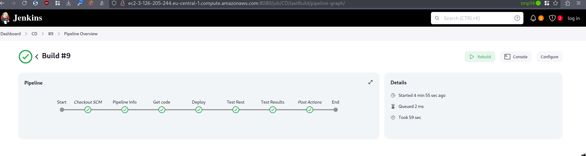
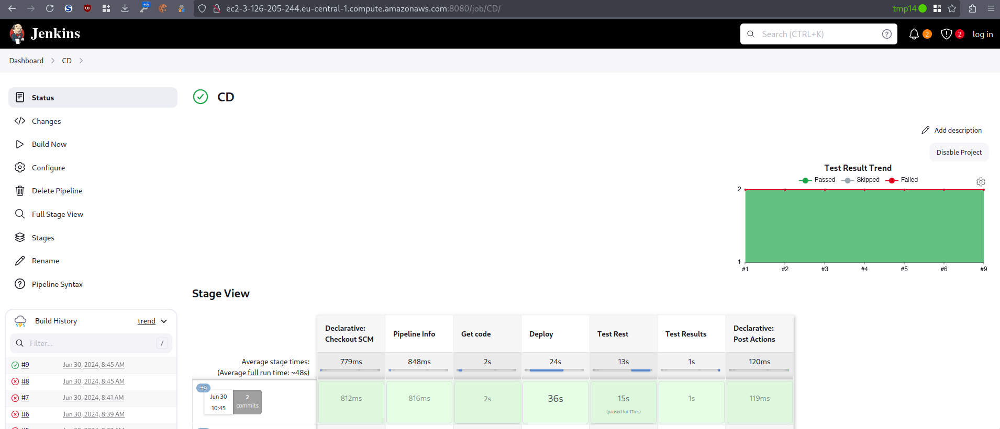

-   [Reto 2 -- Pipeline
    "CD"](#reto-2-pipeline-cd)
-   [Etapas](#etapas)
    -   [Etapa "Get Code" para descargar el código, de la rama
        master.](#etapa-get-code-para-descargar-el-código-de-la-rama-master.)
    -   [Etapa "Deploy"](#etapa-deploy)
    -   [Etapa "Rest Test"](#etapa-rest-test)
    -   [Resumen de
        ejecución](#resumen-de-ejecución)
        -   [Pipeline](#pipeline)
        -   [Log de ejecución](#log-de-ejecución)

# Reto 2 -- Pipeline "CD"

# Etapas

## Etapa "Get Code" para descargar el código, de la rama master.

No hay gran diferencia entre la rama *master* y la rama *develop*, solo
el commando *checkout*

``` groovy
stage('Get code') {
     agent { label 'linux' }
     steps {
       catchError(buildResult: 'SUCCESS', stageResult: 'FAILURE') {
         pipelineBanner()
         sh ('''
           [ -e "$WORKSPACE/gitCode" ] && rm -fr "$WORKSPACE/gitCode"
           git clone https://${GITHUB_TOKEN}@github.com/dargamenteria/actividad1-D $WORKSPACE/gitCode
           git checkout master
           '''
         )
         stash  (name: 'workspace')
       }
     }
   }
```

## Etapa "Deploy"

Siguiendo en la misma tónica que la fase anterior no hay grandes
cambios, solo apuntar al entorno adecuado.

``` groovy
stage ('Deploy') {
     agent { label 'linux' }
     steps {
       catchError(buildResult: 'FAILURE', stageResult: 'FAILURE') {
         pipelineBanner()
         unstash 'workspace'
         sh ('''
           cd "$WORKSPACE/gitCode"

           export AWS_ACCESS_KEY_ID=${AWS_ACCESS_KEY_ID}
           export AWS_SECRET_ACCESS_KEY=${AWS_SECRET_ACCESS_KEY}

           sam build
           sam deploy 
           --stack-name todo-aws-list-production \
           --region eu-central-1 \
           --disable-rollback \
           --config-env production \
           --no-fail-on-empty-changese

           unset AWS_SECRET_ACCESS_KEY
           unset AWS_ACCESS_KEY_ID

           '''

         )
       }
     } 
   }
```

## Etapa "Rest Test"

Análoga la del entorno de *development*, solo cambia la recogida de la
url y el parámetro para ejecutar los test de solo lectura.

``` groovy
stage ('Test Rest') {
      agent { label 'linux' }
      steps {
        catchError(buildResult: 'FAILURE', stageResult: 'FAILURE') {
          pipelineBanner()
          unstash 'workspace'
          lock ('test-resources'){
            sh ('''
              echo "Test phase"
              cd "$WORKSPACE/gitCode"

              export AWS_ACCESS_KEY_ID=${AWS_ACCESS_KEY_ID}
              export AWS_SECRET_ACCESS_KEY=${AWS_SECRET_ACCESS_KEY}

              export BASE_URL=$(aws cloudformation describe-stacks --stack-name todo-aws-list-production    --query 'Stacks[0].Outputs[?OutputKey==`BaseUrlApi`].OutputValue'     --output text) 

              aws sts get-session-token > a.json
              # TODO do not show the passwords find another solution for masking

              export AWS_ACCESS_KEY_ID=$(cat a.json | jq $jq .Credentials.AccessKeyId)
              export AWS_SECRET_ACCESS_KEY=$(cat a.json | jq $jq .Credentials.SecretAccessKey)
              export AWS_SESSION_TOKEN=$(cat a.json | jq $jq .Credentials.SessionToken)

              pytest --junitxml=result-rest.xml -m readonly $(pwd)/test/integration/todoApiTest.py
              '''
            )
          }
          stash  (name: 'workspace')
        }
      }
    }
```

## Resumen de ejecución

La siguiente imagen muestra la estructura de la *pipeline*



### Pipeline

``` groovy
@Library('test-pipeline-library')_


pipeline {
  agent { label 'linux' }
  environment {
    AWS_ACCESS_KEY_ID     = credentials('aws_access_key_id')
    AWS_SECRET_ACCESS_KEY = credentials('aws_secret_access_key')
    GITHUB_TOKEN          = credentials('github_token')
  }

  stages {
    stage('Pipeline Info') {
      steps {
        sh ('echo "        pipelineBanner "')
        pipelineBanner()
      }
    }

    stage('Get code') {
      agent { label 'linux' }
      steps {
        catchError(buildResult: 'SUCCESS', stageResult: 'FAILURE') {
          pipelineBanner()
          sh ('''
            [ -e "$WORKSPACE/gitCode" ] && rm -fr "$WORKSPACE/gitCode"
            git clone https://${GITHUB_TOKEN}@github.com/dargamenteria/actividad1-D $WORKSPACE/gitCode
            git checkout master
            '''
          )
          stash  (name: 'workspace')
        }
      }
    }

    
    stage ('Deploy') {
      agent { label 'linux' }
      steps {
        catchError(buildResult: 'FAILURE', stageResult: 'FAILURE') {
          pipelineBanner()
          unstash 'workspace'
          sh ('''
            cd "$WORKSPACE/gitCode"

            export AWS_ACCESS_KEY_ID=${AWS_ACCESS_KEY_ID}
            export AWS_SECRET_ACCESS_KEY=${AWS_SECRET_ACCESS_KEY}

            sam build
            sam deploy \
            --stack-name todo-aws-list-production \
            --region eu-central-1 \
            --disable-rollback  \
            --config-env production  --no-fail-on-empty-changeset

            unset AWS_SECRET_ACCESS_KEY
            unset AWS_ACCESS_KEY_ID

            '''

          )
        }
      } 
    }

    stage ('Test Rest') {
      agent { label 'linux' }
      steps {
        catchError(buildResult: 'FAILURE', stageResult: 'FAILURE') {
          pipelineBanner()
          unstash 'workspace'
          lock ('test-resources'){
            sh ('''
              echo "Test phase"
              cd "$WORKSPACE/gitCode"

              export AWS_ACCESS_KEY_ID=${AWS_ACCESS_KEY_ID}
              export AWS_SECRET_ACCESS_KEY=${AWS_SECRET_ACCESS_KEY}

              export BASE_URL=$(aws cloudformation describe-stacks --stack-name todo-aws-list-production    --query 'Stacks[0].Outputs[?OutputKey==`BaseUrlApi`].OutputValue'     --output text) 

              aws sts get-session-token > a.json
              # TODO do not show the passwords find another solution for masking

              export AWS_ACCESS_KEY_ID=$(cat a.json | jq $jq .Credentials.AccessKeyId)
              export AWS_SECRET_ACCESS_KEY=$(cat a.json | jq $jq .Credentials.SecretAccessKey)
              export AWS_SESSION_TOKEN=$(cat a.json | jq $jq .Credentials.SessionToken)

              pytest --junitxml=result-rest.xml -m readonly $(pwd)/test/integration/todoApiTest.py
              '''
            )
          }
          stash  (name: 'workspace')
        }
      }
    }

    stage ('Test Results') {
      agent { label 'linux' }
      steps {
        pipelineBanner()
        catchError(buildResult: 'SUCCESS', stageResult: 'SUCCESS') {
          unstash 'workspace'
          junit allowEmptyResults: true, testResults: 'gitCode/result-*.xml'
        }
      }
    }

   
  }//end stages

  post {
    always {
      cleanWs()
    }
  }
}


```

### Log de ejecución

``` bash
Started by user unknown or anonymous
Obtained Jenkinsfile from git https://github.com/dargamenteria/actividad1-D
Loading library test-pipeline-library@master
Attempting to resolve master from remote references...
 > git --version # timeout=10
 > git --version # 'git version 2.34.1'
 > git ls-remote -h -- https://github.com/dargamenteria/actividad1-B # timeout=10
Found match: refs/heads/master revision 92a82048d1a7deb3d98a83bc83d08ab2eb6d14a9
The recommended git tool is: NONE
No credentials specified
 > git rev-parse --resolve-git-dir /var/lib/jenkins/workspace/CD@libs/dbe5ec756152d72f500a5d42d4722cf67d056c195f909a0176fbaf5b216a8290/.git # timeout=10
Fetching changes from the remote Git repository
 > git config remote.origin.url https://github.com/dargamenteria/actividad1-B # timeout=10
Fetching without tags
Fetching upstream changes from https://github.com/dargamenteria/actividad1-B
 > git --version # timeout=10
 > git --version # 'git version 2.34.1'
 > git fetch --no-tags --force --progress -- https://github.com/dargamenteria/actividad1-B +refs/heads/*:refs/remotes/origin/* # timeout=10
Checking out Revision 92a82048d1a7deb3d98a83bc83d08ab2eb6d14a9 (master)
 > git config core.sparsecheckout # timeout=10
 > git checkout -f 92a82048d1a7deb3d98a83bc83d08ab2eb6d14a9 # timeout=10
Commit message: "Some cosmetical changes"
 > git rev-list --no-walk 92a82048d1a7deb3d98a83bc83d08ab2eb6d14a9 # timeout=10
[Pipeline] Start of Pipeline
[Pipeline] node
Running on slave2 in /home/ubuntu/workspace/CD
[Pipeline] {
[Pipeline] stage
[Pipeline] { (Declarative: Checkout SCM)
[Pipeline] checkout
Selected Git installation does not exist. Using Default
The recommended git tool is: NONE
No credentials specified
Cloning the remote Git repository
Avoid second fetch
Checking out Revision 21ce70af6b12cd5358a66b903b131a78676d732b (refs/remotes/origin/master)
Commit message: "fix bloody typo v2 revamped sdgkajsdñlkjsadgñlkasdjgñlkasdj aggggggit push origin master well at least no one is going to read this"
Cloning repository https://github.com/dargamenteria/actividad1-D
 > git init /home/ubuntu/workspace/CD # timeout=10
Fetching upstream changes from https://github.com/dargamenteria/actividad1-D
 > git --version # timeout=10
 > git --version # 'git version 2.34.1'
 > git fetch --tags --force --progress -- https://github.com/dargamenteria/actividad1-D +refs/heads/*:refs/remotes/origin/* # timeout=10
 > git config remote.origin.url https://github.com/dargamenteria/actividad1-D # timeout=10
 > git config --add remote.origin.fetch +refs/heads/*:refs/remotes/origin/* # timeout=10
 > git rev-parse refs/remotes/origin/master^{commit} # timeout=10
 > git config core.sparsecheckout # timeout=10
 > git checkout -f 21ce70af6b12cd5358a66b903b131a78676d732b # timeout=10
 > git rev-list --no-walk 6e1076f99f63937a7299e2886c359dcee3e9bf50 # timeout=10
[Pipeline] }
[Pipeline] // stage
[Pipeline] withEnv
[Pipeline] {
[Pipeline] withCredentials
Masking supported pattern matches of $AWS_ACCESS_KEY_ID or $AWS_SECRET_ACCESS_KEY or $GITHUB_TOKEN
[Pipeline] {
[Pipeline] stage
[Pipeline] { (Pipeline Info)
[Pipeline] sh
+ echo         pipelineBanner 
        pipelineBanner 
[Pipeline] script
[Pipeline] {
[Pipeline] sh
+ echo ##########################
##########################
+ hostname -f
+ echo #Hostname: ip-10-153-10-218.eu-central-1.compute.internal
#Hostname: ip-10-153-10-218.eu-central-1.compute.internal
+ uname -a
+ echo #Hostinfo: Linux ip-10-153-10-218 6.5.0-1021-aws #21~22.04.1-Ubuntu SMP Fri May 10 20:04:44 UTC 2024 x86_64 x86_64 x86_64 GNU/Linux
#Hostinfo: Linux ip-10-153-10-218 6.5.0-1021-aws #21~22.04.1-Ubuntu SMP Fri May 10 20:04:44 UTC 2024 x86_64 x86_64 x86_64 GNU/Linux
+ echo ##########################
##########################
[Pipeline] }
[Pipeline] // script
[Pipeline] }
[Pipeline] // stage
[Pipeline] stage
[Pipeline] { (Get code)
[Pipeline] node
Running on slave2 in /home/ubuntu/workspace/CD@2
[Pipeline] {
[Pipeline] checkout
Selected Git installation does not exist. Using Default
The recommended git tool is: NONE
No credentials specified
Fetching changes from the remote Git repository
Checking out Revision 21ce70af6b12cd5358a66b903b131a78676d732b (refs/remotes/origin/master)
Commit message: "fix bloody typo v2 revamped sdgkajsdñlkjsadgñlkasdjgñlkasdj aggggggit push origin master well at least no one is going to read this"
[Pipeline] withEnv
[Pipeline] {
[Pipeline] catchError
[Pipeline] {
[Pipeline] script
[Pipeline] {
[Pipeline] sh
+ echo ##########################
##########################
+ hostname -f
+ echo #Hostname: ip-10-153-10-218.eu-central-1.compute.internal
#Hostname: ip-10-153-10-218.eu-central-1.compute.internal
+ uname -a
+ echo #Hostinfo: Linux ip-10-153-10-218 6.5.0-1021-aws #21~22.04.1-Ubuntu SMP Fri May 10 20:04:44 UTC 2024 x86_64 x86_64 x86_64 GNU/Linux
#Hostinfo: Linux ip-10-153-10-218 6.5.0-1021-aws #21~22.04.1-Ubuntu SMP Fri May 10 20:04:44 UTC 2024 x86_64 x86_64 x86_64 GNU/Linux
+ echo ##########################
##########################
[Pipeline] }
[Pipeline] // script
[Pipeline] sh
 > git rev-parse --resolve-git-dir /home/ubuntu/workspace/CD@2/.git # timeout=10
 > git config remote.origin.url https://github.com/dargamenteria/actividad1-D # timeout=10
Fetching upstream changes from https://github.com/dargamenteria/actividad1-D
 > git --version # timeout=10
 > git --version # 'git version 2.34.1'
 > git fetch --tags --force --progress -- https://github.com/dargamenteria/actividad1-D +refs/heads/*:refs/remotes/origin/* # timeout=10
 > git rev-parse refs/remotes/origin/master^{commit} # timeout=10
 > git config core.sparsecheckout # timeout=10
 > git checkout -f 21ce70af6b12cd5358a66b903b131a78676d732b # timeout=10
+ [ -e /home/ubuntu/workspace/CD@2/gitCode ]
+ rm -fr /home/ubuntu/workspace/CD@2/gitCode
+ git clone https://****@github.com/dargamenteria/actividad1-D /home/ubuntu/workspace/CD@2/gitCode
Cloning into '/home/ubuntu/workspace/CD@2/gitCode'...
+ git checkout master
Previous HEAD position was 21ce70a fix bloody typo v2 revamped sdgkajsdñlkjsadgñlkasdjgñlkasdj aggggggit push origin master well at least no one is going to read this
Switched to branch 'master'
Your branch is behind 'origin/master' by 10 commits, and can be fast-forwarded.
  (use "git pull" to update your local branch)
[Pipeline] stash
Stashed 98 file(s)
[Pipeline] }
[Pipeline] // catchError
[Pipeline] }
[Pipeline] // withEnv
[Pipeline] }
[Pipeline] // node
[Pipeline] }
[Pipeline] // stage
[Pipeline] stage
[Pipeline] { (Deploy)
[Pipeline] node
Running on slave2 in /home/ubuntu/workspace/CD@2
[Pipeline] {
[Pipeline] checkout
Selected Git installation does not exist. Using Default
The recommended git tool is: NONE
No credentials specified
Fetching changes from the remote Git repository
Checking out Revision 21ce70af6b12cd5358a66b903b131a78676d732b (refs/remotes/origin/master)
Commit message: "fix bloody typo v2 revamped sdgkajsdñlkjsadgñlkasdjgñlkasdj aggggggit push origin master well at least no one is going to read this"
[Pipeline] withEnv
[Pipeline] {
[Pipeline] catchError
[Pipeline] {
[Pipeline] script
[Pipeline] {
[Pipeline] sh
+ echo ##########################
##########################
+ hostname -f
+ echo #Hostname: ip-10-153-10-218.eu-central-1.compute.internal
#Hostname: ip-10-153-10-218.eu-central-1.compute.internal
+ uname -a
+ echo #Hostinfo: Linux ip-10-153-10-218 6.5.0-1021-aws #21~22.04.1-Ubuntu SMP Fri May 10 20:04:44 UTC 2024 x86_64 x86_64 x86_64 GNU/Linux
#Hostinfo: Linux ip-10-153-10-218 6.5.0-1021-aws #21~22.04.1-Ubuntu SMP Fri May 10 20:04:44 UTC 2024 x86_64 x86_64 x86_64 GNU/Linux
+ echo ##########################
##########################
[Pipeline] }
[Pipeline] // script
[Pipeline] unstash
 > git rev-parse --resolve-git-dir /home/ubuntu/workspace/CD@2/.git # timeout=10
 > git config remote.origin.url https://github.com/dargamenteria/actividad1-D # timeout=10
Fetching upstream changes from https://github.com/dargamenteria/actividad1-D
 > git --version # timeout=10
 > git --version # 'git version 2.34.1'
 > git fetch --tags --force --progress -- https://github.com/dargamenteria/actividad1-D +refs/heads/*:refs/remotes/origin/* # timeout=10
 > git rev-parse refs/remotes/origin/master^{commit} # timeout=10
 > git config core.sparsecheckout # timeout=10
 > git checkout -f 21ce70af6b12cd5358a66b903b131a78676d732b # timeout=10
[Pipeline] sh
+ cd /home/ubuntu/workspace/CD@2/gitCode
+ export AWS_ACCESS_KEY_ID=****
+ export AWS_SECRET_ACCESS_KEY=****
+ sam build
Building codeuri: /home/ubuntu/workspace/CD@2/gitCode/src runtime: python3.10 metadata: {} architecture: x86_64 functions: CreateTodoFunction, ListTodosFunction, GetTodoFunction, UpdateTodoFunction, DeleteTodoFunction
 Running PythonPipBuilder:ResolveDependencies
 Running PythonPipBuilder:CopySource

Build Succeeded

Built Artifacts  : .aws-sam/build
Built Template   : .aws-sam/build/template.yaml

Commands you can use next
=========================
[*] Validate SAM template: sam validate
[*] Invoke Function: sam local invoke
[*] Test Function in the Cloud: sam sync --stack-name {{stack-name}} --watch
[*] Deploy: sam deploy --guided
+ sam deploy --stack-name todo-aws-list-production --region eu-central-1 --disable-rollback --config-env production --no-fail-on-empty-changeset

    Uploading to todo-list-aws/0eb47a2b3fe620b3936bd178596d48b5  262144 / 562390  (46.61%)
    Uploading to todo-list-aws/0eb47a2b3fe620b3936bd178596d48b5  524288 / 562390  (93.22%)
    Uploading to todo-list-aws/0eb47a2b3fe620b3936bd178596d48b5  562390 / 562390  (100.00%)
File with same data already exists at todo-list-aws/0eb47a2b3fe620b3936bd178596d48b5, skipping upload
File with same data already exists at todo-list-aws/0eb47a2b3fe620b3936bd178596d48b5, skipping upload
File with same data already exists at todo-list-aws/0eb47a2b3fe620b3936bd178596d48b5, skipping upload
File with same data already exists at todo-list-aws/0eb47a2b3fe620b3936bd178596d48b5, skipping upload

    Deploying with following values
    ===============================
    Stack name                   : todo-aws-list-production
    Region                       : eu-central-1
    Confirm changeset            : False
    Disable rollback             : True
    Deployment s3 bucket         : marga-deploy-bucket-production
    Capabilities                 : ["CAPABILITY_IAM"]
    Parameter overrides          : {"Stage": "production"}
    Signing Profiles             : {}

Initiating deployment
=====================


    Uploading to todo-list-aws/934761d25de6f30df9e7e39df9e3c202.template  4510 / 4510  (100.00%)


Waiting for changeset to be created..

CloudFormation stack changeset
-------------------------------------------------------------------------------------------------
Operation                LogicalResourceId        ResourceType             Replacement            
-------------------------------------------------------------------------------------------------
* Modify                 CreateTodoFunction       AWS::Lambda::Function    False                  
* Modify                 DeleteTodoFunction       AWS::Lambda::Function    False                  
* Modify                 GetTodoFunction          AWS::Lambda::Function    False                  
* Modify                 ListTodosFunction        AWS::Lambda::Function    False                  
* Modify                 ServerlessRestApi        AWS::ApiGateway::RestA   False                  
                                                  pi                                              
* Modify                 UpdateTodoFunction       AWS::Lambda::Function    False                  
-------------------------------------------------------------------------------------------------


Changeset created successfully. arn:aws:cloudformation:eu-central-1:851725263660:changeSet/samcli-deploy1719737171/bbd56649-cb95-4048-ba5a-0975aaf05cc2


2024-06-30 08:46:22 - Waiting for stack create/update to complete

CloudFormation events from stack operations (refresh every 5.0 seconds)
-------------------------------------------------------------------------------------------------
ResourceStatus           ResourceType             LogicalResourceId        ResourceStatusReason   
-------------------------------------------------------------------------------------------------
UPDATE_IN_PROGRESS       AWS::Lambda::Function    ListTodosFunction        -                      
UPDATE_IN_PROGRESS       AWS::Lambda::Function    DeleteTodoFunction       -                      
UPDATE_IN_PROGRESS       AWS::Lambda::Function    UpdateTodoFunction       -                      
UPDATE_IN_PROGRESS       AWS::Lambda::Function    GetTodoFunction          -                      
UPDATE_IN_PROGRESS       AWS::Lambda::Function    CreateTodoFunction       -                      
UPDATE_COMPLETE          AWS::Lambda::Function    GetTodoFunction          -                      
UPDATE_COMPLETE          AWS::Lambda::Function    ListTodosFunction        -                      
UPDATE_COMPLETE          AWS::Lambda::Function    CreateTodoFunction       -                      
UPDATE_COMPLETE          AWS::Lambda::Function    UpdateTodoFunction       -                      
UPDATE_COMPLETE          AWS::Lambda::Function    DeleteTodoFunction       -                      
UPDATE_COMPLETE_CLEANU   AWS::CloudFormation::S   todo-aws-list-           -                      
P_IN_PROGRESS            tack                     production                                      
UPDATE_COMPLETE          AWS::CloudFormation::S   todo-aws-list-           -                      
                         tack                     production                                      
-------------------------------------------------------------------------------------------------

CloudFormation outputs from deployed stack
-------------------------------------------------------------------------------------------------
Outputs                                                                                         
-------------------------------------------------------------------------------------------------
Key                 BaseUrlApi                                                                  
Description         Base URL of API                                                             
Value               https://r5pnwodmf1.execute-api.eu-central-1.amazonaws.com/Prod              

Key                 DeleteTodoApi                                                               
Description         API Gateway endpoint URL for ${opt:stage} stage for Delete TODO             
Value               https://r5pnwodmf1.execute-api.eu-                                          
central-1.amazonaws.com/production/todos/{id}                                                   

Key                 ListTodosApi                                                                
Description         API Gateway endpoint URL for ${opt:stage} stage for List TODO               
Value               https://r5pnwodmf1.execute-api.eu-central-1.amazonaws.com/production/todos  

Key                 UpdateTodoApi                                                               
Description         API Gateway endpoint URL for ${opt:stage} stage for Update TODO             
Value               https://r5pnwodmf1.execute-api.eu-                                          
central-1.amazonaws.com/production/todos/{id}                                                   

Key                 GetTodoApi                                                                  
Description         API Gateway endpoint URL for ${opt:stage} stage for Get TODO                
Value               https://r5pnwodmf1.execute-api.eu-                                          
central-1.amazonaws.com/production/todos/{id}                                                   

Key                 CreateTodoApi                                                               
Description         API Gateway endpoint URL for ${opt:stage} stage for Create TODO             
Value               https://r5pnwodmf1.execute-api.eu-central-1.amazonaws.com/production/todos/ 
-------------------------------------------------------------------------------------------------


Successfully created/updated stack - todo-aws-list-production in eu-central-1

+ unset AWS_SECRET_ACCESS_KEY
+ unset AWS_ACCESS_KEY_ID
[Pipeline] }
[Pipeline] // catchError
[Pipeline] }
[Pipeline] // withEnv
[Pipeline] }
[Pipeline] // node
[Pipeline] }
[Pipeline] // stage
[Pipeline] stage
[Pipeline] { (Test Rest)
[Pipeline] node
Running on slave1 in /home/ubuntu/workspace/CD
[Pipeline] {
[Pipeline] checkout
Selected Git installation does not exist. Using Default
The recommended git tool is: NONE
No credentials specified
Fetching changes from the remote Git repository
Checking out Revision 21ce70af6b12cd5358a66b903b131a78676d732b (refs/remotes/origin/master)
Commit message: "fix bloody typo v2 revamped sdgkajsdñlkjsadgñlkasdjgñlkasdj aggggggit push origin master well at least no one is going to read this"
[Pipeline] withEnv
[Pipeline] {
[Pipeline] catchError
[Pipeline] {
[Pipeline] script
[Pipeline] {
[Pipeline] sh
+ echo ##########################
##########################
+ hostname -f
+ echo #Hostname: ip-10-153-10-174.eu-central-1.compute.internal
#Hostname: ip-10-153-10-174.eu-central-1.compute.internal
+ uname -a
+ echo #Hostinfo: Linux ip-10-153-10-174 6.5.0-1021-aws #21~22.04.1-Ubuntu SMP Fri May 10 20:04:44 UTC 2024 x86_64 x86_64 x86_64 GNU/Linux
#Hostinfo: Linux ip-10-153-10-174 6.5.0-1021-aws #21~22.04.1-Ubuntu SMP Fri May 10 20:04:44 UTC 2024 x86_64 x86_64 x86_64 GNU/Linux
+ echo ##########################
##########################
[Pipeline] }
[Pipeline] // script
 > git rev-parse --resolve-git-dir /home/ubuntu/workspace/CD/.git # timeout=10
 > git config remote.origin.url https://github.com/dargamenteria/actividad1-D # timeout=10
Fetching upstream changes from https://github.com/dargamenteria/actividad1-D
 > git --version # timeout=10
 > git --version # 'git version 2.34.1'
 > git fetch --tags --force --progress -- https://github.com/dargamenteria/actividad1-D +refs/heads/*:refs/remotes/origin/* # timeout=10
 > git rev-parse refs/remotes/origin/master^{commit} # timeout=10
 > git config core.sparsecheckout # timeout=10
 > git checkout -f 21ce70af6b12cd5358a66b903b131a78676d732b # timeout=10
[Pipeline] unstash
[Pipeline] lock
Trying to acquire lock on [Resource: test-resources]
Resource [test-resources] did not exist. Created.
Lock acquired on [Resource: test-resources]
[Pipeline] {
[Pipeline] sh
+ echo Test phase
Test phase
+ cd /home/ubuntu/workspace/CD/gitCode
+ export AWS_ACCESS_KEY_ID=****
+ export AWS_SECRET_ACCESS_KEY=****
+ aws cloudformation describe-stacks --stack-name todo-aws-list-production --query Stacks[0].Outputs[?OutputKey==`BaseUrlApi`].OutputValue --output text
+ export BASE_URL=https://r5pnwodmf1.execute-api.eu-central-1.amazonaws.com/Prod
+ aws sts get-session-token
+ cat a.json
+ jq .Credentials.AccessKeyId
+ export AWS_ACCESS_KEY_ID="XXXX"
+ cat a.json
+ jq .Credentials.SecretAccessKey
+ export AWS_SECRET_ACCESS_KEY="YYYY"
+ cat a.json
+ jq .Credentials.SessionToken
+ export AWS_SESSION_TOKEN="AAAA"
+ pwd
+ pytest --junitxml=result-rest.xml -m readonly /home/ubuntu/workspace/CD/gitCode/test/integration/todoApiTest.py
============================= test session starts ==============================
platform linux -- Python 3.10.12, pytest-8.2.2, pluggy-1.5.0
rootdir: /home/ubuntu/workspace/CD/gitCode
configfile: pytest.ini
collected 5 items / 3 deselected / 2 selected

test/integration/todoApiTest.py ..                                       [100%]

=============================== warnings summary ===============================
test/integration/todoApiTest.py:22
  /home/ubuntu/workspace/CD/gitCode/test/integration/todoApiTest.py:22: PytestUnknownMarkWarning: Unknown pytest.mark.readonly - is this a typo?  You can register custom marks to avoid this warning - for details, see https://docs.pytest.org/en/stable/how-to/mark.html
    @pytest.mark.readonly

test/integration/todoApiTest.py:80
  /home/ubuntu/workspace/CD/gitCode/test/integration/todoApiTest.py:80: PytestUnknownMarkWarning: Unknown pytest.mark.readonly - is this a typo?  You can register custom marks to avoid this warning - for details, see https://docs.pytest.org/en/stable/how-to/mark.html
    @pytest.mark.readonly

-- Docs: https://docs.pytest.org/en/stable/how-to/capture-warnings.html
---- generated xml file: /home/ubuntu/workspace/CD/gitCode/result-rest.xml -----
================= 2 passed, 3 deselected, 2 warnings in 10.81s =================
[Pipeline] }
Lock released on resource [Resource: test-resources]
[Pipeline] // lock
[Pipeline] stash
Warning: overwriting stash ‘workspace’
Stashed 105 file(s)
[Pipeline] }
[Pipeline] // catchError
[Pipeline] }
[Pipeline] // withEnv
[Pipeline] }
[Pipeline] // node
[Pipeline] }
[Pipeline] // stage
[Pipeline] stage
[Pipeline] { (Test Results)
[Pipeline] node
Running on slave2 in /home/ubuntu/workspace/CD@2
[Pipeline] {
[Pipeline] checkout
Selected Git installation does not exist. Using Default
The recommended git tool is: NONE
No credentials specified
Fetching changes from the remote Git repository
Checking out Revision 21ce70af6b12cd5358a66b903b131a78676d732b (refs/remotes/origin/master)
Commit message: "fix bloody typo v2 revamped sdgkajsdñlkjsadgñlkasdjgñlkasdj aggggggit push origin master well at least no one is going to read this"
[Pipeline] withEnv
[Pipeline] {
[Pipeline] script
[Pipeline] {
[Pipeline] sh
+ echo ##########################
##########################
+ hostname -f
+ echo #Hostname: ip-10-153-10-218.eu-central-1.compute.internal
#Hostname: ip-10-153-10-218.eu-central-1.compute.internal
+ uname -a
+ echo #Hostinfo: Linux ip-10-153-10-218 6.5.0-1021-aws #21~22.04.1-Ubuntu SMP Fri May 10 20:04:44 UTC 2024 x86_64 x86_64 x86_64 GNU/Linux
#Hostinfo: Linux ip-10-153-10-218 6.5.0-1021-aws #21~22.04.1-Ubuntu SMP Fri May 10 20:04:44 UTC 2024 x86_64 x86_64 x86_64 GNU/Linux
+ echo ##########################
##########################
[Pipeline] }
[Pipeline] // script
[Pipeline] catchError
[Pipeline] {
 > git rev-parse --resolve-git-dir /home/ubuntu/workspace/CD@2/.git # timeout=10
 > git config remote.origin.url https://github.com/dargamenteria/actividad1-D # timeout=10
Fetching upstream changes from https://github.com/dargamenteria/actividad1-D
 > git --version # timeout=10
 > git --version # 'git version 2.34.1'
 > git fetch --tags --force --progress -- https://github.com/dargamenteria/actividad1-D +refs/heads/*:refs/remotes/origin/* # timeout=10
 > git rev-parse refs/remotes/origin/master^{commit} # timeout=10
 > git config core.sparsecheckout # timeout=10
 > git checkout -f 21ce70af6b12cd5358a66b903b131a78676d732b # timeout=10
[Pipeline] unstash
[Pipeline] junit
Recording test results
[Checks API] No suitable checks publisher found.
[Pipeline] }
[Pipeline] // catchError
[Pipeline] }
[Pipeline] // withEnv
[Pipeline] }
[Pipeline] // node
[Pipeline] }
[Pipeline] // stage
[Pipeline] stage
[Pipeline] { (Declarative: Post Actions)
[Pipeline] cleanWs
[WS-CLEANUP] Deleting project workspace...
[WS-CLEANUP] Deferred wipeout is used...
[WS-CLEANUP] done
[Pipeline] }
[Pipeline] // stage
[Pipeline] }
[Pipeline] // withCredentials
[Pipeline] }
[Pipeline] // withEnv
[Pipeline] }
[Pipeline] // node
[Pipeline] End of Pipeline
Finished: SUCCESS

```
