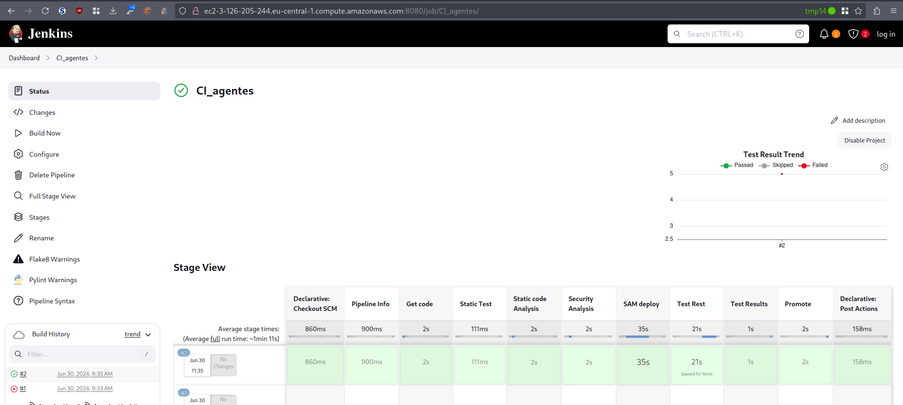
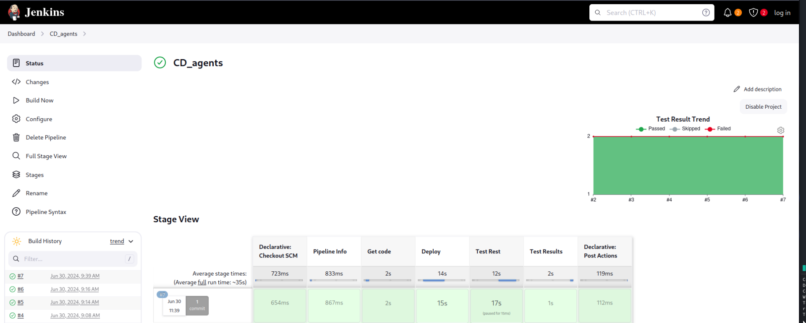

-   [Reto 3 -- Distribución en
    agentes](#reto-3-distribución-en-agentes)
-   [Un agente para las pruebas de análisis estático (Flake8 y
    Bandit).](#un-agente-para-las-pruebas-de-análisis-estático-flake8-y-bandit.)
-   [Un agente para las pruebas de la Api Rest (Pytest o
    curl+shellscript).](#un-agente-para-las-pruebas-de-la-api-rest-pytest-o-curlshellscript.)
-   [Resumen de
    ejecución](#resumen-de-ejecución)
    -   [Pipelines](#pipelines)
        -   [master](#master)
        -   [develop](#develop)
    -   [Log de ejecución](#log-de-ejecución)

# Reto 3 -- Distribución en agentes

Los agentes se etiquetan de la siguiente manera \* Nodo Cordinador:
builtin \* Slave1: linux, agent1, anal \* Slave2: linux, agent2,tester

# Un agente para las pruebas de análisis estático (Flake8 y Bandit).

Forzamos que se ejecuten en el *slave1*

    stage ('Static Test'){
          parallel {
            stage('Static code Analysis') {
              agent { label 'anal' }
              steps {
                catchError(buildResult: 'SUCCESS', stageResult: 'FAILURE') {
                  pipelineBanner()
                  unstash 'workspace'
                  sh ('''
                    cd "$WORKSPACE/gitCode"
                    flake8 --format=pylint --exit-zero --max-line-length 120 $(pwd)/src >$(pwd)/flake8.out
                    '''
                  )
                  recordIssues tools: [flake8(name: 'Flake8', pattern: 'gitCode/flake8.out')],
                    qualityGates: [
                      [threshold: 8, type: 'TOTAL', critically: 'UNSTABLE'],
                      [threshold: 10,  type: 'TOTAL', critically: 'FAILURE', unstable: false ]
                    ]
                  // stash  (name: 'workspace')
                }
              }
            }
            stage('Security Analysis') {
              agent { label 'anal' }
              steps {
                catchError(buildResult: 'SUCCESS', stageResult: 'FAILURE') {
                  pipelineBanner()
                  unstash 'workspace'
                  sh ('''
                    cd "$WORKSPACE/gitCode"
                    bandit  -r src --format custom --msg-template     "{abspath}:{line}: {test_id}[bandit]: {severity}: {msg}"  -o $(pwd)/bandit.out || echo "Controlled exit"
                    '''
                  )
                  recordIssues tools: [pyLint(pattern: 'gitCode/bandit.out')],
                    qualityGates: [
                      [threshold: 1, type: 'TOTAL', critically: 'UNSTABLE'],
                      [threshold: 2, type: 'TOTAL', critically: 'FAILURE', unstable: false]
                    ]
                  // stash  (name: 'workspace')
                }
              }
            }
          }
        }

# Un agente para las pruebas de la Api Rest (Pytest o curl+shellscript).

Forzamos que se ejecute en el *slave2*

    stage ('Test Rest') {
          agent { label 'tester' }
          steps {
            catchError(buildResult: 'FAILURE', stageResult: 'FAILURE') {
              pipelineBanner()
              unstash 'workspace'
              lock ('test-resources'){
                sh ('''
                  echo "Test phase"
                  cd "$WORKSPACE/gitCode"

                  export AWS_ACCESS_KEY_ID=${AWS_ACCESS_KEY_ID}
                  export AWS_SECRET_ACCESS_KEY=${AWS_SECRET_ACCESS_KEY}

                  export BASE_URL=$(aws cloudformation describe-stacks --stack-name todo-aws-list-staging     --query 'Stacks[0].Outputs[?OutputKey==`BaseUrlApi`].OutputValue'     --output text) 

                  aws sts get-session-token > a.json
                  # TODO do not show the passwords find another solution for masking

                  export AWS_ACCESS_KEY_ID=$(cat a.json | jq $jq .Credentials.AccessKeyId)
                  export AWS_SECRET_ACCESS_KEY=$(cat a.json | jq $jq .Credentials.SecretAccessKey)
                  export AWS_SESSION_TOKEN=$(cat a.json | jq $jq .Credentials.SessionToken)

                  pytest --junitxml=result-rest.xml $(pwd)/test/integration/todoApiTest.py
                  '''
                )
              }
              stash  (name: 'workspace')
            }
          }
        }

# Resumen de ejecución

Se muestra a continuación la ejecución de las pipelines
## Pipelines
=======



### master

    @Library('test-pipeline-library')_


    pipeline {
      agent { label ('linux || builtin') }
      environment {
        AWS_ACCESS_KEY_ID     = credentials('aws_access_key_id')
        AWS_SECRET_ACCESS_KEY = credentials('aws_secret_access_key')
        GITHUB_TOKEN          = credentials('github_token')
      }

      stages {
        stage('Pipeline Info') {
          steps {
            sh ('echo "        pipelineBanner "')
            pipelineBanner()
          }
        }

        stage('Get code') {
          agent { label 'builtin' }
          steps {
            catchError(buildResult: 'SUCCESS', stageResult: 'FAILURE') {
              pipelineBanner()
              sh ('''
                [ -e "$WORKSPACE/gitCode" ] && rm -fr "$WORKSPACE/gitCode"
                git clone https://${GITHUB_TOKEN}@github.com/dargamenteria/actividad1-D $WORKSPACE/gitCode
                git checkout master
                '''
              )
              stash  (name: 'workspace')
            }
          }
        }

        
        stage ('Deploy') {
          agent { label 'linux' }
          steps {
            catchError(buildResult: 'FAILURE', stageResult: 'FAILURE') {
              pipelineBanner()
              unstash 'workspace'
              sh ('''
                cd "$WORKSPACE/gitCode"

                export AWS_ACCESS_KEY_ID=${AWS_ACCESS_KEY_ID}
                export AWS_SECRET_ACCESS_KEY=${AWS_SECRET_ACCESS_KEY}

                sam build
                sam deploy \
                --stack-name todo-aws-list-production \
                --region eu-central-1 \
                --disable-rollback  \
                --config-env production  --no-fail-on-empty-changeset

                unset AWS_SECRET_ACCESS_KEY
                unset AWS_ACCESS_KEY_ID

                '''

              )
            }
          } 
        }

        stage ('Test Rest') {
          agent { label 'linux' }
          steps {
            catchError(buildResult: 'FAILURE', stageResult: 'FAILURE') {
              pipelineBanner()
              unstash 'workspace'
              lock ('test-resources'){
                sh ('''
                  echo "Test phase"
                  cd "$WORKSPACE/gitCode"

                  export AWS_ACCESS_KEY_ID=${AWS_ACCESS_KEY_ID}
                  export AWS_SECRET_ACCESS_KEY=${AWS_SECRET_ACCESS_KEY}

                  export BASE_URL=$(aws cloudformation describe-stacks --stack-name todo-aws-list-production    --query 'Stacks[0].Outputs[?OutputKey==`BaseUrlApi`].OutputValue'     --output text) 

                  aws sts get-session-token > a.json
                  # TODO do not show the passwords find another solution for masking

                  export AWS_ACCESS_KEY_ID=$(cat a.json | jq $jq .Credentials.AccessKeyId)
                  export AWS_SECRET_ACCESS_KEY=$(cat a.json | jq $jq .Credentials.SecretAccessKey)
                  export AWS_SESSION_TOKEN=$(cat a.json | jq $jq .Credentials.SessionToken)

                  pytest --junitxml=result-rest.xml -m readonly $(pwd)/test/integration/todoApiTest.py
                  '''
                )
              }
              stash  (name: 'workspace')
            }
          }
        }

        stage ('Test Results') {
          agent { label 'linux' }
          steps {
            pipelineBanner()
            catchError(buildResult: 'SUCCESS', stageResult: 'SUCCESS') {
              unstash 'workspace'
              junit allowEmptyResults: true, testResults: 'gitCode/result-*.xml'
            }
          }
        }

       
      }//end stages

      post {
        always {
          cleanWs()
        }
      }
    }


### develop

``` groovy
@Library('test-pipeline-library')_


pipeline {
  agent { label ('linux || builtin') }
  environment {
    AWS_ACCESS_KEY_ID     = credentials('aws_access_key_id')
    AWS_SECRET_ACCESS_KEY = credentials('aws_secret_access_key')
    GITHUB_TOKEN          = credentials('github_token')
  }

  stages {
    stage('Pipeline Info') {
      steps {
        sh ('echo "  DEV      pipelineBanner "')
        pipelineBanner()
      }
    }

    stage('Get code') {
      agent { label 'builtin' }
      steps {
        catchError(buildResult: 'SUCCESS', stageResult: 'FAILURE') {
          pipelineBanner()
          sh ('''
            [ -e "$WORKSPACE/gitCode" ] && rm -fr "$WORKSPACE/gitCode"
            git clone https://${GITHUB_TOKEN}@github.com/dargamenteria/actividad1-D $WORKSPACE/gitCode
            git checkout develop
            '''
          )
          stash  (name: 'workspace')
        }
      }
    }

    stage ('Static Test'){
      parallel {
        stage('Static code Analysis') {
          agent { label 'anal' }
          steps {
            catchError(buildResult: 'SUCCESS', stageResult: 'FAILURE') {
              pipelineBanner()
              unstash 'workspace'
              sh ('''
                cd "$WORKSPACE/gitCode"
                flake8 --format=pylint --exit-zero --max-line-length 120 $(pwd)/src >$(pwd)/flake8.out
                '''
              )
              recordIssues tools: [flake8(name: 'Flake8', pattern: 'gitCode/flake8.out')],
                qualityGates: [
                  [threshold: 8, type: 'TOTAL', critically: 'UNSTABLE'],
                  [threshold: 10,  type: 'TOTAL', critically: 'FAILURE', unstable: false ]
                ]
              // stash  (name: 'workspace')
            }
          }
        }
        stage('Security Analysis') {
          agent { label 'anal' }
          steps {
            catchError(buildResult: 'SUCCESS', stageResult: 'FAILURE') {
              pipelineBanner()
              unstash 'workspace'
              sh ('''
                cd "$WORKSPACE/gitCode"
                bandit  -r src --format custom --msg-template     "{abspath}:{line}: {test_id}[bandit]: {severity}: {msg}"  -o $(pwd)/bandit.out || echo "Controlled exit"
                '''
              )
              recordIssues tools: [pyLint(pattern: 'gitCode/bandit.out')],
                qualityGates: [
                  [threshold: 1, type: 'TOTAL', critically: 'UNSTABLE'],
                  [threshold: 2, type: 'TOTAL', critically: 'FAILURE', unstable: false]
                ]
              // stash  (name: 'workspace')
            }
          }
        }
      }
    }

    stage ('SAM deploy') {
      agent { label 'linux' }
      steps {
        catchError(buildResult: 'FAILURE', stageResult: 'FAILURE') {
          pipelineBanner()
          unstash 'workspace'
          sh ('''
            cd "$WORKSPACE/gitCode"

            export AWS_ACCESS_KEY_ID=${AWS_ACCESS_KEY_ID}
            export AWS_SECRET_ACCESS_KEY=${AWS_SECRET_ACCESS_KEY}

            sam build
            sam deploy \
            --stack-name todo-aws-list-staging \
            --region eu-central-1 \
            --disable-rollback  \
            --config-env staging  --no-fail-on-empty-changeset

            unset AWS_SECRET_ACCESS_KEY
            unset AWS_ACCESS_KEY_ID

            '''

          )
        }
      } 
    }

    stage ('Test Rest') {
      agent { label 'tester' }
      steps {
        catchError(buildResult: 'FAILURE', stageResult: 'FAILURE') {
          pipelineBanner()
          unstash 'workspace'
          lock ('test-resources'){
            sh ('''
              echo "Test phase"
              cd "$WORKSPACE/gitCode"

              export AWS_ACCESS_KEY_ID=${AWS_ACCESS_KEY_ID}
              export AWS_SECRET_ACCESS_KEY=${AWS_SECRET_ACCESS_KEY}

              export BASE_URL=$(aws cloudformation describe-stacks --stack-name todo-aws-list-staging     --query 'Stacks[0].Outputs[?OutputKey==`BaseUrlApi`].OutputValue'     --output text) 

              aws sts get-session-token > a.json
              # TODO do not show the passwords find another solution for masking

              export AWS_ACCESS_KEY_ID=$(cat a.json | jq $jq .Credentials.AccessKeyId)
              export AWS_SECRET_ACCESS_KEY=$(cat a.json | jq $jq .Credentials.SecretAccessKey)
              export AWS_SESSION_TOKEN=$(cat a.json | jq $jq .Credentials.SessionToken)

              pytest --junitxml=result-rest.xml $(pwd)/test/integration/todoApiTest.py
              '''
            )
          }
          stash  (name: 'workspace')
        }
      }
    }

    stage ('Test Results') {
      agent { label 'tester' }
      steps {
        pipelineBanner()
        catchError(buildResult: 'SUCCESS', stageResult: 'SUCCESS') {
          unstash 'workspace'
          junit allowEmptyResults: true, testResults: 'gitCode/result-*.xml'
        }
      }
    }

    stage ('Promote') {
      agent { label 'linux' }
      steps {
        catchError(buildResult: 'FAILURE', stageResult: 'FAILURE') {
          pipelineBanner()
          sh ('''
            [ -e "$WORKSPACE/gitCode" ] && rm -fr "$WORKSPACE/gitCode"
            git clone https://${GITHUB_TOKEN}@github.com/dargamenteria/actividad1-D $WORKSPACE/gitCode
            git config --global merge.ours.driver true
            git config --global --list

            cd "$WORKSPACE/gitCode"

            git checkout master
            cat testDevel

            git fetch --all
            git merge origin/develop -m "Merge from DEV" --no-ff

            cat testDevel

            '''

          )
        }
      } 
    }

  }//end stages

  post {
    always {
      cleanWs()
    }
  }
}


```

## Log de ejecución

``` bash
Started by user unknown or anonymous
Obtained Jenkinsfile_agentes from git https://github.com/dargamenteria/actividad1-D
Loading library test-pipeline-library@master
Attempting to resolve master from remote references...
 > git --version # timeout=10
 > git --version # 'git version 2.34.1'
 > git ls-remote -h -- https://github.com/dargamenteria/actividad1-B # timeout=10
Found match: refs/heads/master revision 92a82048d1a7deb3d98a83bc83d08ab2eb6d14a9
The recommended git tool is: NONE
No credentials specified
 > git rev-parse --resolve-git-dir /var/lib/jenkins/workspace/CI_agentes@libs/dbe5ec756152d72f500a5d42d4722cf67d056c195f909a0176fbaf5b216a8290/.git # timeout=10
Fetching changes from the remote Git repository
 > git config remote.origin.url https://github.com/dargamenteria/actividad1-B # timeout=10
Fetching without tags
Fetching upstream changes from https://github.com/dargamenteria/actividad1-B
 > git --version # timeout=10
 > git --version # 'git version 2.34.1'
 > git fetch --no-tags --force --progress -- https://github.com/dargamenteria/actividad1-B +refs/heads/*:refs/remotes/origin/* # timeout=10
Checking out Revision 92a82048d1a7deb3d98a83bc83d08ab2eb6d14a9 (master)
 > git config core.sparsecheckout # timeout=10
 > git checkout -f 92a82048d1a7deb3d98a83bc83d08ab2eb6d14a9 # timeout=10
Commit message: "Some cosmetical changes"
 > git rev-list --no-walk 92a82048d1a7deb3d98a83bc83d08ab2eb6d14a9 # timeout=10
[Pipeline] Start of Pipeline
[Pipeline] node
Running on slave1 in /home/ubuntu/workspace/CI_agentes
[Pipeline] {
[Pipeline] stage
[Pipeline] { (Declarative: Checkout SCM)
[Pipeline] checkout
Selected Git installation does not exist. Using Default
The recommended git tool is: NONE
No credentials specified
Cloning the remote Git repository
Avoid second fetch
Checking out Revision c908e55e91a0ce0a5bc99e573a4c1af627c05270 (refs/remotes/origin/develop)
Commit message: "Adeed jenkis file agentes"
First time build. Skipping changelog.
[Pipeline] }
[Pipeline] // stage
[Pipeline] withEnv
[Pipeline] {
[Pipeline] withCredentials
Masking supported pattern matches of $AWS_ACCESS_KEY_ID or $AWS_SECRET_ACCESS_KEY or $GITHUB_TOKEN
[Pipeline] {
[Pipeline] stage
[Pipeline] { (Pipeline Info)
Cloning repository https://github.com/dargamenteria/actividad1-D
 > git init /home/ubuntu/workspace/CI_agentes # timeout=10
Fetching upstream changes from https://github.com/dargamenteria/actividad1-D
 > git --version # timeout=10
 > git --version # 'git version 2.34.1'
 > git fetch --tags --force --progress -- https://github.com/dargamenteria/actividad1-D +refs/heads/*:refs/remotes/origin/* # timeout=10
 > git config remote.origin.url https://github.com/dargamenteria/actividad1-D # timeout=10
 > git config --add remote.origin.fetch +refs/heads/*:refs/remotes/origin/* # timeout=10
 > git rev-parse refs/remotes/origin/develop^{commit} # timeout=10
 > git config core.sparsecheckout # timeout=10
 > git checkout -f c908e55e91a0ce0a5bc99e573a4c1af627c05270 # timeout=10
[Pipeline] sh
+ echo   DEV      pipelineBanner 
  DEV      pipelineBanner 
[Pipeline] script
[Pipeline] {
[Pipeline] sh
+ echo ##########################
##########################
+ hostname -f
+ echo #Hostname: ip-10-153-10-174.eu-central-1.compute.internal
#Hostname: ip-10-153-10-174.eu-central-1.compute.internal
+ uname -a
+ echo #Hostinfo: Linux ip-10-153-10-174 6.5.0-1021-aws #21~22.04.1-Ubuntu SMP Fri May 10 20:04:44 UTC 2024 x86_64 x86_64 x86_64 GNU/Linux
#Hostinfo: Linux ip-10-153-10-174 6.5.0-1021-aws #21~22.04.1-Ubuntu SMP Fri May 10 20:04:44 UTC 2024 x86_64 x86_64 x86_64 GNU/Linux
+ echo ##########################
##########################
[Pipeline] }
[Pipeline] // script
[Pipeline] }
[Pipeline] // stage
[Pipeline] stage
[Pipeline] { (Get code)
[Pipeline] node
Running on Jenkins in /var/lib/jenkins/workspace/CI_agentes
[Pipeline] {
[Pipeline] checkout
Selected Git installation does not exist. Using Default
The recommended git tool is: NONE
No credentials specified
Cloning the remote Git repository
Cloning repository https://github.com/dargamenteria/actividad1-D
 > git init /var/lib/jenkins/workspace/CI_agentes # timeout=10
Fetching upstream changes from https://github.com/dargamenteria/actividad1-D
 > git --version # timeout=10
 > git --version # 'git version 2.34.1'
 > git fetch --tags --force --progress -- https://github.com/dargamenteria/actividad1-D +refs/heads/*:refs/remotes/origin/* # timeout=10
 > git config remote.origin.url https://github.com/dargamenteria/actividad1-D # timeout=10
 > git config --add remote.origin.fetch +refs/heads/*:refs/remotes/origin/* # timeout=10
Avoid second fetch
 > git rev-parse refs/remotes/origin/develop^{commit} # timeout=10
Checking out Revision c908e55e91a0ce0a5bc99e573a4c1af627c05270 (refs/remotes/origin/develop)
 > git config core.sparsecheckout # timeout=10
 > git checkout -f c908e55e91a0ce0a5bc99e573a4c1af627c05270 # timeout=10
Commit message: "Adeed jenkis file agentes"
[Pipeline] withEnv
[Pipeline] {
[Pipeline] catchError
[Pipeline] {
[Pipeline] script
[Pipeline] {
[Pipeline] sh
+ echo ##########################
##########################
+ hostname -f
+ echo #Hostname: ip-10-153-10-188.eu-central-1.compute.internal
#Hostname: ip-10-153-10-188.eu-central-1.compute.internal
+ uname -a
+ echo #Hostinfo: Linux ip-10-153-10-188 6.5.0-1014-aws #14~22.04.1-Ubuntu SMP Thu Feb 15 15:27:06 UTC 2024 x86_64 x86_64 x86_64 GNU/Linux
#Hostinfo: Linux ip-10-153-10-188 6.5.0-1014-aws #14~22.04.1-Ubuntu SMP Thu Feb 15 15:27:06 UTC 2024 x86_64 x86_64 x86_64 GNU/Linux
+ echo ##########################
##########################
[Pipeline] }
[Pipeline] // script
[Pipeline] sh
+ [ -e /var/lib/jenkins/workspace/CI_agentes/gitCode ]
+ git clone https://****@github.com/dargamenteria/actividad1-D /var/lib/jenkins/workspace/CI_agentes/gitCode
Cloning into '/var/lib/jenkins/workspace/CI_agentes/gitCode'...
+ git checkout develop
Switched to a new branch 'develop'
Branch 'develop' set up to track remote branch 'develop' from 'origin'.
[Pipeline] stash
Stashed 100 file(s)
[Pipeline] }
[Pipeline] // catchError
[Pipeline] }
[Pipeline] // withEnv
[Pipeline] }
[Pipeline] // node
[Pipeline] }
[Pipeline] // stage
[Pipeline] stage
[Pipeline] { (Static Test)
[Pipeline] parallel
[Pipeline] { (Branch: Static code Analysis)
[Pipeline] { (Branch: Security Analysis)
[Pipeline] stage
[Pipeline] { (Static code Analysis)
[Pipeline] stage
[Pipeline] { (Security Analysis)
[Pipeline] node
Running on slave1 in /home/ubuntu/workspace/CI_agentes@2
[Pipeline] node
Running on slave1 in /home/ubuntu/workspace/CI_agentes@3
[Pipeline] {
[Pipeline] {
[Pipeline] checkout
Selected Git installation does not exist. Using Default
The recommended git tool is: NONE
No credentials specified
Cloning the remote Git repository
[Pipeline] checkout
Selected Git installation does not exist. Using Default
The recommended git tool is: NONE
No credentials specified
Cloning the remote Git repository
Avoid second fetch
Checking out Revision c908e55e91a0ce0a5bc99e573a4c1af627c05270 (refs/remotes/origin/develop)
Commit message: "Adeed jenkis file agentes"
[Pipeline] withEnv
[Pipeline] {
[Pipeline] catchError
[Pipeline] {
Avoid second fetch
Checking out Revision c908e55e91a0ce0a5bc99e573a4c1af627c05270 (refs/remotes/origin/develop)
[Pipeline] script
Commit message: "Adeed jenkis file agentes"
[Pipeline] {
[Pipeline] sh
[Pipeline] withEnv
[Pipeline] {
Cloning repository https://github.com/dargamenteria/actividad1-D
 > git init /home/ubuntu/workspace/CI_agentes@2 # timeout=10
Fetching upstream changes from https://github.com/dargamenteria/actividad1-D
 > git --version # timeout=10
 > git --version # 'git version 2.34.1'
 > git fetch --tags --force --progress -- https://github.com/dargamenteria/actividad1-D +refs/heads/*:refs/remotes/origin/* # timeout=10
 > git config remote.origin.url https://github.com/dargamenteria/actividad1-D # timeout=10
 > git config --add remote.origin.fetch +refs/heads/*:refs/remotes/origin/* # timeout=10
 > git rev-parse refs/remotes/origin/develop^{commit} # timeout=10
 > git config core.sparsecheckout # timeout=10
 > git checkout -f c908e55e91a0ce0a5bc99e573a4c1af627c05270 # timeout=10
[Pipeline] catchError
[Pipeline] {
Cloning repository https://github.com/dargamenteria/actividad1-D
 > git init /home/ubuntu/workspace/CI_agentes@3 # timeout=10
Fetching upstream changes from https://github.com/dargamenteria/actividad1-D
 > git --version # timeout=10
 > git --version # 'git version 2.34.1'
 > git fetch --tags --force --progress -- https://github.com/dargamenteria/actividad1-D +refs/heads/*:refs/remotes/origin/* # timeout=10
 > git config remote.origin.url https://github.com/dargamenteria/actividad1-D # timeout=10
 > git config --add remote.origin.fetch +refs/heads/*:refs/remotes/origin/* # timeout=10
 > git rev-parse refs/remotes/origin/develop^{commit} # timeout=10
 > git config core.sparsecheckout # timeout=10
 > git checkout -f c908e55e91a0ce0a5bc99e573a4c1af627c05270 # timeout=10
[Pipeline] script
[Pipeline] {
[Pipeline] sh
+ echo ##########################
##########################
+ hostname -f
+ echo #Hostname: ip-10-153-10-174.eu-central-1.compute.internal
#Hostname: ip-10-153-10-174.eu-central-1.compute.internal
+ uname -a
+ echo #Hostinfo: Linux ip-10-153-10-174 6.5.0-1021-aws #21~22.04.1-Ubuntu SMP Fri May 10 20:04:44 UTC 2024 x86_64 x86_64 x86_64 GNU/Linux
#Hostinfo: Linux ip-10-153-10-174 6.5.0-1021-aws #21~22.04.1-Ubuntu SMP Fri May 10 20:04:44 UTC 2024 x86_64 x86_64 x86_64 GNU/Linux
+ echo ##########################
##########################
[Pipeline] }
[Pipeline] // script
[Pipeline] unstash
[Pipeline] sh
+ echo ##########################
##########################
+ hostname -f
+ echo #Hostname: ip-10-153-10-174.eu-central-1.compute.internal
#Hostname: ip-10-153-10-174.eu-central-1.compute.internal
+ uname -a
+ echo #Hostinfo: Linux ip-10-153-10-174 6.5.0-1021-aws #21~22.04.1-Ubuntu SMP Fri May 10 20:04:44 UTC 2024 x86_64 x86_64 x86_64 GNU/Linux
#Hostinfo: Linux ip-10-153-10-174 6.5.0-1021-aws #21~22.04.1-Ubuntu SMP Fri May 10 20:04:44 UTC 2024 x86_64 x86_64 x86_64 GNU/Linux
+ echo ##########################
##########################
[Pipeline] }
[Pipeline] // script
[Pipeline] unstash
+ cd /home/ubuntu/workspace/CI_agentes@2/gitCode
+ pwd
+ pwd
+ flake8 --format=pylint --exit-zero --max-line-length 120 /home/ubuntu/workspace/CI_agentes@2/gitCode/src
[Pipeline] sh
[Pipeline] recordIssues
WARNING: Unknown parameter(s) found for class type 'io.jenkins.plugins.analysis.core.util.WarningsQualityGate': critically
WARNING: Unknown parameter(s) found for class type 'io.jenkins.plugins.analysis.core.util.WarningsQualityGate': critically
[Flake8] Searching for all files in '/home/ubuntu/workspace/CI_agentes@2' that match the pattern 'gitCode/flake8.out'
[Flake8] Traversing of symbolic links: enabled
[Flake8] -> found 1 file
[Flake8] Successfully parsed file /home/ubuntu/workspace/CI_agentes@2/gitCode/flake8.out
[Flake8] -> found 3 issues (skipped 0 duplicates)
[Flake8] Successfully processed file 'gitCode/flake8.out'
+ cd /home/ubuntu/workspace/CI_agentes@3/gitCode
+ pwd
+ bandit -r src --format custom --msg-template {abspath}:{line}: {test_id}[bandit]: {severity}: {msg} -o /home/ubuntu/workspace/CI_agentes@3/gitCode/bandit.out
[main]  INFO    profile include tests: None
[main]  INFO    profile exclude tests: None
[main]  INFO    cli include tests: None
[main]  INFO    cli exclude tests: None
[main]  INFO    running on Python 3.10.12
[Flake8] Post processing issues on 'slave1' with source code encoding 'UTF-8'
[Flake8] Creating SCM blamer to obtain author and commit information for affected files
[Flake8] -> No blamer installed yet. You need to install the 'git-forensics' plugin to enable blaming for Git.
[Flake8] Resolving file names for all issues in workspace '/home/ubuntu/workspace/CI_agentes@2'
[Flake8] -> resolved paths in source directory (1 found, 0 not found)
[Flake8] Resolving module names from module definitions (build.xml, pom.xml, or Manifest.mf files)
[Flake8] -> resolved module names for 3 issues
[Flake8] Resolving package names (or namespaces) by parsing the affected files
[Flake8] -> resolved package names of 1 affected files
[Flake8] No filter has been set, publishing all 3 issues
[Flake8] Creating fingerprints for all affected code blocks to track issues over different builds
[Flake8] -> created fingerprints for 3 issues (skipped 0 issues)
[Flake8] Copying affected files to Jenkins' build folder '/var/lib/jenkins/jobs/CI_agentes/builds/2/files-with-issues'
[Flake8] -> 1 copied, 0 not in workspace, 0 not-found, 0 with I/O error
[Flake8] Skipping cleaning of source code files in old builds
[Flake8] Repository miner is not configured, skipping repository mining
[Flake8] Searching for all files in '/home/ubuntu/workspace/CI_agentes@2' that match the pattern 'gitCode/flake8.out'
[Flake8] Traversing of symbolic links: enabled
[Flake8] -> found 1 file
[Flake8] Successfully parsed file /home/ubuntu/workspace/CI_agentes@2/gitCode/flake8.out
[Flake8] -> found 3 issues (skipped 0 duplicates)
[Flake8] Successfully processed file 'gitCode/flake8.out'
[Flake8] Post processing issues on 'slave1' with source code encoding 'UTF-8'
[Flake8] Creating SCM blamer to obtain author and commit information for affected files
[Flake8] -> No blamer installed yet. You need to install the 'git-forensics' plugin to enable blaming for Git.
[Flake8] Resolving file names for all issues in workspace '/home/ubuntu/workspace/CI_agentes@2'
[Flake8] -> resolved paths in source directory (1 found, 0 not found)
[Flake8] Resolving module names from module definitions (build.xml, pom.xml, or Manifest.mf files)
[Flake8] -> resolved module names for 3 issues
[Flake8] Resolving package names (or namespaces) by parsing the affected files
[Flake8] -> resolved package names of 1 affected files
[Flake8] No filter has been set, publishing all 3 issues
[Flake8] Creating fingerprints for all affected code blocks to track issues over different builds
[Flake8] -> created fingerprints for 3 issues (skipped 0 issues)
[Flake8] Copying affected files to Jenkins' build folder '/var/lib/jenkins/jobs/CI_agentes/builds/2/files-with-issues'
[Flake8] -> 1 copied, 0 not in workspace, 0 not-found, 0 with I/O error
[Flake8] Skipping cleaning of source code files in old builds
[Flake8] Repository miner is not configured, skipping repository mining
[Flake8] Reference build recorder is not configured
[Flake8] No valid reference build found
[Flake8] All reported issues will be considered outstanding
[Flake8] Evaluating quality gates
[Flake8] -> All quality gates have been passed
[Flake8] -> Details for each quality gate:
[Flake8]    - [Total (any severity)]: ≪Success≫ - (Actual value: 3, Quality gate: 8.00)
[Flake8]    - [Total (any severity)]: ≪Success≫ - (Actual value: 3, Quality gate: 10.00)
[Flake8] Health report is disabled - skipping
[Flake8] Created analysis result for 3 issues (found 0 new issues, fixed 0 issues)
[Flake8] Attaching ResultAction with ID 'flake8' to build 'CI_agentes #2'.
[Checks API] No suitable checks publisher found.
[Pipeline] }
[Pipeline] // catchError
[Pipeline] }
[custom]    INFO    Result written to file: /home/ubuntu/workspace/CI_agentes@3/gitCode/bandit.out
[Pipeline] // withEnv
[Pipeline] }
[Pipeline] recordIssues
WARNING: Unknown parameter(s) found for class type 'io.jenkins.plugins.analysis.core.util.WarningsQualityGate': critically
WARNING: Unknown parameter(s) found for class type 'io.jenkins.plugins.analysis.core.util.WarningsQualityGate': critically
[Pylint] Searching for all files in '/home/ubuntu/workspace/CI_agentes@3' that match the pattern 'gitCode/bandit.out'
[Pylint] Traversing of symbolic links: enabled
[Pylint] -> found 1 file
[Pylint] Skipping file 'gitCode/bandit.out' because it's empty
[Pylint] Skipping post processing
[Pylint] No filter has been set, publishing all 0 issues
[Pylint] Repository miner is not configured, skipping repository mining
[Pylint] Searching for all files in '/home/ubuntu/workspace/CI_agentes@3' that match the pattern 'gitCode/bandit.out'
[Pylint] Traversing of symbolic links: enabled
[Pylint] -> found 1 file
[Pylint] Skipping file 'gitCode/bandit.out' because it's empty
[Pylint] Skipping post processing
[Pylint] No filter has been set, publishing all 0 issues
[Pylint] Repository miner is not configured, skipping repository mining
[Pylint] Reference build recorder is not configured
[Pylint] No valid reference build found
[Pylint] All reported issues will be considered outstanding
[Pylint] Evaluating quality gates
[Pylint] -> All quality gates have been passed
[Pylint] -> Details for each quality gate:
[Pylint]    - [Total (any severity)]: ≪Success≫ - (Actual value: 0, Quality gate: 1.00)
[Pylint]    - [Total (any severity)]: ≪Success≫ - (Actual value: 0, Quality gate: 2.00)
[Pylint] Health report is disabled - skipping
[Pylint] Created analysis result for 0 issues (found 0 new issues, fixed 0 issues)
[Pylint] Attaching ResultAction with ID 'pylint' to build 'CI_agentes #2'.
[Checks API] No suitable checks publisher found.
[Pipeline] // node
[Pipeline] }
[Pipeline] }
[Pipeline] // stage
[Pipeline] // catchError
[Pipeline] }
[Pipeline] }
[Pipeline] // withEnv
[Pipeline] }
[Pipeline] // node
[Pipeline] }
[Pipeline] // stage
[Pipeline] }
[Pipeline] // parallel
[Pipeline] }
[Pipeline] // stage
[Pipeline] stage
[Pipeline] { (SAM deploy)
[Pipeline] node
Running on slave2 in /home/ubuntu/workspace/CI_agentes
[Pipeline] {
[Pipeline] checkout
Selected Git installation does not exist. Using Default
The recommended git tool is: NONE
No credentials specified
Cloning the remote Git repository
Avoid second fetch
Checking out Revision c908e55e91a0ce0a5bc99e573a4c1af627c05270 (refs/remotes/origin/develop)
Commit message: "Adeed jenkis file agentes"
[Pipeline] withEnv
[Pipeline] {
[Pipeline] catchError
[Pipeline] {
[Pipeline] script
[Pipeline] {
[Pipeline] sh
Cloning repository https://github.com/dargamenteria/actividad1-D
 > git init /home/ubuntu/workspace/CI_agentes # timeout=10
Fetching upstream changes from https://github.com/dargamenteria/actividad1-D
 > git --version # timeout=10
 > git --version # 'git version 2.34.1'
 > git fetch --tags --force --progress -- https://github.com/dargamenteria/actividad1-D +refs/heads/*:refs/remotes/origin/* # timeout=10
 > git config remote.origin.url https://github.com/dargamenteria/actividad1-D # timeout=10
 > git config --add remote.origin.fetch +refs/heads/*:refs/remotes/origin/* # timeout=10
 > git rev-parse refs/remotes/origin/develop^{commit} # timeout=10
 > git config core.sparsecheckout # timeout=10
 > git checkout -f c908e55e91a0ce0a5bc99e573a4c1af627c05270 # timeout=10
+ echo ##########################
##########################
+ hostname -f
+ echo #Hostname: ip-10-153-10-218.eu-central-1.compute.internal
#Hostname: ip-10-153-10-218.eu-central-1.compute.internal
+ uname -a
+ echo #Hostinfo: Linux ip-10-153-10-218 6.5.0-1021-aws #21~22.04.1-Ubuntu SMP Fri May 10 20:04:44 UTC 2024 x86_64 x86_64 x86_64 GNU/Linux
#Hostinfo: Linux ip-10-153-10-218 6.5.0-1021-aws #21~22.04.1-Ubuntu SMP Fri May 10 20:04:44 UTC 2024 x86_64 x86_64 x86_64 GNU/Linux
+ echo ##########################
##########################
[Pipeline] }
[Pipeline] // script
[Pipeline] unstash
[Pipeline] sh
+ cd /home/ubuntu/workspace/CI_agentes/gitCode
+ export AWS_ACCESS_KEY_ID=****
+ export AWS_SECRET_ACCESS_KEY=****
+ sam build
Building codeuri: /home/ubuntu/workspace/CI_agentes/gitCode/src runtime: python3.10 metadata: {} architecture: x86_64 functions: CreateTodoFunction, ListTodosFunction, GetTodoFunction, UpdateTodoFunction, DeleteTodoFunction
 Running PythonPipBuilder:ResolveDependencies
 Running PythonPipBuilder:CopySource

Build Succeeded

Built Artifacts  : .aws-sam/build
Built Template   : .aws-sam/build/template.yaml

Commands you can use next
=========================
[*] Validate SAM template: sam validate
[*] Invoke Function: sam local invoke
[*] Test Function in the Cloud: sam sync --stack-name {{stack-name}} --watch
[*] Deploy: sam deploy --guided
+ sam deploy --stack-name todo-aws-list-staging --region eu-central-1 --disable-rollback --config-env staging --no-fail-on-empty-changeset

    Uploading to todo-list-aws/0eb47a2b3fe620b3936bd178596d48b5  262144 / 562390  (46.61%)
    Uploading to todo-list-aws/0eb47a2b3fe620b3936bd178596d48b5  524288 / 562390  (93.22%)
    Uploading to todo-list-aws/0eb47a2b3fe620b3936bd178596d48b5  562390 / 562390  (100.00%)
File with same data already exists at todo-list-aws/0eb47a2b3fe620b3936bd178596d48b5, skipping upload
File with same data already exists at todo-list-aws/0eb47a2b3fe620b3936bd178596d48b5, skipping upload
File with same data already exists at todo-list-aws/0eb47a2b3fe620b3936bd178596d48b5, skipping upload
File with same data already exists at todo-list-aws/0eb47a2b3fe620b3936bd178596d48b5, skipping upload

    Deploying with following values
    ===============================
    Stack name                   : todo-aws-list-staging
    Region                       : eu-central-1
    Confirm changeset            : False
    Disable rollback             : True
    Deployment s3 bucket         : marga-deploy-bucket-staging
    Capabilities                 : ["CAPABILITY_IAM"]
    Parameter overrides          : {"Stage": "staging"}
    Signing Profiles             : {}

Initiating deployment
=====================


    Uploading to todo-list-aws/1f038114a70b1d1b26a3562c95b6c400.template  4495 / 4495  (100.00%)


Waiting for changeset to be created..

CloudFormation stack changeset
-------------------------------------------------------------------------------------------------
Operation                LogicalResourceId        ResourceType             Replacement            
-------------------------------------------------------------------------------------------------
* Modify                 CreateTodoFunction       AWS::Lambda::Function    False                  
* Modify                 DeleteTodoFunction       AWS::Lambda::Function    False                  
* Modify                 GetTodoFunction          AWS::Lambda::Function    False                  
* Modify                 ListTodosFunction        AWS::Lambda::Function    False                  
* Modify                 ServerlessRestApi        AWS::ApiGateway::RestA   False                  
                                                  pi                                              
* Modify                 UpdateTodoFunction       AWS::Lambda::Function    False                  
-------------------------------------------------------------------------------------------------


Changeset created successfully. arn:aws:cloudformation:eu-central-1:851725263660:changeSet/samcli-deploy1719740143/325339f7-6094-4cbf-a201-64f32f34387f


2024-06-30 09:35:54 - Waiting for stack create/update to complete

CloudFormation events from stack operations (refresh every 5.0 seconds)
-------------------------------------------------------------------------------------------------
ResourceStatus           ResourceType             LogicalResourceId        ResourceStatusReason   
-------------------------------------------------------------------------------------------------
UPDATE_IN_PROGRESS       AWS::Lambda::Function    GetTodoFunction          -                      
UPDATE_IN_PROGRESS       AWS::Lambda::Function    DeleteTodoFunction       -                      
UPDATE_IN_PROGRESS       AWS::Lambda::Function    UpdateTodoFunction       -                      
UPDATE_IN_PROGRESS       AWS::Lambda::Function    CreateTodoFunction       -                      
UPDATE_IN_PROGRESS       AWS::Lambda::Function    ListTodosFunction        -                      
UPDATE_COMPLETE          AWS::Lambda::Function    UpdateTodoFunction       -                      
UPDATE_COMPLETE          AWS::Lambda::Function    DeleteTodoFunction       -                      
UPDATE_COMPLETE          AWS::Lambda::Function    CreateTodoFunction       -                      
UPDATE_COMPLETE          AWS::Lambda::Function    ListTodosFunction        -                      
UPDATE_COMPLETE_CLEANU   AWS::CloudFormation::S   todo-aws-list-staging    -                      
P_IN_PROGRESS            tack                                                                     
UPDATE_COMPLETE          AWS::CloudFormation::S   todo-aws-list-staging    -                      
                         tack                                                                     
-------------------------------------------------------------------------------------------------

CloudFormation outputs from deployed stack
-------------------------------------------------------------------------------------------------
Outputs                                                                                         
-------------------------------------------------------------------------------------------------
Key                 BaseUrlApi                                                                  
Description         Base URL of API                                                             
Value               https://rem31jib2b.execute-api.eu-central-1.amazonaws.com/Prod              

Key                 DeleteTodoApi                                                               
Description         API Gateway endpoint URL for ${opt:stage} stage for Delete TODO             
Value               https://rem31jib2b.execute-api.eu-                                          
central-1.amazonaws.com/staging/todos/{id}                                                      

Key                 ListTodosApi                                                                
Description         API Gateway endpoint URL for ${opt:stage} stage for List TODO               
Value               https://rem31jib2b.execute-api.eu-central-1.amazonaws.com/staging/todos     

Key                 UpdateTodoApi                                                               
Description         API Gateway endpoint URL for ${opt:stage} stage for Update TODO             
Value               https://rem31jib2b.execute-api.eu-                                          
central-1.amazonaws.com/staging/todos/{id}                                                      

Key                 GetTodoApi                                                                  
Description         API Gateway endpoint URL for ${opt:stage} stage for Get TODO                
Value               https://rem31jib2b.execute-api.eu-                                          
central-1.amazonaws.com/staging/todos/{id}                                                      

Key                 CreateTodoApi                                                               
Description         API Gateway endpoint URL for ${opt:stage} stage for Create TODO             
Value               https://rem31jib2b.execute-api.eu-central-1.amazonaws.com/staging/todos/    
-------------------------------------------------------------------------------------------------


Successfully created/updated stack - todo-aws-list-staging in eu-central-1

+ unset AWS_SECRET_ACCESS_KEY
+ unset AWS_ACCESS_KEY_ID
[Pipeline] }
[Pipeline] // catchError
[Pipeline] }
[Pipeline] // withEnv
[Pipeline] }
[Pipeline] // node
[Pipeline] }
[Pipeline] // stage
[Pipeline] stage
[Pipeline] { (Test Rest)
[Pipeline] node
Running on slave2 in /home/ubuntu/workspace/CI_agentes
[Pipeline] {
[Pipeline] checkout
Selected Git installation does not exist. Using Default
The recommended git tool is: NONE
No credentials specified
Fetching changes from the remote Git repository
Checking out Revision c908e55e91a0ce0a5bc99e573a4c1af627c05270 (refs/remotes/origin/develop)
Commit message: "Adeed jenkis file agentes"
[Pipeline] withEnv
[Pipeline] {
[Pipeline] catchError
[Pipeline] {
[Pipeline] script
[Pipeline] {
[Pipeline] sh
+ echo ##########################
##########################
+ hostname -f
+ echo #Hostname: ip-10-153-10-218.eu-central-1.compute.internal
#Hostname: ip-10-153-10-218.eu-central-1.compute.internal
+ uname -a
+ echo #Hostinfo: Linux ip-10-153-10-218 6.5.0-1021-aws #21~22.04.1-Ubuntu SMP Fri May 10 20:04:44 UTC 2024 x86_64 x86_64 x86_64 GNU/Linux
#Hostinfo: Linux ip-10-153-10-218 6.5.0-1021-aws #21~22.04.1-Ubuntu SMP Fri May 10 20:04:44 UTC 2024 x86_64 x86_64 x86_64 GNU/Linux
+ echo ##########################
##########################
[Pipeline] }
[Pipeline] // script
[Pipeline] unstash
 > git rev-parse --resolve-git-dir /home/ubuntu/workspace/CI_agentes/.git # timeout=10
 > git config remote.origin.url https://github.com/dargamenteria/actividad1-D # timeout=10
Fetching upstream changes from https://github.com/dargamenteria/actividad1-D
 > git --version # timeout=10
 > git --version # 'git version 2.34.1'
 > git fetch --tags --force --progress -- https://github.com/dargamenteria/actividad1-D +refs/heads/*:refs/remotes/origin/* # timeout=10
 > git rev-parse refs/remotes/origin/develop^{commit} # timeout=10
 > git config core.sparsecheckout # timeout=10
 > git checkout -f c908e55e91a0ce0a5bc99e573a4c1af627c05270 # timeout=10
[Pipeline] lock
Trying to acquire lock on [Resource: test-resources]
Resource [test-resources] did not exist. Created.
Lock acquired on [Resource: test-resources]
[Pipeline] {
[Pipeline] sh
+ echo Test phase
Test phase
+ cd /home/ubuntu/workspace/CI_agentes/gitCode
+ export AWS_ACCESS_KEY_ID=****
+ export AWS_SECRET_ACCESS_KEY=****
+ aws cloudformation describe-stacks --stack-name todo-aws-list-staging --query Stacks[0].Outputs[?OutputKey==`BaseUrlApi`].OutputValue --output text
+ export BASE_URL=https://rem31jib2b.execute-api.eu-central-1.amazonaws.com/Prod
+ aws sts get-session-token
+ jq .Credentials.AccessKeyId
+ cat a.json
+ AWS_ACCESS_KEY_ID="XXXX"
+ cat a.json
+ jq .Credentials.SecretAccessKey
+ AWS_SECRET_ACCESS_KEY="YYYY"
+ cat a.json
+ jq .Credentials.SessionToken
+ AWS_SESSION_TOKEN="AAAA"
+ pwd
+ pytest --junitxml=result-rest.xml /home/ubuntu/workspace/CI_agentes/gitCode/test/integration/todoApiTest.py
============================= test session starts ==============================
platform linux -- Python 3.10.12, pytest-8.2.2, pluggy-1.5.0
rootdir: /home/ubuntu/workspace/CI_agentes/gitCode
configfile: pytest.ini
collected 5 items

test/integration/todoApiTest.py .....                                    [100%]

=============================== warnings summary ===============================
test/integration/todoApiTest.py:22
  /home/ubuntu/workspace/CI_agentes/gitCode/test/integration/todoApiTest.py:22: PytestUnknownMarkWarning: Unknown pytest.mark.readonly - is this a typo?  You can register custom marks to avoid this warning - for details, see https://docs.pytest.org/en/stable/how-to/mark.html
    @pytest.mark.readonly

test/integration/todoApiTest.py:80
  /home/ubuntu/workspace/CI_agentes/gitCode/test/integration/todoApiTest.py:80: PytestUnknownMarkWarning: Unknown pytest.mark.readonly - is this a typo?  You can register custom marks to avoid this warning - for details, see https://docs.pytest.org/en/stable/how-to/mark.html
    @pytest.mark.readonly

-- Docs: https://docs.pytest.org/en/stable/how-to/capture-warnings.html
- generated xml file: /home/ubuntu/workspace/CI_agentes/gitCode/result-rest.xml -
======================== 5 passed, 2 warnings in 16.00s ========================
[Pipeline] }
Lock released on resource [Resource: test-resources]
[Pipeline] // lock
[Pipeline] stash
Warning: overwriting stash ‘workspace’
Stashed 689 file(s)
[Pipeline] }
[Pipeline] // catchError
[Pipeline] }
[Pipeline] // withEnv
[Pipeline] }
[Pipeline] // node
[Pipeline] }
[Pipeline] // stage
[Pipeline] stage
[Pipeline] { (Test Results)
[Pipeline] node
Running on slave2 in /home/ubuntu/workspace/CI_agentes
[Pipeline] {
[Pipeline] checkout
Selected Git installation does not exist. Using Default
The recommended git tool is: NONE
No credentials specified
Fetching changes from the remote Git repository
Checking out Revision c908e55e91a0ce0a5bc99e573a4c1af627c05270 (refs/remotes/origin/develop)
Commit message: "Adeed jenkis file agentes"
[Pipeline] withEnv
[Pipeline] {
[Pipeline] script
[Pipeline] {
[Pipeline] sh
+ echo ##########################
##########################
+ hostname -f
+ echo #Hostname: ip-10-153-10-218.eu-central-1.compute.internal
#Hostname: ip-10-153-10-218.eu-central-1.compute.internal
+ uname -a
+ echo #Hostinfo: Linux ip-10-153-10-218 6.5.0-1021-aws #21~22.04.1-Ubuntu SMP Fri May 10 20:04:44 UTC 2024 x86_64 x86_64 x86_64 GNU/Linux
#Hostinfo: Linux ip-10-153-10-218 6.5.0-1021-aws #21~22.04.1-Ubuntu SMP Fri May 10 20:04:44 UTC 2024 x86_64 x86_64 x86_64 GNU/Linux
+ echo ##########################
##########################
[Pipeline] }
[Pipeline] // script
[Pipeline] catchError
[Pipeline] {
[Pipeline] unstash
 > git rev-parse --resolve-git-dir /home/ubuntu/workspace/CI_agentes/.git # timeout=10
 > git config remote.origin.url https://github.com/dargamenteria/actividad1-D # timeout=10
Fetching upstream changes from https://github.com/dargamenteria/actividad1-D
 > git --version # timeout=10
 > git --version # 'git version 2.34.1'
 > git fetch --tags --force --progress -- https://github.com/dargamenteria/actividad1-D +refs/heads/*:refs/remotes/origin/* # timeout=10
 > git rev-parse refs/remotes/origin/develop^{commit} # timeout=10
 > git config core.sparsecheckout # timeout=10
 > git checkout -f c908e55e91a0ce0a5bc99e573a4c1af627c05270 # timeout=10
[Pipeline] junit
Recording test results
[Checks API] No suitable checks publisher found.
[Pipeline] }
[Pipeline] // catchError
[Pipeline] }
[Pipeline] // withEnv
[Pipeline] }
[Pipeline] // node
[Pipeline] }
[Pipeline] // stage
[Pipeline] stage
[Pipeline] { (Promote)
[Pipeline] node
Running on slave2 in /home/ubuntu/workspace/CI_agentes
[Pipeline] {
[Pipeline] checkout
Selected Git installation does not exist. Using Default
The recommended git tool is: NONE
No credentials specified
Fetching changes from the remote Git repository
Checking out Revision c908e55e91a0ce0a5bc99e573a4c1af627c05270 (refs/remotes/origin/develop)
Commit message: "Adeed jenkis file agentes"
[Pipeline] withEnv
[Pipeline] {
[Pipeline] catchError
[Pipeline] {
[Pipeline] script
[Pipeline] {
[Pipeline] sh
+ echo ##########################
##########################
+ hostname -f
+ echo #Hostname: ip-10-153-10-218.eu-central-1.compute.internal
#Hostname: ip-10-153-10-218.eu-central-1.compute.internal
+ uname -a
+ echo #Hostinfo: Linux ip-10-153-10-218 6.5.0-1021-aws #21~22.04.1-Ubuntu SMP Fri May 10 20:04:44 UTC 2024 x86_64 x86_64 x86_64 GNU/Linux
#Hostinfo: Linux ip-10-153-10-218 6.5.0-1021-aws #21~22.04.1-Ubuntu SMP Fri May 10 20:04:44 UTC 2024 x86_64 x86_64 x86_64 GNU/Linux
+ echo ##########################
##########################
[Pipeline] }
[Pipeline] // script
[Pipeline] sh
 > git rev-parse --resolve-git-dir /home/ubuntu/workspace/CI_agentes/.git # timeout=10
 > git config remote.origin.url https://github.com/dargamenteria/actividad1-D # timeout=10
Fetching upstream changes from https://github.com/dargamenteria/actividad1-D
 > git --version # timeout=10
 > git --version # 'git version 2.34.1'
 > git fetch --tags --force --progress -- https://github.com/dargamenteria/actividad1-D +refs/heads/*:refs/remotes/origin/* # timeout=10
 > git rev-parse refs/remotes/origin/develop^{commit} # timeout=10
 > git config core.sparsecheckout # timeout=10
 > git checkout -f c908e55e91a0ce0a5bc99e573a4c1af627c05270 # timeout=10
+ [ -e /home/ubuntu/workspace/CI_agentes/gitCode ]
+ rm -fr /home/ubuntu/workspace/CI_agentes/gitCode
+ git clone https://****@github.com/dargamenteria/actividad1-D /home/ubuntu/workspace/CI_agentes/gitCode
Cloning into '/home/ubuntu/workspace/CI_agentes/gitCode'...
+ git config --global merge.ours.driver true
+ git config --global --list
credential.helper=!aws codecommit credential-helper $@
credential.usehttppath=true
core.editor=nano
merge.ours.driver=true
+ cd /home/ubuntu/workspace/CI_agentes/gitCode
+ git checkout master
Already on 'master'
Your branch is up to date with 'origin/master'.
+ cat testDevel
aaa
bbbb

aaa
bbb
+ git fetch --all
Fetching origin
+ git merge origin/develop -m Merge from DEV --no-ff
Auto-merging Jenkinsfile_agentes
Merge made by the 'ort' strategy.
+ cat testDevel
aaa
bbbb

aaa
bbb
[Pipeline] }
[Pipeline] // catchError
[Pipeline] }
[Pipeline] // withEnv
[Pipeline] }
[Pipeline] // node
[Pipeline] }
[Pipeline] // stage
[Pipeline] stage
[Pipeline] { (Declarative: Post Actions)
[Pipeline] cleanWs
[WS-CLEANUP] Deleting project workspace...
[WS-CLEANUP] Deferred wipeout is used...
[WS-CLEANUP] done
[Pipeline] }
[Pipeline] // stage
[Pipeline] }
[Pipeline] // withCredentials
[Pipeline] }
[Pipeline] // withEnv
[Pipeline] }
[Pipeline] // node
[Pipeline] End of Pipeline
Finished: SUCCESS

```
