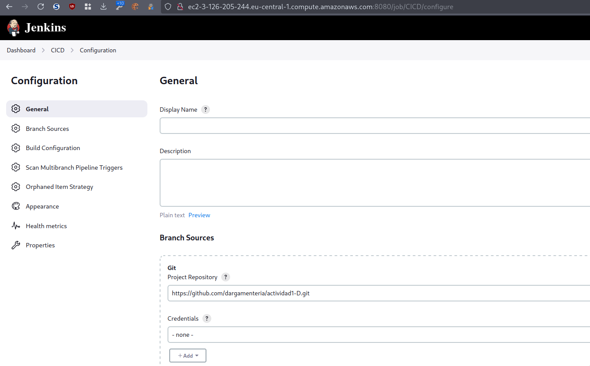
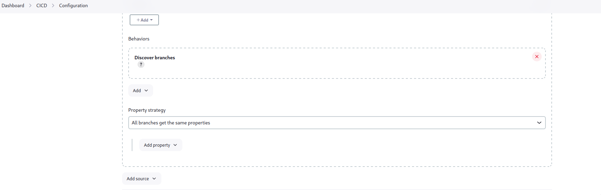
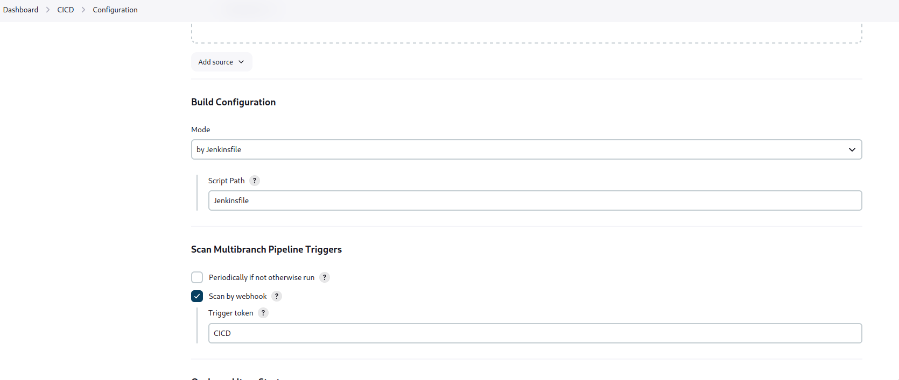
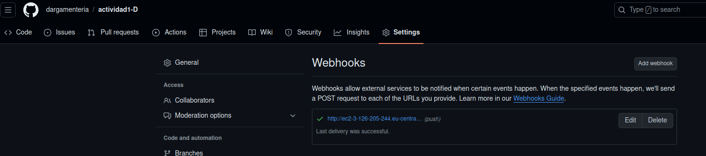
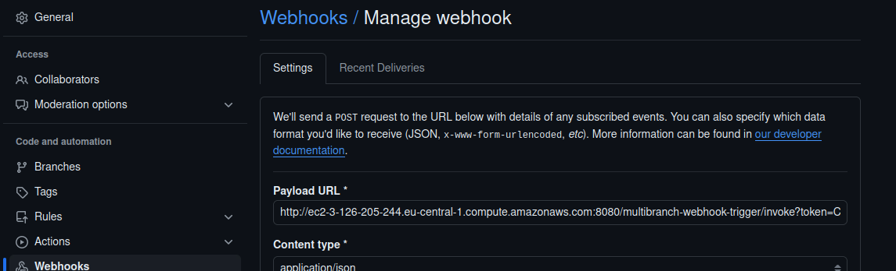
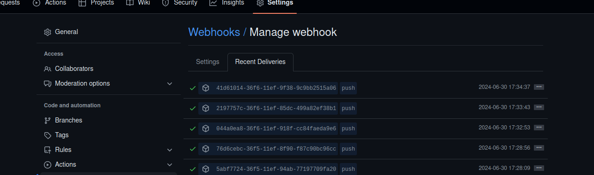
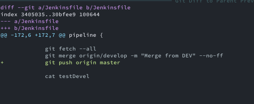
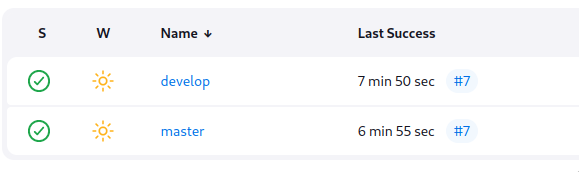

-   [Reto 5 -- Pipeline
    Multibranch](#reto-5-pipeline-multibranch)
    -   [CD log](#cd-log)
    -   [CI log](#ci-log)

# Reto 5 -- Pipeline Multibranch

## Creación del pipeline multibranch, en Jenkins 
* Creamos un *multibranch
pipeline* 

* Ajustamos el repositorio

* Ajustamos los parámetros

* Ajustamos los parámetros del webhook

* Creamos el webhook en Github




Hemos reajustado la fase *promote* para que despues de hacer los cambios
los suba a *origin*


``` groovy
stage ('Promote') {
      agent { label 'linux' }
      steps {
        catchError(buildResult: 'FAILURE', stageResult: 'FAILURE') {
          pipelineBanner()
          sh ('''
            [ -e "$WORKSPACE/gitCode" ] && rm -fr "$WORKSPACE/gitCode"
            git clone https://${GITHUB_TOKEN}@github.com/dargamenteria/actividad1-D $WORKSPACE/gitCode
            git config --global merge.ours.driver true
            git config --global --list

            cd "$WORKSPACE/gitCode"

            git checkout master
            cat testDevel

            git fetch --all
            git merge origin/develop -m "Merge from DEV" --no-ff
            git push origin master

            cat testDevel

            '''

          )
        }
      } 
    }
```

Una vez realiados estos ajustes se observa la ejecución en serie de los
pipelines


## CI log

``` bash
Branch indexing
 > git rev-parse --resolve-git-dir /var/lib/jenkins/caches/git-77b77bea51f19361bb9ce66395224735/.git # timeout=10
Setting origin to https://github.com/dargamenteria/actividad1-D.git
 > git config remote.origin.url https://github.com/dargamenteria/actividad1-D.git # timeout=10
Fetching origin...
Fetching upstream changes from origin
 > git --version # timeout=10
 > git --version # 'git version 2.34.1'
 > git config --get remote.origin.url # timeout=10
 > git fetch --tags --force --progress -- origin +refs/heads/*:refs/remotes/origin/* # timeout=10
Seen branch in repository origin/develop
Seen branch in repository origin/master
Seen 2 remote branches
Obtained Jenkinsfile from cbb2d9ac4996727a1954dc682bbf8505a3162108
Loading library test-pipeline-library@master
Attempting to resolve master from remote references...
 > git --version # timeout=10
 > git --version # 'git version 2.34.1'
 > git ls-remote -h -- https://github.com/dargamenteria/actividad1-B # timeout=10
Found match: refs/heads/master revision 92a82048d1a7deb3d98a83bc83d08ab2eb6d14a9
The recommended git tool is: NONE
No credentials specified
 > git rev-parse --resolve-git-dir /var/lib/jenkins/workspace/CICD_develop@libs/dbe5ec756152d72f500a5d42d4722cf67d056c195f909a0176fbaf5b216a8290/.git # timeout=10
Fetching changes from the remote Git repository
 > git config remote.origin.url https://github.com/dargamenteria/actividad1-B # timeout=10
Fetching without tags
Fetching upstream changes from https://github.com/dargamenteria/actividad1-B
 > git --version # timeout=10
 > git --version # 'git version 2.34.1'
 > git fetch --no-tags --force --progress -- https://github.com/dargamenteria/actividad1-B +refs/heads/*:refs/remotes/origin/* # timeout=10
Checking out Revision 92a82048d1a7deb3d98a83bc83d08ab2eb6d14a9 (master)
 > git config core.sparsecheckout # timeout=10
 > git checkout -f 92a82048d1a7deb3d98a83bc83d08ab2eb6d14a9 # timeout=10
Commit message: "Some cosmetical changes"
 > git rev-list --no-walk 92a82048d1a7deb3d98a83bc83d08ab2eb6d14a9 # timeout=10
[Pipeline] Start of Pipeline
[Pipeline] node
Running on slave2 in /home/ubuntu/workspace/CICD_develop
[Pipeline] {
[Pipeline] stage
[Pipeline] { (Declarative: Checkout SCM)
[Pipeline] checkout
Selected Git installation does not exist. Using Default
The recommended git tool is: NONE
No credentials specified
Cloning the remote Git repository
Cloning with configured refspecs honoured and without tags
Avoid second fetch
Checking out Revision cbb2d9ac4996727a1954dc682bbf8505a3162108 (develop)
Commit message: "dummy content"
Cloning repository https://github.com/dargamenteria/actividad1-D.git
 > git init /home/ubuntu/workspace/CICD_develop # timeout=10
Fetching upstream changes from https://github.com/dargamenteria/actividad1-D.git
 > git --version # timeout=10
 > git --version # 'git version 2.34.1'
 > git fetch --no-tags --force --progress -- https://github.com/dargamenteria/actividad1-D.git +refs/heads/*:refs/remotes/origin/* # timeout=10
 > git config remote.origin.url https://github.com/dargamenteria/actividad1-D.git # timeout=10
 > git config --add remote.origin.fetch +refs/heads/*:refs/remotes/origin/* # timeout=10
 > git config core.sparsecheckout # timeout=10
 > git checkout -f cbb2d9ac4996727a1954dc682bbf8505a3162108 # timeout=10
 > git rev-list --no-walk 2117d60422580301a670c8c30e2f077e235f6e0e # timeout=10
[Pipeline] }
[Pipeline] // stage
[Pipeline] withEnv
[Pipeline] {
[Pipeline] withCredentials
Masking supported pattern matches of $AWS_ACCESS_KEY_ID or $AWS_SECRET_ACCESS_KEY or $GITHUB_TOKEN
[Pipeline] {
[Pipeline] stage
[Pipeline] { (Pipeline Info)
[Pipeline] sh
+ echo   DEV      pipelineBanner 
  DEV      pipelineBanner 
[Pipeline] script
[Pipeline] {
[Pipeline] sh
+ echo ##########################
##########################
+ hostname -f
+ echo #Hostname: ip-10-153-10-218.eu-central-1.compute.internal
#Hostname: ip-10-153-10-218.eu-central-1.compute.internal
+ uname -a
+ echo #Hostinfo: Linux ip-10-153-10-218 6.5.0-1021-aws #21~22.04.1-Ubuntu SMP Fri May 10 20:04:44 UTC 2024 x86_64 x86_64 x86_64 GNU/Linux
#Hostinfo: Linux ip-10-153-10-218 6.5.0-1021-aws #21~22.04.1-Ubuntu SMP Fri May 10 20:04:44 UTC 2024 x86_64 x86_64 x86_64 GNU/Linux
+ echo ##########################
##########################
[Pipeline] }
[Pipeline] // script
[Pipeline] }
[Pipeline] // stage
[Pipeline] stage
[Pipeline] { (Get code)
[Pipeline] node
Running on slave2 in /home/ubuntu/workspace/CICD_develop@2
[Pipeline] {
[Pipeline] checkout
Selected Git installation does not exist. Using Default
The recommended git tool is: NONE
No credentials specified
Fetching changes from the remote Git repository
Fetching without tags
Checking out Revision cbb2d9ac4996727a1954dc682bbf8505a3162108 (develop)
Commit message: "dummy content"
[Pipeline] withEnv
[Pipeline] {
[Pipeline] catchError
[Pipeline] {
[Pipeline] script
[Pipeline] {
[Pipeline] sh
+ echo ##########################
##########################
+ hostname -f
+ echo #Hostname: ip-10-153-10-218.eu-central-1.compute.internal
#Hostname: ip-10-153-10-218.eu-central-1.compute.internal
+ uname -a
+ echo #Hostinfo: Linux ip-10-153-10-218 6.5.0-1021-aws #21~22.04.1-Ubuntu SMP Fri May 10 20:04:44 UTC 2024 x86_64 x86_64 x86_64 GNU/Linux
#Hostinfo: Linux ip-10-153-10-218 6.5.0-1021-aws #21~22.04.1-Ubuntu SMP Fri May 10 20:04:44 UTC 2024 x86_64 x86_64 x86_64 GNU/Linux
+ echo ##########################
##########################
[Pipeline] }
[Pipeline] // script
[Pipeline] sh
 > git rev-parse --resolve-git-dir /home/ubuntu/workspace/CICD_develop@2/.git # timeout=10
 > git config remote.origin.url https://github.com/dargamenteria/actividad1-D.git # timeout=10
Fetching upstream changes from https://github.com/dargamenteria/actividad1-D.git
 > git --version # timeout=10
 > git --version # 'git version 2.34.1'
 > git fetch --no-tags --force --progress -- https://github.com/dargamenteria/actividad1-D.git +refs/heads/*:refs/remotes/origin/* # timeout=10
 > git config core.sparsecheckout # timeout=10
 > git checkout -f cbb2d9ac4996727a1954dc682bbf8505a3162108 # timeout=10
+ [ -e /home/ubuntu/workspace/CICD_develop@2/gitCode ]
+ rm -fr /home/ubuntu/workspace/CICD_develop@2/gitCode
+ git clone https://****@github.com/dargamenteria/actividad1-D /home/ubuntu/workspace/CICD_develop@2/gitCode
Cloning into '/home/ubuntu/workspace/CICD_develop@2/gitCode'...
+ git checkout develop
Previous HEAD position was cbb2d9a dummy content
Switched to branch 'develop'
Your branch is behind 'origin/develop' by 5 commits, and can be fast-forwarded.
  (use "git pull" to update your local branch)
+ curl -sSO https://raw.githubusercontent.com/dargamenteria/actividad1-D-_config/staging/samconfig.toml
+ ls -arlt
total 96
drwxrwxr-x  4 ubuntu ubuntu 4096 Jun 30 14:13 test
drwxrwxr-x  6 ubuntu ubuntu 4096 Jun 30 14:13 pipelines
drwxrwxr-x  3 ubuntu ubuntu 4096 Jun 30 14:13 jenkins
-rw-rw-r--  1 ubuntu ubuntu  134 Jun 30 14:13 .gitignore
-rw-rw-r--  1 ubuntu ubuntu   54 Jun 30 14:13 .gitattributes
drwxrwxr-x 11 ubuntu ubuntu 4096 Jun 30 15:33 ..
-rwxrwxr-x  1 ubuntu ubuntu 1164 Jun 30 15:33 cutreApiTest.sh
-rw-rw-r--  1 ubuntu ubuntu  646 Jun 30 15:33 README.md
-rw-rw-r--  1 ubuntu ubuntu 5720 Jun 30 15:33 Jenkinsfile_agentes
drwxrwxr-x  3 ubuntu ubuntu 4096 Jun 30 15:33 IaC
-rw-rw-r--  1 ubuntu ubuntu  318 Jun 30 15:33 CHANGELOG.md
-rw-rw-r--  1 ubuntu ubuntu 4155 Jun 30 15:33 template.yaml
drwxrwxr-x  2 ubuntu ubuntu 4096 Jun 30 15:33 src
-rw-rw-r--  1 ubuntu ubuntu   76 Jun 30 15:33 pytest.ini
-rw-rw-r--  1 ubuntu ubuntu  775 Jun 30 15:33 localEnvironment.json
drwxrwxr-x  8 ubuntu ubuntu 4096 Jun 30 15:33 gitCode
-rw-rw-r--  1 ubuntu ubuntu   18 Jun 30 15:33 testDevel
-rw-rw-r--  1 ubuntu ubuntu 5888 Jun 30 15:33 Jenkinsfile
drwxrwxr-x  8 ubuntu ubuntu 4096 Jun 30 15:33 .git
drwxrwxr-x  9 ubuntu ubuntu 4096 Jun 30 15:33 .
-rw-rw-r--  1 ubuntu ubuntu  298 Jun 30 15:33 samconfig.toml
[Pipeline] stash
Stashed 99 file(s)
[Pipeline] }
[Pipeline] // catchError
[Pipeline] }
[Pipeline] // withEnv
[Pipeline] }
[Pipeline] // node
[Pipeline] }
[Pipeline] // stage
[Pipeline] stage
[Pipeline] { (Static Test)
[Pipeline] parallel
[Pipeline] { (Branch: Static code Analysis)
[Pipeline] { (Branch: Security Analysis)
[Pipeline] stage
[Pipeline] { (Static code Analysis)
[Pipeline] stage
[Pipeline] { (Security Analysis)
[Pipeline] node
Running on slave1 in /home/ubuntu/workspace/CICD_develop
[Pipeline] node
Running on slave1 in /home/ubuntu/workspace/CICD_develop@2
[Pipeline] {
[Pipeline] {
[Pipeline] checkout
Selected Git installation does not exist. Using Default
The recommended git tool is: NONE
No credentials specified
Fetching changes from the remote Git repository
[Pipeline] checkout
Selected Git installation does not exist. Using Default
The recommended git tool is: NONE
Fetching without tags
No credentials specified
Fetching changes from the remote Git repository
Fetching without tags
Checking out Revision cbb2d9ac4996727a1954dc682bbf8505a3162108 (develop)
Checking out Revision cbb2d9ac4996727a1954dc682bbf8505a3162108 (develop)
Commit message: "dummy content"
Commit message: "dummy content"
[Pipeline] withEnv
[Pipeline] {
[Pipeline] withEnv
[Pipeline] {
[Pipeline] catchError
[Pipeline] {
[Pipeline] script
[Pipeline] {
[Pipeline] sh
[Pipeline] catchError
[Pipeline] {
[Pipeline] script
[Pipeline] {
[Pipeline] sh
 > git rev-parse --resolve-git-dir /home/ubuntu/workspace/CICD_develop/.git # timeout=10
 > git config remote.origin.url https://github.com/dargamenteria/actividad1-D.git # timeout=10
Fetching upstream changes from https://github.com/dargamenteria/actividad1-D.git
 > git --version # timeout=10
 > git --version # 'git version 2.34.1'
 > git fetch --no-tags --force --progress -- https://github.com/dargamenteria/actividad1-D.git +refs/heads/*:refs/remotes/origin/* # timeout=10
 > git config core.sparsecheckout # timeout=10
 > git checkout -f cbb2d9ac4996727a1954dc682bbf8505a3162108 # timeout=10
+ echo ##########################
##########################
+ hostname -f
+ echo #Hostname: ip-10-153-10-174.eu-central-1.compute.internal
#Hostname: ip-10-153-10-174.eu-central-1.compute.internal
+ uname -a
+ echo #Hostinfo: Linux ip-10-153-10-174 6.5.0-1021-aws #21~22.04.1-Ubuntu SMP Fri May 10 20:04:44 UTC 2024 x86_64 x86_64 x86_64 GNU/Linux
#Hostinfo: Linux ip-10-153-10-174 6.5.0-1021-aws #21~22.04.1-Ubuntu SMP Fri May 10 20:04:44 UTC 2024 x86_64 x86_64 x86_64 GNU/Linux
+ echo ##########################
##########################
 > git rev-parse --resolve-git-dir /home/ubuntu/workspace/CICD_develop@2/.git # timeout=10
 > git config remote.origin.url https://github.com/dargamenteria/actividad1-D.git # timeout=10
Fetching upstream changes from https://github.com/dargamenteria/actividad1-D.git
 > git --version # timeout=10
 > git --version # 'git version 2.34.1'
 > git fetch --no-tags --force --progress -- https://github.com/dargamenteria/actividad1-D.git +refs/heads/*:refs/remotes/origin/* # timeout=10
 > git config core.sparsecheckout # timeout=10
 > git checkout -f cbb2d9ac4996727a1954dc682bbf8505a3162108 # timeout=10
[Pipeline] }
[Pipeline] // script
[Pipeline] unstash
+ echo ##########################
##########################
+ hostname -f
+ echo #Hostname: ip-10-153-10-174.eu-central-1.compute.internal
#Hostname: ip-10-153-10-174.eu-central-1.compute.internal
+ uname -a
+ echo #Hostinfo: Linux ip-10-153-10-174 6.5.0-1021-aws #21~22.04.1-Ubuntu SMP Fri May 10 20:04:44 UTC 2024 x86_64 x86_64 x86_64 GNU/Linux
#Hostinfo: Linux ip-10-153-10-174 6.5.0-1021-aws #21~22.04.1-Ubuntu SMP Fri May 10 20:04:44 UTC 2024 x86_64 x86_64 x86_64 GNU/Linux
+ echo ##########################
##########################
[Pipeline] sh
[Pipeline] }
[Pipeline] // script
[Pipeline] unstash
+ cd /home/ubuntu/workspace/CICD_develop/gitCode
+ pwd
+ pwd
+ flake8 --format=pylint --exit-zero --max-line-length 120 /home/ubuntu/workspace/CICD_develop/gitCode/src
[Pipeline] sh
[Pipeline] recordIssues
WARNING: Unknown parameter(s) found for class type 'io.jenkins.plugins.analysis.core.util.WarningsQualityGate': critically
WARNING: Unknown parameter(s) found for class type 'io.jenkins.plugins.analysis.core.util.WarningsQualityGate': critically
[Flake8] Searching for all files in '/home/ubuntu/workspace/CICD_develop' that match the pattern 'gitCode/flake8.out'
[Flake8] Traversing of symbolic links: enabled
[Flake8] -> found 1 file
[Flake8] Successfully parsed file /home/ubuntu/workspace/CICD_develop/gitCode/flake8.out
[Flake8] -> found 3 issues (skipped 0 duplicates)
[Flake8] Successfully processed file 'gitCode/flake8.out'
+ cd /home/ubuntu/workspace/CICD_develop@2/gitCode
+ pwd
+ bandit -r src --format custom --msg-template {abspath}:{line}: {test_id}[bandit]: {severity}: {msg} -o /home/ubuntu/workspace/CICD_develop@2/gitCode/bandit.out
[Flake8] Post processing issues on 'slave1' with source code encoding 'UTF-8'
[Flake8] Creating SCM blamer to obtain author and commit information for affected files
[Flake8] -> No blamer installed yet. You need to install the 'git-forensics' plugin to enable blaming for Git.
[Flake8] Resolving file names for all issues in workspace '/home/ubuntu/workspace/CICD_develop'
[Flake8] -> resolved paths in source directory (1 found, 0 not found)
[Flake8] Resolving module names from module definitions (build.xml, pom.xml, or Manifest.mf files)
[Flake8] -> resolved module names for 3 issues
[Flake8] Resolving package names (or namespaces) by parsing the affected files
[Flake8] -> resolved package names of 1 affected files
[Flake8] No filter has been set, publishing all 3 issues
[Flake8] Creating fingerprints for all affected code blocks to track issues over different builds
[Flake8] -> created fingerprints for 3 issues (skipped 0 issues)
[Flake8] Copying affected files to Jenkins' build folder '/var/lib/jenkins/jobs/CICD/branches/develop/builds/7/files-with-issues'
[Flake8] -> 1 copied, 0 not in workspace, 0 not-found, 0 with I/O error
[Flake8] Skipping cleaning of source code files in old builds
[Flake8] Repository miner is not configured, skipping repository mining
[Flake8] Searching for all files in '/home/ubuntu/workspace/CICD_develop' that match the pattern 'gitCode/flake8.out'
[Flake8] Traversing of symbolic links: enabled
[Flake8] -> found 1 file
[Flake8] Successfully parsed file /home/ubuntu/workspace/CICD_develop/gitCode/flake8.out
[Flake8] -> found 3 issues (skipped 0 duplicates)
[Flake8] Successfully processed file 'gitCode/flake8.out'
[Flake8] Post processing issues on 'slave1' with source code encoding 'UTF-8'
[Flake8] Creating SCM blamer to obtain author and commit information for affected files
[Flake8] -> No blamer installed yet. You need to install the 'git-forensics' plugin to enable blaming for Git.
[Flake8] Resolving file names for all issues in workspace '/home/ubuntu/workspace/CICD_develop'
[Flake8] -> resolved paths in source directory (1 found, 0 not found)
[Flake8] Resolving module names from module definitions (build.xml, pom.xml, or Manifest.mf files)
[Flake8] -> resolved module names for 3 issues
[Flake8] Resolving package names (or namespaces) by parsing the affected files
[Flake8] -> resolved package names of 1 affected files
[Flake8] No filter has been set, publishing all 3 issues
[Flake8] Creating fingerprints for all affected code blocks to track issues over different builds
[Flake8] -> created fingerprints for 3 issues (skipped 0 issues)
[Flake8] Copying affected files to Jenkins' build folder '/var/lib/jenkins/jobs/CICD/branches/develop/builds/7/files-with-issues'
[Flake8] -> 1 copied, 0 not in workspace, 0 not-found, 0 with I/O error
[Flake8] Skipping cleaning of source code files in old builds
[Flake8] Repository miner is not configured, skipping repository mining
[Flake8] Reference build recorder is not configured
[Flake8] No valid reference build found
[Flake8] All reported issues will be considered outstanding
[Flake8] Evaluating quality gates
[Flake8] -> All quality gates have been passed
[Flake8] -> Details for each quality gate:
[Flake8]    - [Total (any severity)]: ≪Success≫ - (Actual value: 3, Quality gate: 8.00)
[Flake8]    - [Total (any severity)]: ≪Success≫ - (Actual value: 3, Quality gate: 10.00)
[Flake8] Health report is disabled - skipping
[Flake8] Created analysis result for 3 issues (found 0 new issues, fixed 0 issues)
[Flake8] Attaching ResultAction with ID 'flake8' to build 'CICD/develop #7'.
[Checks API] No suitable checks publisher found.
[Pipeline] }
[Pipeline] // catchError
[Pipeline] }
[Pipeline] // withEnv
[Pipeline] }
[main]  INFO    profile include tests: None
[main]  INFO    profile exclude tests: None
[main]  INFO    cli include tests: None
[main]  INFO    cli exclude tests: None
[main]  INFO    running on Python 3.10.12
[custom]    INFO    Result written to file: /home/ubuntu/workspace/CICD_develop@2/gitCode/bandit.out
[Pipeline] // node
[Pipeline] }
[Pipeline] recordIssues
WARNING: Unknown parameter(s) found for class type 'io.jenkins.plugins.analysis.core.util.WarningsQualityGate': critically
WARNING: Unknown parameter(s) found for class type 'io.jenkins.plugins.analysis.core.util.WarningsQualityGate': critically
[Pylint] Searching for all files in '/home/ubuntu/workspace/CICD_develop@2' that match the pattern 'gitCode/bandit.out'
[Pylint] Traversing of symbolic links: enabled
[Pylint] -> found 1 file
[Pylint] Skipping file 'gitCode/bandit.out' because it's empty
[Pylint] Skipping post processing
[Pylint] No filter has been set, publishing all 0 issues
[Pylint] Repository miner is not configured, skipping repository mining
[Pylint] Searching for all files in '/home/ubuntu/workspace/CICD_develop@2' that match the pattern 'gitCode/bandit.out'
[Pylint] Traversing of symbolic links: enabled
[Pylint] -> found 1 file
[Pylint] Skipping file 'gitCode/bandit.out' because it's empty
[Pylint] Skipping post processing
[Pylint] No filter has been set, publishing all 0 issues
[Pylint] Repository miner is not configured, skipping repository mining
[Pylint] Reference build recorder is not configured
[Pylint] No valid reference build found
[Pylint] All reported issues will be considered outstanding
[Pylint] Evaluating quality gates
[Pylint] -> All quality gates have been passed
[Pylint] -> Details for each quality gate:
[Pylint]    - [Total (any severity)]: ≪Success≫ - (Actual value: 0, Quality gate: 1.00)
[Pylint]    - [Total (any severity)]: ≪Success≫ - (Actual value: 0, Quality gate: 2.00)
[Pylint] Health report is disabled - skipping
[Pylint] Created analysis result for 0 issues (found 0 new issues, fixed 0 issues)
[Pylint] Attaching ResultAction with ID 'pylint' to build 'CICD/develop #7'.
[Pipeline] // stage
[Checks API] No suitable checks publisher found.
[Pipeline] }
[Pipeline] }
[Pipeline] // catchError
[Pipeline] }
[Pipeline] // withEnv
[Pipeline] }
[Pipeline] // node
[Pipeline] }
[Pipeline] // stage
[Pipeline] }
[Pipeline] // parallel
[Pipeline] }
[Pipeline] // stage
[Pipeline] stage
[Pipeline] { (SAM deploy)
[Pipeline] node
Running on slave2 in /home/ubuntu/workspace/CICD_develop@2
[Pipeline] {
[Pipeline] checkout
Selected Git installation does not exist. Using Default
The recommended git tool is: NONE
No credentials specified
Fetching changes from the remote Git repository
Fetching without tags
Checking out Revision cbb2d9ac4996727a1954dc682bbf8505a3162108 (develop)
Commit message: "dummy content"
[Pipeline] withEnv
[Pipeline] {
[Pipeline] catchError
[Pipeline] {
[Pipeline] script
[Pipeline] {
[Pipeline] sh
+ echo ##########################
##########################
+ hostname -f
+ echo #Hostname: ip-10-153-10-218.eu-central-1.compute.internal
#Hostname: ip-10-153-10-218.eu-central-1.compute.internal
+ uname -a
+ echo #Hostinfo: Linux ip-10-153-10-218 6.5.0-1021-aws #21~22.04.1-Ubuntu SMP Fri May 10 20:04:44 UTC 2024 x86_64 x86_64 x86_64 GNU/Linux
#Hostinfo: Linux ip-10-153-10-218 6.5.0-1021-aws #21~22.04.1-Ubuntu SMP Fri May 10 20:04:44 UTC 2024 x86_64 x86_64 x86_64 GNU/Linux
+ echo ##########################
##########################
[Pipeline] }
[Pipeline] // script
[Pipeline] unstash
 > git rev-parse --resolve-git-dir /home/ubuntu/workspace/CICD_develop@2/.git # timeout=10
 > git config remote.origin.url https://github.com/dargamenteria/actividad1-D.git # timeout=10
Fetching upstream changes from https://github.com/dargamenteria/actividad1-D.git
 > git --version # timeout=10
 > git --version # 'git version 2.34.1'
 > git fetch --no-tags --force --progress -- https://github.com/dargamenteria/actividad1-D.git +refs/heads/*:refs/remotes/origin/* # timeout=10
 > git config core.sparsecheckout # timeout=10
 > git checkout -f cbb2d9ac4996727a1954dc682bbf8505a3162108 # timeout=10
[Pipeline] sh
+ cd /home/ubuntu/workspace/CICD_develop@2/gitCode
+ export AWS_ACCESS_KEY_ID=****
+ export AWS_SECRET_ACCESS_KEY=****
+ sam build
Building codeuri: /home/ubuntu/workspace/CICD_develop@2/gitCode/src runtime: python3.10 metadata: {} architecture: x86_64 functions: CreateTodoFunction, ListTodosFunction, GetTodoFunction, UpdateTodoFunction, DeleteTodoFunction
 Running PythonPipBuilder:ResolveDependencies
 Running PythonPipBuilder:CopySource

Build Succeeded

Built Artifacts  : .aws-sam/build
Built Template   : .aws-sam/build/template.yaml

Commands you can use next
=========================
[*] Validate SAM template: sam validate
[*] Invoke Function: sam local invoke
[*] Test Function in the Cloud: sam sync --stack-name {{stack-name}} --watch
[*] Deploy: sam deploy --guided
+ sam deploy --stack-name todo-aws-list-staging --config-file ../samconfig.toml --region eu-central-1 --disable-rollback --config-env staging --no-fail-on-empty-changeset
File with same data already exists at todo-list-aws/0eb47a2b3fe620b3936bd178596d48b5, skipping upload
File with same data already exists at todo-list-aws/0eb47a2b3fe620b3936bd178596d48b5, skipping upload
File with same data already exists at todo-list-aws/0eb47a2b3fe620b3936bd178596d48b5, skipping upload
File with same data already exists at todo-list-aws/0eb47a2b3fe620b3936bd178596d48b5, skipping upload
File with same data already exists at todo-list-aws/0eb47a2b3fe620b3936bd178596d48b5, skipping upload

    Deploying with following values
    ===============================
    Stack name                   : todo-aws-list-staging
    Region                       : eu-central-1
    Confirm changeset            : False
    Disable rollback             : True
    Deployment s3 bucket         : marga-deploy-bucket-staging
    Capabilities                 : ["CAPABILITY_IAM"]
    Parameter overrides          : {"Stage": "staging"}
    Signing Profiles             : {}

Initiating deployment
=====================

File with same data already exists at todo-list-aws/1f038114a70b1d1b26a3562c95b6c400.template, skipping upload


Waiting for changeset to be created..

No changes to deploy. Stack todo-aws-list-staging is up to date
+ unset AWS_SECRET_ACCESS_KEY
+ unset AWS_ACCESS_KEY_ID
[Pipeline] }
[Pipeline] // catchError
[Pipeline] }
[Pipeline] // withEnv
[Pipeline] }
[Pipeline] // node
[Pipeline] }
[Pipeline] // stage
[Pipeline] stage
[Pipeline] { (Test Rest)
[Pipeline] node
Running on slave1 in /home/ubuntu/workspace/CICD_develop
[Pipeline] {
[Pipeline] checkout
Selected Git installation does not exist. Using Default
The recommended git tool is: NONE
No credentials specified
Fetching changes from the remote Git repository
Fetching without tags
Checking out Revision cbb2d9ac4996727a1954dc682bbf8505a3162108 (develop)
Commit message: "dummy content"
[Pipeline] withEnv
[Pipeline] {
[Pipeline] catchError
[Pipeline] {
[Pipeline] script
[Pipeline] {
[Pipeline] sh
+ echo ##########################
##########################
+ hostname -f
+ echo #Hostname: ip-10-153-10-174.eu-central-1.compute.internal
#Hostname: ip-10-153-10-174.eu-central-1.compute.internal
+ uname -a
+ echo #Hostinfo: Linux ip-10-153-10-174 6.5.0-1021-aws #21~22.04.1-Ubuntu SMP Fri May 10 20:04:44 UTC 2024 x86_64 x86_64 x86_64 GNU/Linux
#Hostinfo: Linux ip-10-153-10-174 6.5.0-1021-aws #21~22.04.1-Ubuntu SMP Fri May 10 20:04:44 UTC 2024 x86_64 x86_64 x86_64 GNU/Linux
+ echo ##########################
##########################
[Pipeline] }
[Pipeline] // script
[Pipeline] unstash
[Pipeline] lock
 > git rev-parse --resolve-git-dir /home/ubuntu/workspace/CICD_develop/.git # timeout=10
 > git config remote.origin.url https://github.com/dargamenteria/actividad1-D.git # timeout=10
Fetching upstream changes from https://github.com/dargamenteria/actividad1-D.git
 > git --version # timeout=10
 > git --version # 'git version 2.34.1'
 > git fetch --no-tags --force --progress -- https://github.com/dargamenteria/actividad1-D.git +refs/heads/*:refs/remotes/origin/* # timeout=10
 > git config core.sparsecheckout # timeout=10
 > git checkout -f cbb2d9ac4996727a1954dc682bbf8505a3162108 # timeout=10
Trying to acquire lock on [Resource: test-resources]
Resource [test-resources] did not exist. Created.
Lock acquired on [Resource: test-resources]
[Pipeline] {
[Pipeline] sh
+ echo Test phase
Test phase
+ cd /home/ubuntu/workspace/CICD_develop/gitCode
+ export AWS_ACCESS_KEY_ID=****
+ export AWS_SECRET_ACCESS_KEY=****
+ aws cloudformation describe-stacks --stack-name todo-aws-list-staging --query Stacks[0].Outputs[?OutputKey==`BaseUrlApi`].OutputValue --output text
+ export BASE_URL=https://rem31jib2b.execute-api.eu-central-1.amazonaws.com/Prod
+ aws sts get-session-token
+ cat a.json
+ jq .Credentials.AccessKeyId
+ export AWS_ACCESS_KEY_ID="XXXXXX"
+ cat a.json
+ jq .Credentials.SecretAccessKey
+ export AWS_SECRET_ACCESS_KEY="YYYYY"
+ cat a.json
+ jq .Credentials.SessionToken
+ export AWS_SESSION_TOKEN="AAAAAA"
+ pwd
+ pytest --junitxml=result-rest.xml /home/ubuntu/workspace/CICD_develop/gitCode/test/integration/todoApiTest.py
============================= test session starts ==============================
platform linux -- Python 3.10.12, pytest-8.2.2, pluggy-1.5.0
rootdir: /home/ubuntu/workspace/CICD_develop/gitCode
configfile: pytest.ini
collected 5 items

test/integration/todoApiTest.py .....                                    [100%]

=============================== warnings summary ===============================
test/integration/todoApiTest.py:22
  /home/ubuntu/workspace/CICD_develop/gitCode/test/integration/todoApiTest.py:22: PytestUnknownMarkWarning: Unknown pytest.mark.readonly - is this a typo?  You can register custom marks to avoid this warning - for details, see https://docs.pytest.org/en/stable/how-to/mark.html
    @pytest.mark.readonly

test/integration/todoApiTest.py:80
  /home/ubuntu/workspace/CICD_develop/gitCode/test/integration/todoApiTest.py:80: PytestUnknownMarkWarning: Unknown pytest.mark.readonly - is this a typo?  You can register custom marks to avoid this warning - for details, see https://docs.pytest.org/en/stable/how-to/mark.html
    @pytest.mark.readonly

-- Docs: https://docs.pytest.org/en/stable/how-to/capture-warnings.html
- generated xml file: /home/ubuntu/workspace/CICD_develop/gitCode/result-rest.xml -
======================== 5 passed, 2 warnings in 9.22s =========================
[Pipeline] }
Lock released on resource [Resource: test-resources]
[Pipeline] // lock
[Pipeline] stash
Warning: overwriting stash ‘workspace’
Stashed 107 file(s)
[Pipeline] }
[Pipeline] // catchError
[Pipeline] }
[Pipeline] // withEnv
[Pipeline] }
[Pipeline] // node
[Pipeline] }
[Pipeline] // stage
[Pipeline] stage
[Pipeline] { (Test Results)
[Pipeline] node
Running on slave2 in /home/ubuntu/workspace/CICD_develop@2
[Pipeline] {
[Pipeline] checkout
Selected Git installation does not exist. Using Default
The recommended git tool is: NONE
No credentials specified
Fetching changes from the remote Git repository
Fetching without tags
Checking out Revision cbb2d9ac4996727a1954dc682bbf8505a3162108 (develop)
Commit message: "dummy content"
[Pipeline] withEnv
[Pipeline] {
[Pipeline] script
[Pipeline] {
[Pipeline] sh
+ echo ##########################
##########################
+ hostname -f
+ echo #Hostname: ip-10-153-10-218.eu-central-1.compute.internal
#Hostname: ip-10-153-10-218.eu-central-1.compute.internal
+ uname -a
+ echo #Hostinfo: Linux ip-10-153-10-218 6.5.0-1021-aws #21~22.04.1-Ubuntu SMP Fri May 10 20:04:44 UTC 2024 x86_64 x86_64 x86_64 GNU/Linux
#Hostinfo: Linux ip-10-153-10-218 6.5.0-1021-aws #21~22.04.1-Ubuntu SMP Fri May 10 20:04:44 UTC 2024 x86_64 x86_64 x86_64 GNU/Linux
+ echo ##########################
##########################
[Pipeline] }
[Pipeline] // script
[Pipeline] catchError
[Pipeline] {
[Pipeline] unstash
[Pipeline] junit
Recording test results
[Checks API] No suitable checks publisher found.
[Pipeline] }
[Pipeline] // catchError
 > git rev-parse --resolve-git-dir /home/ubuntu/workspace/CICD_develop@2/.git # timeout=10
 > git config remote.origin.url https://github.com/dargamenteria/actividad1-D.git # timeout=10
Fetching upstream changes from https://github.com/dargamenteria/actividad1-D.git
 > git --version # timeout=10
 > git --version # 'git version 2.34.1'
 > git fetch --no-tags --force --progress -- https://github.com/dargamenteria/actividad1-D.git +refs/heads/*:refs/remotes/origin/* # timeout=10
 > git config core.sparsecheckout # timeout=10
 > git checkout -f cbb2d9ac4996727a1954dc682bbf8505a3162108 # timeout=10
[Pipeline] }
[Pipeline] // withEnv
[Pipeline] }
[Pipeline] // node
[Pipeline] }
[Pipeline] // stage
[Pipeline] stage
[Pipeline] { (Promote)
[Pipeline] node
Running on slave1 in /home/ubuntu/workspace/CICD_develop
[Pipeline] {
[Pipeline] checkout
Selected Git installation does not exist. Using Default
The recommended git tool is: NONE
No credentials specified
Fetching changes from the remote Git repository
Fetching without tags
Checking out Revision cbb2d9ac4996727a1954dc682bbf8505a3162108 (develop)
Commit message: "dummy content"
[Pipeline] withEnv
[Pipeline] {
[Pipeline] catchError
[Pipeline] {
[Pipeline] script
[Pipeline] {
[Pipeline] sh
+ echo ##########################
##########################
+ hostname -f
+ echo #Hostname: ip-10-153-10-174.eu-central-1.compute.internal
#Hostname: ip-10-153-10-174.eu-central-1.compute.internal
+ uname -a
+ echo #Hostinfo: Linux ip-10-153-10-174 6.5.0-1021-aws #21~22.04.1-Ubuntu SMP Fri May 10 20:04:44 UTC 2024 x86_64 x86_64 x86_64 GNU/Linux
#Hostinfo: Linux ip-10-153-10-174 6.5.0-1021-aws #21~22.04.1-Ubuntu SMP Fri May 10 20:04:44 UTC 2024 x86_64 x86_64 x86_64 GNU/Linux
+ echo ##########################
##########################
[Pipeline] }
[Pipeline] // script
[Pipeline] sh
 > git rev-parse --resolve-git-dir /home/ubuntu/workspace/CICD_develop/.git # timeout=10
 > git config remote.origin.url https://github.com/dargamenteria/actividad1-D.git # timeout=10
Fetching upstream changes from https://github.com/dargamenteria/actividad1-D.git
 > git --version # timeout=10
 > git --version # 'git version 2.34.1'
 > git fetch --no-tags --force --progress -- https://github.com/dargamenteria/actividad1-D.git +refs/heads/*:refs/remotes/origin/* # timeout=10
 > git config core.sparsecheckout # timeout=10
 > git checkout -f cbb2d9ac4996727a1954dc682bbf8505a3162108 # timeout=10
+ [ -e /home/ubuntu/workspace/CICD_develop/gitCode ]
+ rm -fr /home/ubuntu/workspace/CICD_develop/gitCode
+ git clone https://****@github.com/dargamenteria/actividad1-D /home/ubuntu/workspace/CICD_develop/gitCode
Cloning into '/home/ubuntu/workspace/CICD_develop/gitCode'...
+ git config --global merge.ours.driver true
+ git config --global --list
credential.helper=!aws codecommit credential-helper $@
credential.usehttppath=true
core.editor=nano
merge.ours.driver=true
+ cd /home/ubuntu/workspace/CICD_develop/gitCode
+ git checkout master
Already on 'master'
Your branch is up to date with 'origin/master'.
+ cat testDevel
aaa
bbbb

aaa
bbb
1650
1656
1725
+ git fetch --all
Fetching origin
+ git merge origin/develop -m Merge from DEV --no-ff
Merge made by the 'ort' strategy.
 testDevel | 1 +
 1 file changed, 1 insertion(+)
+ git push origin master
To https://github.com/dargamenteria/actividad1-D
   8bfc44a..0133b33  master -> master
+ cat testDevel
aaa
bbbb

aaa
bbb
1650
1656
1725
1732
[Pipeline] }
[Pipeline] // catchError
[Pipeline] }
[Pipeline] // withEnv
[Pipeline] }
[Pipeline] // node
[Pipeline] }
[Pipeline] // stage
[Pipeline] stage
[Pipeline] { (Declarative: Post Actions)
[Pipeline] cleanWs
[WS-CLEANUP] Deleting project workspace...
[WS-CLEANUP] Deferred wipeout is used...
[WS-CLEANUP] done
[Pipeline] }
[Pipeline] // stage
[Pipeline] }
[Pipeline] // withCredentials
[Pipeline] }
[Pipeline] // withEnv
[Pipeline] }
[Pipeline] // node
[Pipeline] End of Pipeline
Finished: SUCCESS
```

## CD log

``` bash
Branch indexing
 > git rev-parse --resolve-git-dir /var/lib/jenkins/caches/git-77b77bea51f19361bb9ce66395224735/.git # timeout=10
Setting origin to https://github.com/dargamenteria/actividad1-D.git
 > git config remote.origin.url https://github.com/dargamenteria/actividad1-D.git # timeout=10
Fetching origin...
Fetching upstream changes from origin
 > git --version # timeout=10
 > git --version # 'git version 2.34.1'
 > git config --get remote.origin.url # timeout=10
 > git fetch --tags --force --progress -- origin +refs/heads/*:refs/remotes/origin/* # timeout=10
Seen branch in repository origin/develop
Seen branch in repository origin/master
Seen 2 remote branches
Obtained Jenkinsfile from 0133b335325c6c95e8ad5c6573d24cd7dffbb195
Loading library test-pipeline-library@master
Attempting to resolve master from remote references...
 > git --version # timeout=10
 > git --version # 'git version 2.34.1'
 > git ls-remote -h -- https://github.com/dargamenteria/actividad1-B # timeout=10
Found match: refs/heads/master revision 92a82048d1a7deb3d98a83bc83d08ab2eb6d14a9
The recommended git tool is: NONE
No credentials specified
 > git rev-parse --resolve-git-dir /var/lib/jenkins/workspace/CICD_master@libs/dbe5ec756152d72f500a5d42d4722cf67d056c195f909a0176fbaf5b216a8290/.git # timeout=10
Fetching changes from the remote Git repository
 > git config remote.origin.url https://github.com/dargamenteria/actividad1-B # timeout=10
Fetching without tags
Fetching upstream changes from https://github.com/dargamenteria/actividad1-B
 > git --version # timeout=10
 > git --version # 'git version 2.34.1'
 > git fetch --no-tags --force --progress -- https://github.com/dargamenteria/actividad1-B +refs/heads/*:refs/remotes/origin/* # timeout=10
Checking out Revision 92a82048d1a7deb3d98a83bc83d08ab2eb6d14a9 (master)
 > git config core.sparsecheckout # timeout=10
 > git checkout -f 92a82048d1a7deb3d98a83bc83d08ab2eb6d14a9 # timeout=10
Commit message: "Some cosmetical changes"
 > git rev-list --no-walk 92a82048d1a7deb3d98a83bc83d08ab2eb6d14a9 # timeout=10
[Pipeline] Start of Pipeline
[Pipeline] node
Running on slave1 in /home/ubuntu/workspace/CICD_master
[Pipeline] {
[Pipeline] stage
[Pipeline] { (Declarative: Checkout SCM)
[Pipeline] checkout
Selected Git installation does not exist. Using Default
The recommended git tool is: NONE
No credentials specified
Cloning the remote Git repository
Cloning with configured refspecs honoured and without tags
Avoid second fetch
Checking out Revision 0133b335325c6c95e8ad5c6573d24cd7dffbb195 (master)
Commit message: "Merge from DEV"
Cloning repository https://github.com/dargamenteria/actividad1-D.git
 > git init /home/ubuntu/workspace/CICD_master # timeout=10
Fetching upstream changes from https://github.com/dargamenteria/actividad1-D.git
 > git --version # timeout=10
 > git --version # 'git version 2.34.1'
 > git fetch --no-tags --force --progress -- https://github.com/dargamenteria/actividad1-D.git +refs/heads/*:refs/remotes/origin/* # timeout=10
 > git config remote.origin.url https://github.com/dargamenteria/actividad1-D.git # timeout=10
 > git config --add remote.origin.fetch +refs/heads/*:refs/remotes/origin/* # timeout=10
 > git config core.sparsecheckout # timeout=10
 > git checkout -f 0133b335325c6c95e8ad5c6573d24cd7dffbb195 # timeout=10
 > git rev-list --no-walk 8bfc44a07dff63ff675ada9748a7d165f1550baf # timeout=10
[Pipeline] }
[Pipeline] // stage
[Pipeline] withEnv
[Pipeline] {
[Pipeline] withCredentials
Masking supported pattern matches of $AWS_ACCESS_KEY_ID or $AWS_SECRET_ACCESS_KEY or $GITHUB_TOKEN
[Pipeline] {
[Pipeline] stage
[Pipeline] { (Pipeline Info)
[Pipeline] sh
+ echo         pipelineBanner 
        pipelineBanner 
[Pipeline] script
[Pipeline] {
[Pipeline] sh
+ echo ##########################
##########################
+ hostname -f
+ echo #Hostname: ip-10-153-10-174.eu-central-1.compute.internal
#Hostname: ip-10-153-10-174.eu-central-1.compute.internal
+ uname -a
+ echo #Hostinfo: Linux ip-10-153-10-174 6.5.0-1021-aws #21~22.04.1-Ubuntu SMP Fri May 10 20:04:44 UTC 2024 x86_64 x86_64 x86_64 GNU/Linux
#Hostinfo: Linux ip-10-153-10-174 6.5.0-1021-aws #21~22.04.1-Ubuntu SMP Fri May 10 20:04:44 UTC 2024 x86_64 x86_64 x86_64 GNU/Linux
+ echo ##########################
##########################
[Pipeline] }
[Pipeline] // script
[Pipeline] }
[Pipeline] // stage
[Pipeline] stage
[Pipeline] { (Get code)
[Pipeline] node
Running on slave2 in /home/ubuntu/workspace/CICD_master
[Pipeline] {
[Pipeline] checkout
Selected Git installation does not exist. Using Default
The recommended git tool is: NONE
No credentials specified
Fetching changes from the remote Git repository
Fetching without tags
Checking out Revision 0133b335325c6c95e8ad5c6573d24cd7dffbb195 (master)
Commit message: "Merge from DEV"
[Pipeline] withEnv
[Pipeline] {
[Pipeline] catchError
[Pipeline] {
[Pipeline] script
[Pipeline] {
[Pipeline] sh
+ echo ##########################
##########################
+ hostname -f
+ echo #Hostname: ip-10-153-10-218.eu-central-1.compute.internal
#Hostname: ip-10-153-10-218.eu-central-1.compute.internal
+ uname -a
+ echo #Hostinfo: Linux ip-10-153-10-218 6.5.0-1021-aws #21~22.04.1-Ubuntu SMP Fri May 10 20:04:44 UTC 2024 x86_64 x86_64 x86_64 GNU/Linux
#Hostinfo: Linux ip-10-153-10-218 6.5.0-1021-aws #21~22.04.1-Ubuntu SMP Fri May 10 20:04:44 UTC 2024 x86_64 x86_64 x86_64 GNU/Linux
+ echo ##########################
##########################
[Pipeline] }
 > git rev-parse --resolve-git-dir /home/ubuntu/workspace/CICD_master/.git # timeout=10
 > git config remote.origin.url https://github.com/dargamenteria/actividad1-D.git # timeout=10
Fetching upstream changes from https://github.com/dargamenteria/actividad1-D.git
 > git --version # timeout=10
 > git --version # 'git version 2.34.1'
 > git fetch --no-tags --force --progress -- https://github.com/dargamenteria/actividad1-D.git +refs/heads/*:refs/remotes/origin/* # timeout=10
 > git config core.sparsecheckout # timeout=10
 > git checkout -f 0133b335325c6c95e8ad5c6573d24cd7dffbb195 # timeout=10
[Pipeline] // script
[Pipeline] sh
+ [ -e /home/ubuntu/workspace/CICD_master/gitCode ]
+ rm -fr /home/ubuntu/workspace/CICD_master/gitCode
+ git clone https://****@github.com/dargamenteria/actividad1-D /home/ubuntu/workspace/CICD_master/gitCode
Cloning into '/home/ubuntu/workspace/CICD_master/gitCode'...
+ git checkout master
Previous HEAD position was 0133b33 Merge from DEV
Switched to branch 'master'
Your branch is behind 'origin/master' by 17 commits, and can be fast-forwarded.
  (use "git pull" to update your local branch)
+ curl -sSO https://raw.githubusercontent.com/dargamenteria/actividad1-D-_config/production/samconfig.toml
+ cat samconfig.toml
version = 0.1
[production]
[production.deploy]
[production.deploy.parameters]
stack_name = "todo-list-aws-production"
s3_bucket = "marga-deploy-bucket-production"
s3_prefix = "todo-list-aws"
region = "eu-central-1"
capabilities = "CAPABILITY_IAM"
parameter_overrides = "Stage=\"production\""
image_repositories = []
+ cat testDevel
aaa
bbbb

aaa
bbb
[Pipeline] stash
Stashed 99 file(s)
[Pipeline] }
[Pipeline] // catchError
[Pipeline] }
[Pipeline] // withEnv
[Pipeline] }
[Pipeline] // node
[Pipeline] }
[Pipeline] // stage
[Pipeline] stage
[Pipeline] { (Deploy)
[Pipeline] node
Running on slave2 in /home/ubuntu/workspace/CICD_master
[Pipeline] {
[Pipeline] checkout
Selected Git installation does not exist. Using Default
The recommended git tool is: NONE
No credentials specified
Fetching changes from the remote Git repository
Fetching without tags
Checking out Revision 0133b335325c6c95e8ad5c6573d24cd7dffbb195 (master)
Commit message: "Merge from DEV"
[Pipeline] withEnv
[Pipeline] {
[Pipeline] catchError
[Pipeline] {
[Pipeline] script
[Pipeline] {
[Pipeline] sh
+ echo ##########################
##########################
+ hostname -f
+ echo #Hostname: ip-10-153-10-218.eu-central-1.compute.internal
#Hostname: ip-10-153-10-218.eu-central-1.compute.internal
+ uname -a
+ echo #Hostinfo: Linux ip-10-153-10-218 6.5.0-1021-aws #21~22.04.1-Ubuntu SMP Fri May 10 20:04:44 UTC 2024 x86_64 x86_64 x86_64 GNU/Linux
#Hostinfo: Linux ip-10-153-10-218 6.5.0-1021-aws #21~22.04.1-Ubuntu SMP Fri May 10 20:04:44 UTC 2024 x86_64 x86_64 x86_64 GNU/Linux
+ echo ##########################
##########################
[Pipeline] }
[Pipeline] // script
[Pipeline] unstash
[Pipeline] sh
 > git rev-parse --resolve-git-dir /home/ubuntu/workspace/CICD_master/.git # timeout=10
 > git config remote.origin.url https://github.com/dargamenteria/actividad1-D.git # timeout=10
Fetching upstream changes from https://github.com/dargamenteria/actividad1-D.git
 > git --version # timeout=10
 > git --version # 'git version 2.34.1'
 > git fetch --no-tags --force --progress -- https://github.com/dargamenteria/actividad1-D.git +refs/heads/*:refs/remotes/origin/* # timeout=10
 > git config core.sparsecheckout # timeout=10
 > git checkout -f 0133b335325c6c95e8ad5c6573d24cd7dffbb195 # timeout=10
+ cd /home/ubuntu/workspace/CICD_master/gitCode
+ export AWS_ACCESS_KEY_ID=****
+ export AWS_SECRET_ACCESS_KEY=****
+ cat ../samconfig.toml
version = 0.1
[production]
[production.deploy]
[production.deploy.parameters]
stack_name = "todo-list-aws-production"
s3_bucket = "marga-deploy-bucket-production"
s3_prefix = "todo-list-aws"
region = "eu-central-1"
capabilities = "CAPABILITY_IAM"
parameter_overrides = "Stage=\"production\""
image_repositories = []
+ sam build
Building codeuri: /home/ubuntu/workspace/CICD_master/gitCode/src runtime: python3.10 metadata: {} architecture: x86_64 functions: CreateTodoFunction, ListTodosFunction, GetTodoFunction, UpdateTodoFunction, DeleteTodoFunction
 Running PythonPipBuilder:ResolveDependencies
 Running PythonPipBuilder:CopySource

Build Succeeded

Built Artifacts  : .aws-sam/build
Built Template   : .aws-sam/build/template.yaml

Commands you can use next
=========================
[*] Validate SAM template: sam validate
[*] Invoke Function: sam local invoke
[*] Test Function in the Cloud: sam sync --stack-name {{stack-name}} --watch
[*] Deploy: sam deploy --guided
+ sam deploy --stack-name todo-aws-list-production --config-file ../samconfig.toml --region eu-central-1 --disable-rollback --config-env production --no-fail-on-empty-changeset
File with same data already exists at todo-list-aws/0eb47a2b3fe620b3936bd178596d48b5, skipping upload
File with same data already exists at todo-list-aws/0eb47a2b3fe620b3936bd178596d48b5, skipping upload
File with same data already exists at todo-list-aws/0eb47a2b3fe620b3936bd178596d48b5, skipping upload
File with same data already exists at todo-list-aws/0eb47a2b3fe620b3936bd178596d48b5, skipping upload
File with same data already exists at todo-list-aws/0eb47a2b3fe620b3936bd178596d48b5, skipping upload

    Deploying with following values
    ===============================
    Stack name                   : todo-aws-list-production
    Region                       : eu-central-1
    Confirm changeset            : False
    Disable rollback             : True
    Deployment s3 bucket         : marga-deploy-bucket-production
    Capabilities                 : ["CAPABILITY_IAM"]
    Parameter overrides          : {"Stage": "production"}
    Signing Profiles             : {}

Initiating deployment
=====================

File with same data already exists at todo-list-aws/934761d25de6f30df9e7e39df9e3c202.template, skipping upload


Waiting for changeset to be created..

No changes to deploy. Stack todo-aws-list-production is up to date
+ unset AWS_SECRET_ACCESS_KEY
+ unset AWS_ACCESS_KEY_ID
[Pipeline] }
[Pipeline] // catchError
[Pipeline] }
[Pipeline] // withEnv
[Pipeline] }
[Pipeline] // node
[Pipeline] }
[Pipeline] // stage
[Pipeline] stage
[Pipeline] { (Test Rest)
[Pipeline] node
Running on slave2 in /home/ubuntu/workspace/CICD_master
[Pipeline] {
[Pipeline] checkout
Selected Git installation does not exist. Using Default
The recommended git tool is: NONE
No credentials specified
Fetching changes from the remote Git repository
Fetching without tags
Checking out Revision 0133b335325c6c95e8ad5c6573d24cd7dffbb195 (master)
Commit message: "Merge from DEV"
[Pipeline] withEnv
[Pipeline] {
[Pipeline] catchError
[Pipeline] {
[Pipeline] script
[Pipeline] {
[Pipeline] sh
+ echo ##########################
##########################
+ hostname -f
+ echo #Hostname: ip-10-153-10-218.eu-central-1.compute.internal
#Hostname: ip-10-153-10-218.eu-central-1.compute.internal
+ uname -a
+ echo #Hostinfo: Linux ip-10-153-10-218 6.5.0-1021-aws #21~22.04.1-Ubuntu SMP Fri May 10 20:04:44 UTC 2024 x86_64 x86_64 x86_64 GNU/Linux
#Hostinfo: Linux ip-10-153-10-218 6.5.0-1021-aws #21~22.04.1-Ubuntu SMP Fri May 10 20:04:44 UTC 2024 x86_64 x86_64 x86_64 GNU/Linux
+ echo ##########################
##########################
[Pipeline] }
[Pipeline] // script
[Pipeline] unstash
[Pipeline] lock
Trying to acquire lock on [Resource: test-resources]
Resource [test-resources] did not exist. Created.
Lock acquired on [Resource: test-resources]
[Pipeline] {
 > git rev-parse --resolve-git-dir /home/ubuntu/workspace/CICD_master/.git # timeout=10
 > git config remote.origin.url https://github.com/dargamenteria/actividad1-D.git # timeout=10
Fetching upstream changes from https://github.com/dargamenteria/actividad1-D.git
 > git --version # timeout=10
 > git --version # 'git version 2.34.1'
 > git fetch --no-tags --force --progress -- https://github.com/dargamenteria/actividad1-D.git +refs/heads/*:refs/remotes/origin/* # timeout=10
 > git config core.sparsecheckout # timeout=10
 > git checkout -f 0133b335325c6c95e8ad5c6573d24cd7dffbb195 # timeout=10
[Pipeline] sh
+ echo Test phase
Test phase
+ cd /home/ubuntu/workspace/CICD_master/gitCode
+ export AWS_ACCESS_KEY_ID=****
+ export AWS_SECRET_ACCESS_KEY=****
+ aws cloudformation describe-stacks --stack-name todo-aws-list-production --query Stacks[0].Outputs[?OutputKey==`BaseUrlApi`].OutputValue --output text
+ export BASE_URL=https://r5pnwodmf1.execute-api.eu-central-1.amazonaws.com/Prod
+ aws sts get-session-token
+ cat a.json
+ jq .Credentials.AccessKeyId
+ export AWS_ACCESS_KEY_ID="XXXX"
+ cat a.json
+ jq .Credentials.SecretAccessKey
+ export AWS_SECRET_ACCESS_KEY="YYYY"
+ cat a.json
+ jq .Credentials.SessionToken
+ export AWS_SESSION_TOKEN="AAAA"
+ pwd
+ pytest --junitxml=result-rest.xml -m readonly /home/ubuntu/workspace/CICD_master/gitCode/test/integration/todoApiTest.py
============================= test session starts ==============================
platform linux -- Python 3.10.12, pytest-8.2.2, pluggy-1.5.0
rootdir: /home/ubuntu/workspace/CICD_master/gitCode
configfile: pytest.ini
collected 5 items / 3 deselected / 2 selected

test/integration/todoApiTest.py ..                                       [100%]

=============================== warnings summary ===============================
test/integration/todoApiTest.py:22
  /home/ubuntu/workspace/CICD_master/gitCode/test/integration/todoApiTest.py:22: PytestUnknownMarkWarning: Unknown pytest.mark.readonly - is this a typo?  You can register custom marks to avoid this warning - for details, see https://docs.pytest.org/en/stable/how-to/mark.html
    @pytest.mark.readonly

test/integration/todoApiTest.py:80
  /home/ubuntu/workspace/CICD_master/gitCode/test/integration/todoApiTest.py:80: PytestUnknownMarkWarning: Unknown pytest.mark.readonly - is this a typo?  You can register custom marks to avoid this warning - for details, see https://docs.pytest.org/en/stable/how-to/mark.html
    @pytest.mark.readonly

-- Docs: https://docs.pytest.org/en/stable/how-to/capture-warnings.html
- generated xml file: /home/ubuntu/workspace/CICD_master/gitCode/result-rest.xml -
================= 2 passed, 3 deselected, 2 warnings in 2.24s ==================
[Pipeline] }
Lock released on resource [Resource: test-resources]
[Pipeline] // lock
[Pipeline] stash
Warning: overwriting stash ‘workspace’
Stashed 688 file(s)
[Pipeline] }
[Pipeline] // catchError
[Pipeline] }
[Pipeline] // withEnv
[Pipeline] }
[Pipeline] // node
[Pipeline] }
[Pipeline] // stage
[Pipeline] stage
[Pipeline] { (Test Results)
[Pipeline] node
Running on slave1 in /home/ubuntu/workspace/CICD_master@2
[Pipeline] {
[Pipeline] checkout
Selected Git installation does not exist. Using Default
The recommended git tool is: NONE
No credentials specified
Fetching changes from the remote Git repository
Fetching without tags
Checking out Revision 0133b335325c6c95e8ad5c6573d24cd7dffbb195 (master)
Commit message: "Merge from DEV"
[Pipeline] withEnv
[Pipeline] {
[Pipeline] script
[Pipeline] {
[Pipeline] sh
+ echo ##########################
##########################
+ hostname -f
+ echo #Hostname: ip-10-153-10-174.eu-central-1.compute.internal
#Hostname: ip-10-153-10-174.eu-central-1.compute.internal
+ uname -a
+ echo #Hostinfo: Linux ip-10-153-10-174 6.5.0-1021-aws #21~22.04.1-Ubuntu SMP Fri May 10 20:04:44 UTC 2024 x86_64 x86_64 x86_64 GNU/Linux
#Hostinfo: Linux ip-10-153-10-174 6.5.0-1021-aws #21~22.04.1-Ubuntu SMP Fri May 10 20:04:44 UTC 2024 x86_64 x86_64 x86_64 GNU/Linux
+ echo ##########################
##########################
[Pipeline] }
[Pipeline] // script
[Pipeline] catchError
[Pipeline] {
[Pipeline] unstash
 > git rev-parse --resolve-git-dir /home/ubuntu/workspace/CICD_master@2/.git # timeout=10
 > git config remote.origin.url https://github.com/dargamenteria/actividad1-D.git # timeout=10
Fetching upstream changes from https://github.com/dargamenteria/actividad1-D.git
 > git --version # timeout=10
 > git --version # 'git version 2.34.1'
 > git fetch --no-tags --force --progress -- https://github.com/dargamenteria/actividad1-D.git +refs/heads/*:refs/remotes/origin/* # timeout=10
 > git config core.sparsecheckout # timeout=10
 > git checkout -f 0133b335325c6c95e8ad5c6573d24cd7dffbb195 # timeout=10
[Pipeline] junit
Recording test results
[Checks API] No suitable checks publisher found.
[Pipeline] }
[Pipeline] // catchError
[Pipeline] }
[Pipeline] // withEnv
[Pipeline] }
[Pipeline] // node
[Pipeline] }
[Pipeline] // stage
[Pipeline] stage
[Pipeline] { (Declarative: Post Actions)
[Pipeline] cleanWs
[WS-CLEANUP] Deleting project workspace...
[WS-CLEANUP] Deferred wipeout is used...
[WS-CLEANUP] done
[Pipeline] }
[Pipeline] // stage
[Pipeline] }
[Pipeline] // withCredentials
[Pipeline] }
[Pipeline] // withEnv
[Pipeline] }
[Pipeline] // node
[Pipeline] End of Pipeline
Finished: SUCCESS
```
